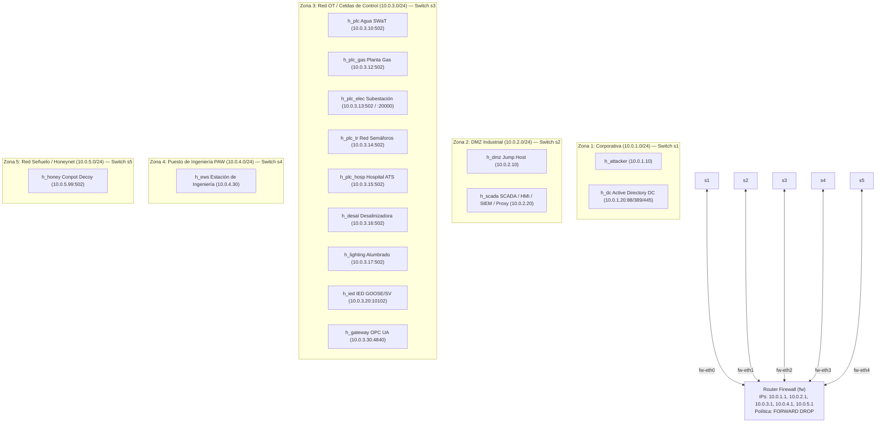
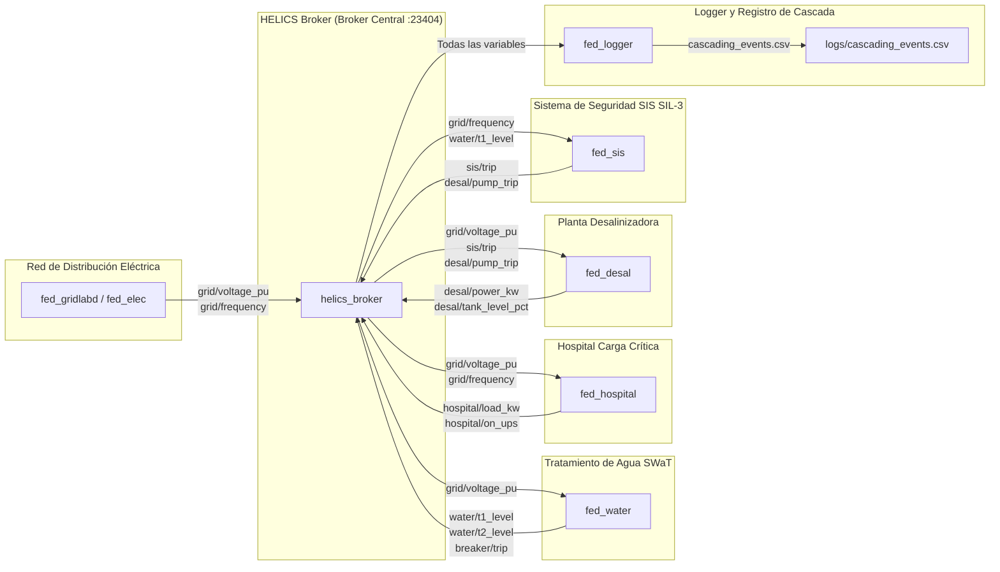
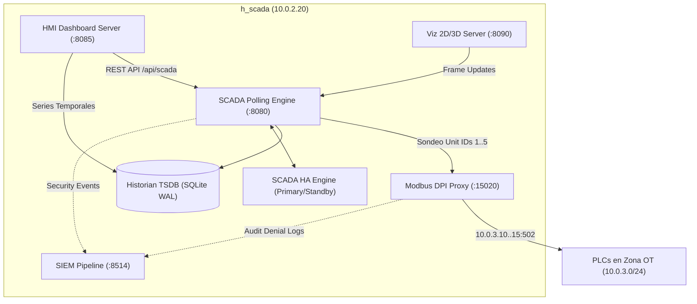

# 🛡️ Arquitectura del Cyber Range CityLab (IEC 62443 / Co-Simulación Ciberfísica)

Este documento describe la arquitectura integral de software, topología de red, modelos ciberfísicos, protocolos industriales y flujos de control del **Cyber Range CityLab**. Está diseñado para que ingenieros de software, analistas de seguridad y operadores de sistemas de control comprendan la estructura y el flujo de datos exacto del repositorio.

---

## 📑 Tabla de Contenidos
1. [Visión General del Sistema y Filosofía de Diseño](#1-visión-general-del-sistema-y-filosofía-de-diseño)
2. [Estructura del Proyecto y Módulos de Código](#2-estructura-del-proyecto-y-módulos-de-código)
3. [Topología de Red y Microsegmentación (IEC 62443)](#3-topología-de-red-y-microsegmentación-iec-62443)
4. [Capa Ciberfísica y Co-Simulación HELICS](#4-capa-ciberfísica-y-co-simulación-helics)
5. [Capa de Emulación de Dispositivos de Campo (OT)](#5-capa-de-emulación-de-dispositivos-de-campo-ot)
6. [Capa de Supervisión, DMZ y Servicios Centrales](#6-capa-de-supervisión-dmz-y-servicios-centrales)
7. [Pipeline de Seguridad: SIEM Central y Defensa Dinámica SDN](#7-pipeline-de-seguridad-siem-central-y-defensa-dinámica-sdn)
8. [Matriz Integral de Puertos, Conduits y Variables de Entorno](#8-matriz-integral-de-puertos-conduits-y-variables-de-entorno)

---

## 1. Visión General del Sistema y Filosofía de Diseño

CityLab es un Cyber Range **100% nativo en software** para simulación de ciberguerra y hacking ético en infraestructuras críticas urbanas (ICS/OT/SCADA).

- **Ejecución Ligera sin Hipervisores Pesados**: Utiliza namespaces de red Linux (Mininet), Open vSwitch (OVS) y procesos Python puros (`pymodbus`, sockets UDP/TCP nativos, `http.server`, SQLite WAL). No requiere Docker ni VMs pesadas para ejecutar la simulación completa.
- **Presupuesto de Memoria RAM**: Ejecución en tiempo real con < **2 GB RAM** de consumo real medido (margen de diseño global: **8 GB RAM**).
- **Fidelidad Protocolar y de Red**: Sockets de red reales con sockets de red multicast UDP (`IP_ADD_MEMBERSHIP` para IEC 61850 GOOSE/SV), framing binario Modbus TCP con filtrado por Unit ID / Byte 6, autenticación RBAC con cabeceras Bearer, DNP3 Outstation y emulación de Samba Active Directory (LDAP/Kerberos/SMB).

```mermaid
flowchart TB
    subgraph L1 ["Capa 1: Co-Simulación Ciberfísica (HELICS)"]
        WaterMath["SWaT 2-Etapas (Tanques T1/T2)"]
        ElecMath["Red Eléctrica Swing / Frecuencia"]
        GasMath["Red Distribución Gas / Válvulas"]
        HospMath["Hospital Crítico / ATS-UPS"]
        TransMath["Semáforos / Congestión"]
        DesalMath["Planta Desalinizadora"]
        LightMath["Alumbrado Inteligente"]
        SisMath["Sistema SIS SIL-3"]
        Broker["HELICS Broker (23404 / 23500)"]
    end

    subgraph L2 ["Capa 2: Dispositivos de Campo OT (Emuladores en Mininet s3)"]
        PLC_Water["Modbus PLC Agua (10.0.3.10:502)"]
        PLC_Gas["Modbus PLC Gas (10.0.3.12:502)"]
        PLC_Elec["DNP3 Outstation (10.0.3.13:20000)"]
        PLC_Trans["Modbus PLC Tráfico (10.0.3.14:502)"]
        PLC_Hosp["Modbus PLC Hospital (10.0.3.15:502)"]
        IED_Subst["IED Subestación IEC 61850 (10.0.3.20:10102)"]
        GW_Opcua["Gateway OPC UA (10.0.3.30:4840)"]
    end

    subgraph L3 ["Capa 3: DMZ y Control Central (Mininet s2)"]
        Proxy["Modbus DPI Proxy (10.0.2.20:15020)"]
        SCADA["SCADA Server + HA (10.0.2.20:8080)"]
        Historian["TSDB Historian (SQLite WAL)"]
        SIEM["SIEM Correlation Engine (10.0.2.20:8514)"]
        HMI["HMI Server (10.0.2.20:8085)"]
        Viz["Visualizador 2D/3D (10.0.2.20:8090)"]
    end

    subgraph L4 ["Capa 4: Zona Corporativa & Honey (Mininet s1 / s5)"]
        DC["Active Directory DC (10.0.1.20:88/389/445)"]
        Attacker["Host Atacante (10.0.1.10)"]
        Honeypot["Conpot Modbus Decoy (10.0.5.99:502)"]
    end

    Broker <--> WaterMath & ElecMath & GasMath & HospMath & TransMath & DesalMath & LightMath & SisMath
    WaterMath <--> PLC_Water
    ElecMath <--> PLC_Elec & IED_Subst
    GasMath <--> PLC_Gas
    TransMath <--> PLC_Trans
    
    Proxy -->|Demux Unit IDs| PLC_Water & PLC_Gas & PLC_Elec & PLC_Trans & PLC_Hosp
    SCADA --> Proxy
    SCADA <--> Historian
    PLC_Water & PLC_Gas & PLC_Elec & IED_Subst & GW_Opcua & Proxy -.->|Async Audit Logs| SIEM
    SCADA -->|LDAP Auth TCP 389| DC
    HMI --> SCADA
    Viz --> SCADA
```



---

## 2. Estructura del Proyecto y Módulos de Código

La base de código está organizada en paquetes modulares con responsabilidades estrictamente separadas:

```
CityLab/
├── citylab.sh                   # Script de orquestación y CLI único del Cyber Range
├── network/                     # Infraestructura de red, protocolos SCADA, DMZ y SIEM
│   ├── topology.py              # Topología Mininet (17 hosts, 5 switches OVS, Firewall Router)
│   ├── scada_server.py          # Servidor SCADA REST API y motor de sondeo (polling engine)
│   ├── scada_ha.py              # Cluster de Alta Disponibilidad SCADA (Primary/Standby/Heartbeat)
│   ├── modbus_proxy.py          # Proxy inverso Modbus TCP con DPI y demuxing por Unit ID
│   ├── siem_pipeline.py         # Motor de correlación SOC/SIEM con reenvío asíncrono
│   ├── sdn_controller.py        # Controlador SDN OpenFlow / Mitigación Circuit Breaker dinámica
│   ├── rbac.py                  # Autenticación de usuarios por roles (PAM / AD LDAP / Bearer)
│   ├── historian.py             # Base de datos de series temporales de telemetría (SQLite WAL)
│   ├── hmi_server.py            # Servidor web HMI de supervisión operativa
│   ├── viz_server.py            # Servidor de streaming de telemetría para canvas 2D/3D
│   ├── ad_dc_emulator.py        # Emulador de Active Directory Domain Controller (Kerberos/LDAP/SMB)
│   └── tests/                   # Suite de pruebas unitarias y de integración de red
├── plc/                         # Emuladores de dispositivos de campo (PLCs, IEDs, Gateways)
│   ├── modbus_emulator.py       # Servidor esclavo Modbus TCP multi-sectorial
│   ├── dnp3_emulator.py         # Outstation DNP3 con soporte Secure Authentication L1
│   ├── iec61850_emulator.py     # Emulador de IED Subestación (GOOSE/Sampled Values multicast)
│   ├── opcua_emulator.py        # Servidor binario OPC UA con árbol de nodos
│   ├── honeypot_server.py       # Señuelo Conpot Modbus para detección temprana de escaneos
│   └── tests/                   # Pruebas de emuladores OT
├── helics_sim/                  # Co-simulación ciberfísica distribuida en tiempo real
│   ├── fed_water.py / fed_gas.py / fed_elec.py / fed_transport.py / fed_hospital.py
│   ├── fed_desal.py / fed_lighting.py / fed_sis.py / fed_gridlabd.py / fed_logger.py
│   ├── run_federates.py         # Orquestador general de co-simulación HELICS
│   └── smoke_test_phase*.sh     # Smoke tests automatizados de co-simulación
├── physical/                    # Modelos matemáticos de dinámica física diferencial
│   ├── water/ / gas/ / elec/ / hospital/ / transport/
├── attacker/                    # Vectores de ataque e inyecciones de protocolos industriales
│   ├── attack_goose_spoofing.py # Inyección de paquetes GOOSE falsificados
│   ├── attack_dnp3_breaker.py   # Disparo directo de interruptor mediante DNP3 CROB
│   ├── attack_modbus_dos.py     # Inundación de comandos de escritura y denegación de servicio
│   ├── attack_live_sdn_defense.py # Arnés de verificación de mitigación SDN
│   └── tests/                   # Suite de pruebas de validación de ataques
├── scripts/                     # Herramientas de validación y profiling
│   ├── validate_e2e.sh          # Arnés de validación End-to-End en Mininet real
│   ├── validate_localhost.py    # Arnés de validación preliminar en localhost
│   └── profile_resources.py     # Monitor de consumo de CPU y memoria RAM
└── docs/                        # Documentación técnica, matriz ERS y escenarios CTF
```

---

## 3. Topología de Red y Microsegmentación (IEC 62443)

La topología de red se implementa en [`network/topology.py`](file:///home/kripi/Documentos/GitHub/CityLab/network/topology.py) y modela la arquitectura estándar **Purdue Model / IEC 62443-3-3** mediante 5 zonas de seguridad independientes interconectadas por un router central de filtrado de paquetes (`fw`):



### Reglas de Firewall Linux (`iptables`) y Conduits Habilitados

1. **Política por Defecto**: `iptables -P FORWARD DROP` (todo el tráfico entre zonas denegado por defecto).
2. **Conduit DMZ SCADA <-> Zona OT**: `10.0.2.20 <-> 10.0.3.0/24 ACCEPT` (adquisición de telemetría y comandos de control).
3. **Conduit EWS PAW <-> Zona OT**: `10.0.4.30 <-> 10.0.3.0/24 ACCEPT` (mantenimiento e ingeniería).
4. **Conduit SCADA -> AD DC LDAP**: `10.0.2.20 -> 10.0.1.20:389 TCP ACCEPT` (autenticación centralizada de usuarios SCADA).
5. **Conduit Honeypot**: Tráfico hacia `10.0.5.99 ACCEPT` desde cualquier zona para captura y alerta temprana de escaneos.
6. **Aislamiento Corporativo <-> OT**: Todo tráfico directo desde `10.0.1.0/24` hacia `10.0.3.0/24` es bloqueado estrictamente (`DROP`).

---

## 4. Capa Ciberfísica y Co-Simulación HELICS

La dinámica ciberfísica se ejecuta bajo el framework de co-simulación **HELICS (Hierarchical Engine for Large-scale Infrastructure Co-Simulation)**, sincronizando modelos diferenciales continuos con eventos discretos a intervalos de paso de tiempo configurables (`0.5 s` / `1.0 s`):



### Relaciones de Cascada Crítica
- **Disparo de Red Eléctrica (`grid/frequency < 59.5 Hz` o `> 60.5 Hz`)**: Provoca transferencia automática en el hospital hacia banco de baterías UPS (`hospital/on_ups = 1`). Si la tensión cae por debajo de `0.85 pu`, las bombas SWaT y de la desalinizadora se detienen por protección de bajo voltaje.
- **Interbloqueo SIS SIL-3 (`fed_sis.py`)**: Si el nivel del tanque T1 excede `19.0 m³` o la frecuencia de red supera `62.5 Hz`, el federado SIS publica `sis/trip = 1.0` y `desal/pump_trip = 1.0`, provocando la parada de emergencia simultánea de las bombas de alimentación de agua y desalinizadora.

---

## 5. Capa de Emulación de Dispositivos de Campo (OT)

Los emuladores corren en namespaces aislados de Mininet y simulan el comportamiento estricto de PLCs, RTUs e IEDs industriales:

### 1. Modbus TCP Server (`plc/modbus_emulator.py`)
- Emula registros para 7 perfiles de planta (`water`, `gas`, `elec`, `transport`, `hospital`, `desal`, `lighting`).
- Mapeo de Coils: `Coil 0` (Interruptor / Breaker principal), `Coil 1` (Bomba / Válvula principal), `Coil 2` (Actuador auxiliar).
- Mapeo de Holding Registers (`0..10`): Almacenan telemetría física en coma flotante empaquetada en formato entero escalado (nivel de tanques, presión en PSI, potencia activa en kW, estado de semáforos).

### 2. DNP3 Outstation (`plc/dnp3_emulator.py`)
- Escucha en puerto TCP `20000` en `10.0.3.13` (Subestación eléctrica).
- Implementa comandos CROB (Control Relay Output Block) para conmutación de disyuntores de subestación.
- Soporta Secure Authentication (SA L1) con clave HMAC opcionalmente activable (`sa_required=True`).

### 3. IED Subestación IEC 61850 GOOSE & Sampled Values (`plc/iec61850_emulator.py`)
- Escucha y emite mensajes GOOSE en puerto UDP `10102` y Sampled Values (SV) en puerto UDP `10103`.
- Soporta sockets multicast mediante suscripción `IP_ADD_MEMBERSHIP` a los grupos normalizados `239.0.0.1` (GOOSE) y `239.0.0.2` (SV), con `IP_MULTICAST_TTL=2` e `IP_MULTICAST_LOOP=1`.
- Gestiona contadores de secuencia estrictos: `stNum` (State Number), `sqNum` (Sequence Number) y valor de posición de interruptor `XCBR1.Pos.stVal`.

### 4. OPC UA Server (`plc/opcua_emulator.py`)
- Servidor binario nativo en puerto TCP `4840` (`10.0.3.30`).
- Estructura un árbol jerárquico de nodos (`Objects/CityLab_Gateway/Substation_Telemetry`) con acceso a variables de tensión, corriente y frecuencia.

---

## 6. Capa de Supervisión, DMZ y Servicios Centrales

Ubicada en la zona DMZ (`10.0.2.20`), proporciona los servicios de control y supervisión:



### Modbus DPI Proxy con Enrutamiento por Unit ID (`network/modbus_proxy.py`)
El proxy escucha en `10.0.2.20:15020` y realiza inspección profunda de paquetes (DPI) y multiplexación inversa:
1. Inspecciona la cabecera MBAP del paquete TCP.
2. Lee el **Byte 6 (Unit ID)** para determinar el sector destino:
   - `Unit ID 1` $\to$ Agua SWaT (`10.0.3.10:502`)
   - `Unit ID 2` $\to$ Gas Natural (`10.0.3.12:502`)
   - `Unit ID 3` $\to$ Red Eléctrica (`10.0.3.13:502`)
   - `Unit ID 4` $\to$ Transporte (`10.0.3.14:502`)
   - `Unit ID 5` $\to$ Hospital (`10.0.3.15:502`)
3. **DPI Enforcement**: Si la función Modbus de escritura está restringida o el rango de registros es inválido, el paquete es rechazado y se reenvía una alerta de auditoría al SIEM central.

### SCADA Server y Alta Disponibilidad (`network/scada_server.py`, `network/scada_ha.py`)
- **Polling Loop**: Ejecuta lecturas periódicas a los PLCs (directas o a través del proxy cuando `USE_MODBUS_PROXY=1`).
- **Detección Loss-of-View (F-06)**: Mantiene un contador `_consecutive_failures[sector]`. Si se alcanzan 3 fallos consecutivos, el estado del sector pasa a `LOSS_OF_VIEW` y se generan alertas operativas.
- **Sincronización HA**: Sincroniza instantáneas de estado mediante `sync_state(state)` y expone el estado de conmutación en `/api/ha/status`.

---

## 7. Pipeline de Seguridad: SIEM Central y Defensa Dinámica SDN

### Motor de Correlación SIEM (`network/siem_pipeline.py`)
Escucha eventos HTTP POST en `10.0.2.20:8514` y correlaciona incidentes en tiempo real mediante reglas heurísticas:
- **Regla 1 (Ataque en Cascada Multisectorial)**: Detecta eventos de desconexión o fallo en más de 2 sectores diferentes en una ventana de 10 segundos. Genera alerta crítica `SOC-ALT-0002`.
- **Regla 2 (Spoofing IEC 61850 GOOSE - Patrón Industroyer2)**: Detecta inyección de paquetes GOOSE con disparos no autorizados en subestaciones eléctricas (`SOC-ALT-0001`).
- **Regla 3 (Ataque de Fuerza Bruta / Denegación Modbus)**: Detecta más de 10 escrituras anómalas o denegadas por el DPI proxy en una ventana de 5 segundos.

### Controlador SDN y Circuit Breaker (`network/sdn_controller.py`)
Implementa defensa activa a nivel de plano de datos (Data Plane Enforcement):
- Cuando el SIEM o el operador detecta un nodo hostil (ej. atacante `10.0.1.10`), se invoca `apply_circuit_breaker(ip)`.
- El controlador inyecta dinámicamente una regla OpenFlow de alta prioridad en el switch OVS `s3` (`priority=1000, ip, nw_src=10.0.1.10, actions=drop`).
- Aislamiento inmediato a nivel de conmutación (100% packet loss), impidiendo el acceso a cualquier PLC de la red OT.

---

## 8. Matriz Integral de Puertos, Conduits y Variables de Entorno

### Matriz de Puertos y Servicios

| Host / Namespace | IP | Puerto | Protocolo / Capa | Servicio / Descripción |
|---|---|---|---|---|
| `h_attacker` | `10.0.1.10` | Dinámico | TCP/UDP | Host de simulación de atacante |
| `h_dc` | `10.0.1.20` | `88` / `389` / `445` | TCP (Kerberos/LDAP/SMB) | Samba Active Directory DC Emulator |
| `h_dmz` | `10.0.2.10` | `22` | TCP (SSH) | Bastión de salto DMZ |
| `h_scada` | `10.0.2.20` | `15020` | TCP (Modbus TCP) | Modbus DPI Proxy con demuxing Unit ID |
| `h_scada` | `10.0.2.20` | `8080` | HTTP / REST | SCADA Central API & HA Engine |
| `h_scada` | `10.0.2.20` | `8085` | HTTP / HTML5 | Servidor Industrial HMI Dashboard |
| `h_scada` | `10.0.2.20` | `8090` | HTTP / JSON | Servidor de Streaming Visualizador 2D/3D |
| `h_scada` | `10.0.2.20` | `8514` | HTTP / JSON | Pipeline Colector Central SIEM / SOC |
| `h_plc` | `10.0.3.10` | `502` | TCP (Modbus) | PLC Agua SWaT Multi-Etapa |
| `h_plc_gas` | `10.0.3.12` | `502` | TCP (Modbus) | PLC Planta Compresora de Gas |
| `h_plc_elec` | `10.0.3.13` | `502` / `20000` | Modbus / DNP3 SA L1 | PLC / Outstation Subestación Eléctrica |
| `h_plc_tr` | `10.0.3.14` | `502` | TCP (Modbus) | PLC Red de Tráfico y Semáforos |
| `h_plc_hosp` | `10.0.3.15` | `502` | TCP (Modbus) | PLC Hospital y Conmutación ATS/UPS |
| `h_desal` | `10.0.3.16` | `502` | TCP (Modbus) | PLC Planta Desalinizadora de Agua |
| `h_lighting` | `10.0.3.17` | `502` | TCP (Modbus) | PLC Red de Alumbrado Inteligente |
| `h_ied` | `10.0.3.20` | `10102` / `10103` | UDP (Multicast/Unicast) | IED IEC 61850 Subestación (GOOSE/SV) |
| `h_gateway` | `10.0.3.30` | `4840` | TCP (OPC UA Binary) | Gateway Telemetría OPC UA |
| `h_ews` | `10.0.4.30` | `22` / `80` | TCP | Estación de Trabajo de Ingeniería (PAW) |
| `h_honey` | `10.0.5.99` | `502` | TCP (Modbus) | Señuelo Honeypot Conpot de Detección |

### Variables de Entorno de Control de Comportamiento

- `USE_MODBUS_PROXY`: `1` (por defecto en Mininet) enruta el sondeo SCADA a través del proxy DPI en `:15020`. `0` conecta directamente a los PLCs en `:502`.
- `ENABLE_MULTICAST`: `1` activa el bind y suscripción multicast `239.0.0.1`/`239.0.0.2` en el emulador IEC 61850. `0` opera en unicast local (`127.0.0.1`).
- `STRICT_AUTH`: `1` activa el modo estricto en el servidor SCADA y RBAC, exigiendo cabecera `Authorization: Bearer <role>:<token>`. `0` opera en modo permisivo CTF.
- `SIEM_HTTP_URL`: URL del colector central SIEM (`http://10.0.2.20:8514`). Si está definida, los emuladores reenvían eventos de seguridad de forma asíncrona.
- `ENABLE_SIS_FEDERATE`: `1` activa el federado de seguridad SIS SIL-3 en la co-simulación HELICS (utilizado en la federación de 10 federados).

