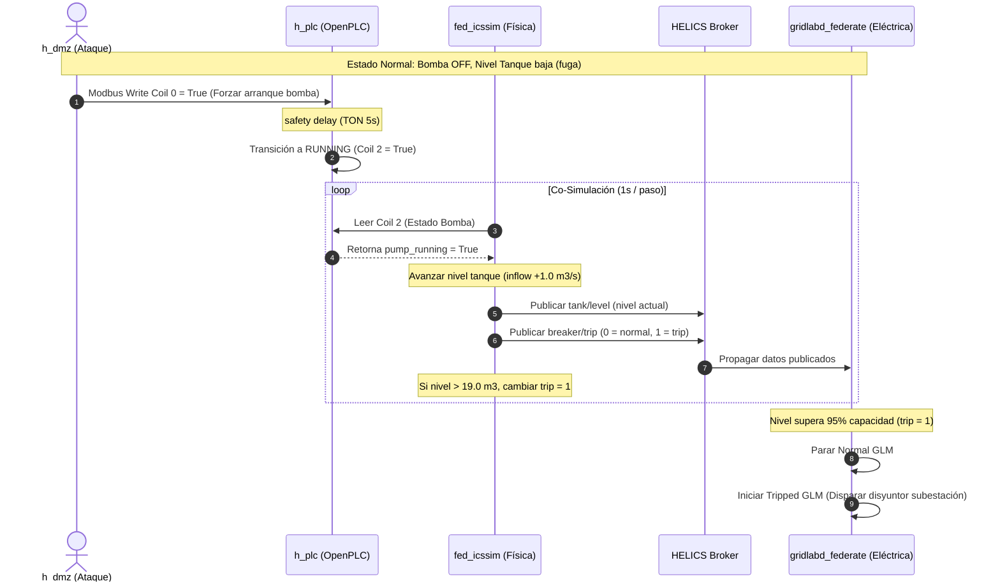

# Arquitectura del Cyber Range (Fase 1)

## Contexto del Proyecto

Cyber Range 100% software para simular incidentes cibernéticos en infraestructura crítica (ICS/SCADA).
- **Entorno**: Ejecución nativa en Linux sin máquinas virtuales pesadas.
- **Eficiencia**: Bajo consumo de memoria RAM (<1 GB en total).

---

## Segmentación de Red (IEC 62443)

Topología emulada por Mininet con tres zonas aisladas mediante un firewall (`iptables`):

```mermaid
graph TD
    subgraph CorpZone ["1. Corporate (10.0.1.0/24)"]
        h_attacker["h_attacker (10.0.1.10)"]
    end

    subgraph DmzZone ["2. DMZ (10.0.2.0/24)"]
        h_dmz["h_dmz (10.0.2.10)"]
    end

    subgraph OtZone ["3. OT Cell (10.0.3.0/24)"]
        h_plc["h_plc (10.0.3.10)"]
        h_icssim["h_icssim (10.0.3.11)"]
    end

    fw["Firewall (fw)"]

    h_attacker <--> fw-eth0
    h_dmz <--> fw-eth1
    h_plc <--> fw-eth2
    h_icssim <--> fw-eth2

    classDef zone fill:#2a2a2a,stroke:#444,stroke-width:2px;
    class CorpZone,DmzZone,OtZone zone;
```

### Reglas de Acceso (Firewall)
- **Corporate -> OT**: DENEGADO (Bloqueo total).
- **DMZ -> OT**: PERMITIDO tráfico Modbus/TCP (puerto `502`) hacia el PLC (`10.0.3.10`).

---

## Cadena de Ataque y Co-Simulación (End-to-End)

El flujo de control ciberfísico está orquestado por HELICS 3.x y sincronizado en tiempo real (1 paso de simulación = 1 segundo real):

---

## Lógica Física y de Control

### 1. Lógica del PLC
- **IEC 61131-3 (Structured Text)**:
  - Entrada: `pump_start` (Coil 0), `pump_stop` (Coil 1).
  - Salida: `pump_running` (Coil 2), `pump_fault` (Coil 3).
  - Control de seguridad: Si `pump_start` y `pump_stop` activos a la vez, activa `pump_fault` y detiene bomba.

### 2. Modelo Físico (Bomba y Tanque)
- **Capacidad Tanque**: 20.0 m³
- **Nivel Inicial**: 10.0 m³
- **Tasa de Llenado**: 1.0 m³/s (bomba encendida)
- **Tasa de Fuga**: 0.001 m³/s (bomba apagada)
- **Criterio de Disparo (Trip)**:
  - Nivel crítico superior: > 19.0 m³ (95% capacidad).
  - Nivel crítico inferior: < 1.0 m³.

---

## Simplificaciones de Diseño (Ponytail Notes)

- **OpenPLC Fallback**:
  <!-- ponytail: OpenPLC Fallback (Ceiling: No corre Structured Text nativo. Upgrade: Compilar e integrar OpenPLC completo en h_plc) -->
  Si OpenPLC no está en el host, se levanta el emulador Python (`modbus_emulator.py`) emulando bobinas y retardos en el puerto `502`.
- **Uso de pymodbus en lugar de scapy**:
  `pymodbus` ofrece una abstracción limpia del protocolo sin necesidad de generar y calcular checksums IP/TCP de forma manual.
