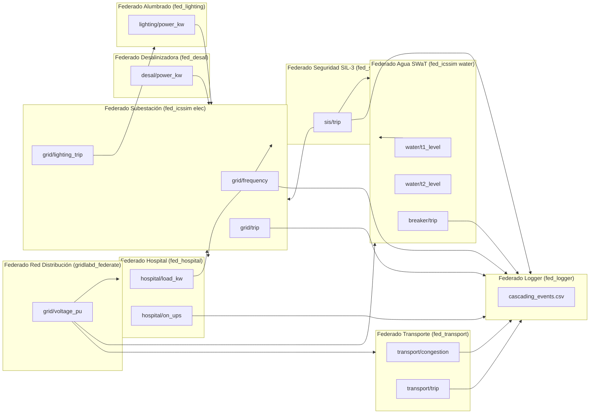

# 🛡️ Arquitectura del Cyber Range CityLab (Fase 3 Ciudad Completa)

## 📌 Contexto del Proyecto y Presupuesto de Recursos

CityLab es un Cyber Range 100% software para simulación de ciberguerra y hacking ético en infraestructuras críticas urbanas (ICS/OT/SCADA).
- **Entorno de Ejecución**: Linux nativo (Debian / Ubuntu / Athena OS) sin necesidad de máquinas virtuales pesadas.
- **Margen y Presupuesto de Memoria RAM**: **8 GB RAM** para la federación completa en tiempo real (incluyendo hasta 10 federados HELICS nativos, Mininet, 5 switches OVS, 5 emuladores de protocolo PLC/IED, Samba Active Directory DC, SIEM, SCADA HA, HMI y Visualizador Web 2D/3D).
- **Federados HELICS realmente lanzados**: `run_phase3.sh` arranca **7** (`HELICS_FED_COUNT=7`: agua, gas, eléctrico, transporte, hospital, GridLAB-D, logger). La federación de **10** —que suma `fed_desal`, `fed_lighting` y `fed_sis`— hoy solo la orquesta `helics_sim/smoke_test_phase7.sh` (`helics_broker -f 10`, con `ENABLE_SIS_FEDERATE=1`); los entrypoints por fases todavía no la lanzan. Los diagramas de co-simulación de este documento describen esa federación de 10.
- **Alcance Multisectorial**: Co-Simulación Ciberfísica de 5 Sectores Vitales (Agua SWaT multi-etapa, Desalinizadora, Alumbrado Inteligente, Gas natural, Red Eléctrica 13.8 kV, Hospital con Failover ATS/UPS, SIS SIL-3 y Transporte/Semáforos) interconectados bajo normas IEC 62443 e IEC 61511.

---

## 📐 Topología de Red y Microsegmentación (IEC 62443)

Topología emulada por Mininet con 5 zonas de seguridad interconectadas mediante firewall Linux (`iptables`) y microsegmentadas por Open vSwitch (OVS):

```mermaid
graph TD
    subgraph CorpZone ["1. Corporate Zone (10.0.1.0/24) - Switch s1"]
        h_attacker["h_attacker (10.0.1.10)"]
        h_dc["h_dc Samba AD DC (10.0.1.20:88/389/445)"]
    end

    subgraph DmzZone ["2. DMZ Zone (10.0.2.0/24) - Switch s2"]
        h_dmz["h_dmz Jump Host (10.0.2.10) — sin servicio activo"]
        h_scada["h_scada SCADA Central + Historian TSDB (10.0.2.20:8080)"]
    end

    subgraph OtZone ["3. OT Zone (10.0.3.0/24) - Switch s3"]
        h_plc_water["h_plc Water Modbus (10.0.3.10:502)"]
        h_plc_gas["h_plc_gas Gas Modbus (10.0.3.12:502)"]
        h_plc_elec["h_plc_elec DNP3 SA (10.0.3.13:20000)"]
        h_plc_trans["h_plc_trans Transport Modbus (10.0.3.14:502)"]
        h_plc_hosp["h_plc_hosp Hospital Modbus (10.0.3.15:502)"]
        h_desal["h_desal Desalination (10.0.3.16:502)"]
        h_lighting["h_lighting Smart Lighting (10.0.3.17:502)"]
        h_ied["h_ied Substation GOOSE (10.0.3.20:10102)"]
        h_gateway["h_gateway OPC UA (10.0.3.30:4840)"]
    end

    subgraph EwsZone ["4. EWS PAW Zone (10.0.4.0/24) - Switch s4"]
        h_ews["h_ews Engineering PAW (10.0.4.30)"]
    end

    subgraph HoneyZone ["5. Honeypot Zone (10.0.5.0/24) - Switch s5"]
        h_honey["h_honey Conpot Decoy (10.0.5.99:502)"]
    end

    fw["Firewall Linux Router (fw)"]

    s1 <-->|fw-eth0| fw
    s2 <-->|fw-eth1| fw
    s3 <-->|fw-eth2| fw
    s4 <-->|fw-eth3| fw
    s5 <-->|fw-eth4| fw

    classDef zone fill:#1e1e1e,stroke:#555,stroke-width:2px;
    class CorpZone,DmzZone,OtZone,EwsZone,HoneyZone zone;
```

---

## ⚡ Matriz de Co-Simulación HELICS y Flujo Ciberfísico

---

## 📂 Índice de Documentación Quirúrgica por Federado e Infraestructura

Para detalles de implementación, flujos de código, esquemas de registros Modbus/DNP3/GOOSE y modelos matemáticos de cada componente, consultar los módulos dedicados:

1. [📘 **Federado 01 — Agua SWaT (Tratamiento y Distribución)**](file:///home/kripi/Documentos/GitHub/CityLab/docs/federates/01_water_treatment_federate.md)
2. [⚡ **Federado 02 — Red Eléctrica y Subestación DNP3/GOOSE**](file:///home/kripi/Documentos/GitHub/CityLab/docs/federates/02_power_grid_electrical_federate.md)
3. [🚦 **Federado 03 — Sistema de Transporte y Tráfico Urbano**](file:///home/kripi/Documentos/GitHub/CityLab/docs/federates/03_transport_traffic_federate.md)
4. [🏥 **Federado 04 — Hospital Carga Crítica y Sistema ATS/UPS**](file:///home/kripi/Documentos/GitHub/CityLab/docs/federates/04_hospital_critical_power_federate.md)
5. [🛡️ **Federado 05 — Sistema de Seguridad SIS / ESD (SIL-3)**](file:///home/kripi/Documentos/GitHub/CityLab/docs/federates/05_safety_instrumented_system_sis_federate.md)
6. [📊 **Federado 06 — Observer y Logger de Co-Simulación HELICS**](file:///home/kripi/Documentos/GitHub/CityLab/docs/federates/06_helics_logger_observer_federate.md)
7. [🖥️ **Infraestructura 07 — Servidor SCADA Central, HA y HMI**](file:///home/kripi/Documentos/GitHub/CityLab/docs/federates/07_scada_hmi_infrastructure.md)
8. [🛡️ **Infraestructura 08 — SIEM, SDN Controller y Active Directory**](file:///home/kripi/Documentos/GitHub/CityLab/docs/federates/08_siem_sdn_active_directory_infrastructure.md)
