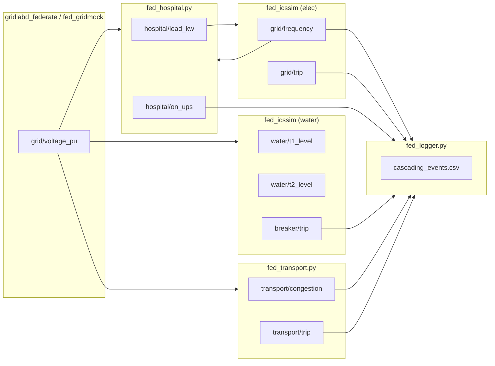

# Arquitectura del Cyber Range CityLab (Fase 3 Ciudad Completa)

## Contexto del Proyecto

Cyber Range 100% software para simulación de ciberguerra y hacking ético en infraestructuras críticas urbanas (ICS/SCADA).
- **Entorno**: Ejecución nativa sobre Linux (Debian/Athena OS) sin sobrecarga de máquinas virtuales.
- **Presupuesto de Memoria**: <1.5 GB RAM para la federación completa de 7 procesos y red Mininet.
- **Fase 3**: Co-Simulación Multisectorial de Ciudad Completa (Agua SWaT 2 Etapas, Gas, Red Eléctrica 13.8 kV, Hospital con Failover, Red de Transporte/Semáforos y Servidor SCADA Central).

---

## Segmentación de Red (IEC 62443)

Topología emulada por Mininet con tres zonas aisladas mediante un firewall (`iptables`):

```mermaid
graph TD
    subgraph CorpZone ["1. Corporate Zone (10.0.1.0/24)"]
        h_attacker["h_attacker (10.0.1.10)"]
    end

    subgraph DmzZone ["2. DMZ (10.0.2.0/24)"]
        h_dmz["h_dmz (10.0.2.10)"]
        h_scada["h_scada SCADA Server (10.0.2.20:8080)"]
    end

    subgraph OtZone ["3. OT Cell (10.0.3.0/24)"]
        h_plc_water["h_plc (Water 10.0.3.10)"]
        h_plc_gas["h_plc_gas (Gas 10.0.3.12)"]
        h_plc_elec["h_plc_elec (Elec 10.0.3.13)"]
        h_plc_trans["h_plc_trans (Transport 10.0.3.14)"]
    end

    fw["Firewall (fw)"]

    h_attacker <--> fw-eth0
    h_dmz <--> fw-eth1
    h_scada <--> fw-eth1
    h_plc_water <--> fw-eth2
    h_plc_gas <--> fw-eth2
    h_plc_elec <--> fw-eth2
    h_plc_trans <--> fw-eth2

    classDef zone fill:#2a2a2a,stroke:#444,stroke-width:2px;
    class CorpZone,DmzZone,OtZone zone;
```

---

## Módulos Físicos e Interdependencias Ciberfísicas (Fase 3)

### 1. Sector Eléctrico (`ElecPlant` + GridLAB-D)
- **Física**: Ecuación de swing síncrona:
  $$\frac{df}{dt} = \frac{P_{gen} - P_{load}}{2 \cdot H}$$
  donde $H = 4.0\text{ s}$ es la constante de inercia y la base del alimentador es de $550\text{ kW}$ ($1.0\text{ pu}$).

### 2. Sector Hospital (`fed_hospital.py`)
- **Física**: Carga crítica de $150\text{ kW}$, sistema UPS de $75\text{ kWh}$ ($30\text{ min}$) y generador diésel de emergencia.
- **Failover Automático**: Transición a `UPS_ACTIVE` si $V_{grid} < 0.85\text{ pu}$ o $f < 58.0\text{ Hz}$.

### 3. Sector Agua SWaT Multi-Etapa (`TwoStageWaterPlant`)
- **Física**: Reservorio Crudo $\xrightarrow{\text{Bomba P1}}$ Tanque Sedimentador T1 ($20\text{ m}^3$) $\xrightarrow{\text{Bomba P2}}$ Tanque Distribución T2 ($30\text{ m}^3$).
- **Dependencia Eléctrica**: Bomba P1 se detiene si $V_{grid} < 0.85\text{ pu}$.

### 4. Sector Transporte / Semáforos (`TrafficLightIntersection` / `fed_transport.py`)
- **Física**: Intersección urbana de 4 fases.
- **Dependencia Eléctrica**: Si $V_{grid} < 0.85\text{ pu}$, los semáforos entran en fallo `FLASHING_YELLOW_EMERGENCY`, incrementando el índice de congestión vehicular hacia $1.0$ (bloqueo total).

---

## Matriz de Co-Simulación HELICS (7 Federados)

