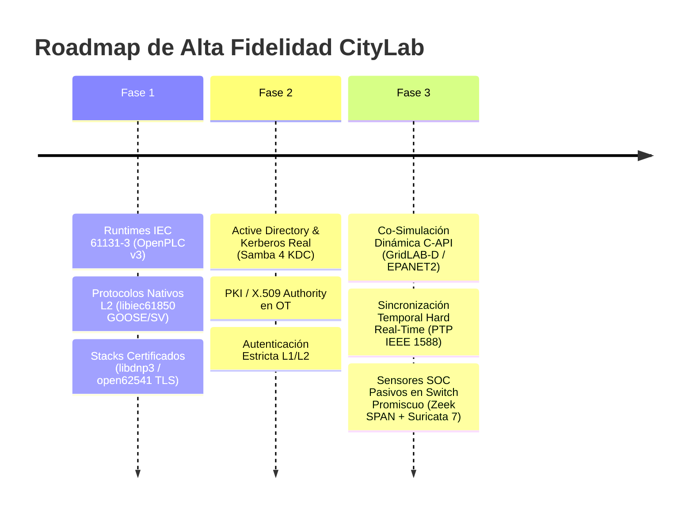

# 🏗️ PLAN DIRECTOR DE EVOLUCIÓN: ARQUITECTURA DE ALTA FIDELIDAD INDUSTRIAL Y GEMELO DIGITAL
## Roadmap de Transformación Integral (Fases 1, 2 y 3) · CityLab Cyber Range

| Metadatos del Plan | Detalle |
| :--- | :--- |
| **Documento:** | `docs/Audits/PLAN_ALTA_FIDELIDAD_DIGITAL_TWIN.md` |
| **Objetivo:** | Elevar fidelidad operativa de **4.0/10 (Maqueta)** a **9.5/10 (Gemelo Digital / HIL Ready)** |
| **Alcance:** | Runtimes IEC 61131-3, Stacks Nativos L2/L7, Samba 4 AD/KDC, Física C-API, OVS SPAN Zeek |
| **Estándar:** | IEC 62443-3-3 (FR1-FR7) / IEEE 1815 / IEC 61850 / NIST SP 800-82r3 |
| **Estado:** | PROPUESTA MAESTRA DE INGENIERÍA |
| **Fecha:** | 2026-08-31 |

---

## 🗺️ MATRIZ DE RUTA Y EVOLUCIÓN POR FASES



---

## 📦 FASE 1: RUNTIMES DE CONTROL IEC 61131-3 Y PROTOCOLOS NATIVOS L2/L7

**Objetivo de Fidelidad:** 4.0 $\to$ 6.5  
**Problema Actual:** Lógica de proceso en scripts planos Python (`if level < 1.0`) y protocolos empaquetados en UDP unicast/loopback.

```
+-----------------------------------------------------------------------------------+
| FASE 1: ARQUITECTURA DE CONTROL Y COMUNICACIÓN                                    |
+-----------------------------------------------------------------------------------+
| 1.1 OpenPLC v3 Runtime en Namespaces OT:                                         |
|     - Ciclo de scan determinista: Read Inputs -> Logic -> Write Outputs (20ms)     |
|     - Código en Structured Text (ST) compilado en C (MatIEC)                      |
|                                                                                   |
| 1.2 libiec61850 Native Daemon:                                                    |
|     - Socket crudo AF_PACKET en OVS (EtherType 0x88B8 GOOSE / 0x88BA SV)          |
|     - Tramas Ethernet Layer 2 con codificación ASN.1 BER y dataset SCL/CID real  |
|                                                                                   |
| 1.3 open62541 OPC UA Server:                                                      |
|     - Canales UASC cifrados con Basic256Sha256 y certificados de cliente X.509    |
|                                                                                   |
| 1.4 libdnp3 IEEE 1815-2012 Outstation:                                            |
|     - Máquina de estados SBO (Select-Before-Operate) y fragmentación multiframe   |
+-----------------------------------------------------------------------------------+
```

### Entregables Técnicos Fase 1
1. **Contenedores/Procesos OpenPLC (`plc/runtimes/`)**:
   - `plc_water.st`: Lógica de bombeo y dosificación química en Structured Text.
   - `plc_elec.st`: Lógica de disparo por sobre-frecuencia/subvoltaje (ANSI 81O/81U/27).
2. **Reemplazo de `plc/iec61850_emulator.py`**:
   - Compilación e integración de `libiec61850` usando sockets raw en interfaces OVS `s3-ethX`.
3. **Reemplazo de `plc/opcua_emulator.py`**:
   - Binario `open62541` con endpoints seguros y validación de TrustList.

---

## 🔐 FASE 2: INFRAESTRUCTURA IT INDUSTRIAL & GESTIÓN DE IDENTIDAD REAL

**Objetivo de Fidelidad:** 6.5 $\to$ 7.5  
**Estado Actual vs. Evolución:** `ad_dc_emulator.py` implementa un emulador ligero en Python con escuchadores TCP para LDAP (:389, respuestas preformateadas BER) y Kerberos KDC (:88, tags ASN.1 `\x76\x82` con hashes estáticos precomputados `$krb5tgs$23$...`). Para alcanzar fidelidad de gemelo digital, se requiere evolucionar hacia una instancia real de Samba 4 AD DC con catálogo de objetos dinámico, negociación criptográfica completa (AES256-CTS / RC4-HMAC) y validación de tickets vía GSSAPI/SPNEGO en SCADA.

```
+-----------------------------------------------------------------------------------+
| FASE 2: GESTIÓN DE IDENTIDAD Y SEGURIDAD DE DOMINIO                               |
+-----------------------------------------------------------------------------------+
| 2.1 Samba 4 Active Directory Domain Controller (AD DC) en h_dc (10.0.1.20):       |
|     - KDC Kerberos nativo (puerto 88 TCP/UDP, cifrado RC4-HMAC y AES256-CTS)      |
|     - Directorio LDAP/LDAPS (puerto 389/636 con schema Active Directory)          |
|     - SMB File Shares seguros (puerto 445) con firmas SMB v3.1.1                 |
|                                                                                   |
| 2.2 Vector Real de Kerberoasting:                                                 |
|     - SPN configurado: `krbe_ews/scada.citylab.local`                             |
|     - Extracción real de hashes TGS `$krb5tgs$23$...` con Impacket/Rubeus         |
|     - Crackeo offline con Hashcat (modo 13100) contra diccionario de passwords   |
|                                                                                   |
| 2.3 Autoridad de Certificación Interna (PKI / X.509):                             |
|     - Emisión de certificados cliente para operadores HMI y SCADA HTTPS           |
+-----------------------------------------------------------------------------------+
```

### Entregables Técnicos Fase 2
1. **Provisionamiento de Dominio `citylab.local`**:
   - `scripts/setup_samba_ad.sh`: Configura Samba 4 AD en contenedor ligero de red.
2. **Cuentas y SPNs Industriales**:
   - `svc_scada`, `svc_historian`, `krbe_ews` con contraseñas débiles auditables.
3. **Validación de Autenticación SCADA/HMI**:
   - `network/scada_server.py` autentica tokens SPNEGO/Kerberos reales mediante GSSAPI/python-gssapi.

---

## ⚡ FASE 3: FÍSICA NO LINEAL EN TIEMPO REAL & TELEMETRÍA SOC PASIVA EN PROMISCUO

**Objetivo de Fidelidad:** 7.5 $\to$ 9.5  
**Problema Actual:** Modelos de física integrados con Euler escalar simple y SIEM con ingestión simulada de texto sin captura de red.

```
+-----------------------------------------------------------------------------------+
| FASE 3: CO-SIMULACIÓN CIBERFÍSICA AVANZADA Y MONITOREO SOC PASIVO                 |
+-----------------------------------------------------------------------------------+
| 3.1 Motor Eléctrico Multifásico Dinámico:                                         |
|     - Integración con GridLAB-D C++ / OpenDSS vía HELICS 3.4                      |
|     - Dinámica de subestación: matriz de impedancia Y_bus, flujo de carga AC,     |
|       cálculo de potencia activa/reactiva (kW/kVAR) y armónicos en tiempo real   |
|                                                                                   |
| 3.2 Motor Hidráulico C-API (EPANET2 / WNTR):                                     |
|     - Ecuaciones de continuidad y pérdida de carga Darcy-Weisbach                |
|     - Dinámica de presiones nodales, transitorios de golpe de ariete y calidad    |
|                                                                                   |
| 3.3 Sincronización Temporal Estricta:                                             |
|     - HELICS configurado con Time Delta = 10ms, acoplado a reloj PTP (IEEE 1588)  |
|                                                                                   |
| 3.4 Sondas SOC Pasivas en Switch OVS (Modo Promiscuo SPAN):                      |
|     - OVS Port Mirroring en switch OT s3 -> interfaz espejo eth-mon               |
|     - Zeek NIDS con analizadores Spicy (spicy-modbus, spicy-dnp3, zeek-iec61850)  |
|     - Suricata 7 con firmas ET-Open Industrial y generación de eve.json real      |
+-----------------------------------------------------------------------------------+
```

### Entregables Técnicos Fase 3
1. **Conector C-API `physical/water/epanet_engine.c`**:
   - Enlace directo con `libepanet2.so` para resolver la red SWaT en cada paso temporal.
2. **Conector GridLAB-D `helics_sim/gridlabd_realtime.py`**:
   - Subestación 3-fases balanceada/desbalanceada con cálculo electromecánico.
3. **Configuración OVS SPAN en `network/topology.py`**:
   - Creación de puerto espejo: `ovs-vsctl -- set Bridge s3 mirrors=@m ...`
4. **Daemon Zeek/Suricata en `h_scada` / Sensor SOC dedicado**.

---

## 📊 COMPARATIVA DE IMPACTO ARQUITECTÓNICO

| Capa | Estado Actual (CityLab v0.14) | Estado Objetivo (Alta Fidelidad) |
| :--- | :--- | :--- |
| **Control Lógico** | Python scripts escalares (`plant.py`) | **OpenPLC v3 (Ladder / ST compilado)** |
| **GOOSE / SV** | UDP unicast socket con `struct.pack` | **Raw Ethernet Layer 2 (`libiec61850`)** |
| **OPC UA** | Parser socket de 3 funciones | **Servidor `open62541` con canales TLS** |
| **Active Directory** | Script Python con HMAC precalculado | **Samba 4 AD/DC real con Kerberos KDC** |
| **Modelado Físico** | Ecuaciones Euler 1D ($dt=1.0\text{s}$) | **GridLAB-D + EPANET2 C-API ($dt=10\text{ms}$)** |
| **Sensores NIDS** | Ingesta de texto JSON a memoria | **Zeek + Suricata en puerto SPAN de OVS** |
| **Consumo RAM** | ~1.2 GB | **~3.5 GB (Aún ejecutable en laptop)** |

---

## 🎯 CRITERIOS DE ACEPTACIÓN FINAL

1. **Pruebas de Protocolo**: Wireshark capturando tramas Layer 2 `0x88B8` (GOOSE) con payload ASN.1 válido sin transporte IP/UDP.
2. **Pruebas de AD**: `impacket-GetUserSPNs` ejecutado desde `h_attacker` extrae un ticket TGS real contra `10.0.1.20:88`.
3. **Pruebas de Física**: Un corte de bomba en EPANET genera transitorio de presión hidráulica propagado a los sensores Modbus del OpenPLC.
4. **Pruebas de SOC**: Suricata y Zeek generan alertas en `eve.json` capturando paquetes del switch OVS en tiempo real sin intervención del script de ataque.
