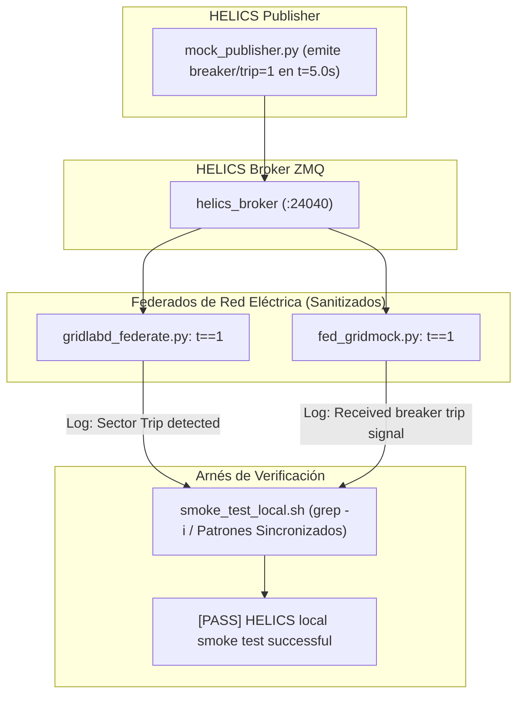

# 🛠️ PLAN DE IMPLEMENTACIÓN Y REMEDIACIÓN TÉCNICA (V2 — REVISADO)
## HALLAZGO-2026-08-31-01: Sanitización de Valores Centinela y Sincronización de Patrones de Smoke Test en Federados HELICS

| Metadatos del Plan | Detalle |
| :--- | :--- |
| **Documento:** | `docs/Audits/PLAN_REMEDIACION_HELICS_SENTINEL.md` |
| **Referencia Hallazgo:** | `HALLAZGO-2026-08-31-01` (🔴 Severidad Alta / Defecto #17) |
| **Módulos Principales:** | `helics_sim/gridlabd_federate.py`, `helics_sim/fed_gridmock.py`, `helics_sim/smoke_test_local.sh` |
| **Módulos Afectados:** | `logs/helics_smoke_*/` |
| **Estándar:** | IEC 62443-3-3 (FR5 - Restricted Data Flow / Integridad de Modelado Ciberfísico) |
| **Estado:** | APROBADO CON OBSERVACIONES / LISTO PARA IMPLEMENTACIÓN |
| **Fecha:** | 2026-08-31 (Revisión V2) |

---

## 1. RESUMEN EJECUTIVO Y ANÁLISIS DE CAUSA RAÍZ

### 1.1 El Problema (Síntomas Combinados)
Al ejecutar el smoke test de co-simulación ciberfísica (`bash helics_sim/smoke_test_local.sh`), se presentan dos fallas encadenadas:

1. **Falso Positivo en Paso Inicial ($t=1.0\,\text{s}$)**:
   El federado `GRIDLABD` entra prematuramente en estado de falla (`TRIPPED`) al inicio de la simulación debido a valores centinela no inicializados de HELICS:
   ```
   INFO:gridlabd_fed:t=1.0 trips=[0, -9223372036854775808, -9223372036854775808] V=1.00pu hospital_load=-9.99e+48kW
   WARNING:gridlabd_fed:Sector trip detected [0, -9223372036854775808, -9223372036854775808] -> switching to TRIPPED state
   ```
2. **Discrepancia de Patrones en el Arnés de Pruebas (Grep Mismatch)**:
   Aun corrigiendo la sanitización, el arnés `smoke_test_local.sh` falla en la verificación final:
   - **Modo Nativo (GridLAB-D)**: `smoke_test_local.sh:26` busca `GRID_TRIP_PATTERN="Trip detected"`, pero `gridlabd_federate.py:124` emite `"Sector trip detected..."` (con `t` minúscula). Debido a la sensibilidad a mayúsculas/minúsculas de `grep`, el test nunca confirma el disparo legítimo emitido en $t=5.0\,\text{s}$.
   - **Modo Mock (Fallback sin GridLAB-D)**: `smoke_test_local.sh:19` busca `GRID_TRIP_PATTERN="Received breaker trip signal"`, cadena que no existe en el código de `fed_gridmock.py`.

---

### 1.2 Causa Raíz (Mecánica Interna)
1. **Semántica de HELICS Core**: En HELICS Value Federates, cuando un suscriptor invoca `helicsInputGetInteger(sub)` o `helicsInputGetDouble(sub)` antes de que el publicador emita un valor válido o cuando el topic no está conectado en el broker, la API C/Python devuelve valores centinela por defecto:
   - Tipo `int64`: `INT64_MIN` (`-9223372036854775808` / `-0x8000000000000000`)
   - Tipo `double`: `-9.999999999999999e+48` (valor empírico pre-publicación de HELICS)
2. **Evaluación Booleana Inválida**:
   - En `helics_sim/gridlabd_federate.py:114-115`:
     ```python
     trips = [h.helicsInputGetInteger(sub) for sub in sub_trips]
     trip = any(t != 0 for t in trips)
     ```
     Como `-9223372036854775808 != 0`, la condición `t != 0` se evalúa como `True` de inmediato.
   - En `helics_sim/fed_gridmock.py:66`:
     ```python
     any_trip = any([water_trip, gas_trip, grid_trip, trans_trip])
     ```
     En Python, `bool(-9223372036854775808) == True`.
3. **Desalineación de Cadenas de Log vs. Arnés**:
   - `gridlabd_federate.py` loguea `"Sector trip detected..."`.
   - `fed_gridmock.py` no emitía ningún log explícito al cambiar a estado tripped.
   - `smoke_test_local.sh` empleaba `grep -q` estricto con patrones no alineados con los emisores.

---

## 2. MATRIZ DE IMPACTO Y ALCANCE



---

## 3. ESPECIFICACIÓN TÉCNICA DE LA SOLUCIÓN

### 3.1 Reglas de Sanitización de Datos
1. **Señales Booleanas / Disparos (Integer Trips)**:
   - Solo un valor entero exacto `1` (o `True`) representa un disparo activo.
   - Cualquier valor negativo centinela (`< -9000000`) o valor `0` debe ser interpretado como estado normal `0`.
   - Regla canónica: `trip = any(t == 1 for t in trips)`.
2. **Mediciones Analógicas de Potencia y Tensión (Double Telemetry)**:
   - Carga de hospital (`hospital_load_kw`): Si `val < -1e20` o `val < 0.0`, adoptar valor nominal base `0.0 kW` (o carga base configurada).
   - Tensión en pu (`voltage_pu`): Si `val < -1e20`, adoptar `1.0 pu`.
   - Frecuencia (`frequency_hz`): Si `val < -1e20`, adoptar `60.0 Hz`.

### 3.2 Sincronización de Contratos de Logging y Arnés
1. **`gridlabd_federate.py`**:
   - Modificar mensaje a: `LOGGER.warning('Sector Trip detected %s -> switching to TRIPPED state', trips)` para coincidir con `GRID_TRIP_PATTERN="Trip detected"`.
2. **`fed_gridmock.py`**:
   - Agregar emisión explícita al detectar trip: `LOGGER.warning('Received breaker trip signal [w=%d g=%d e=%d t=%d] -> switching to TRIPPED state', water_trip, gas_trip, grid_trip, trans_trip)` para coincidir con `GRID_TRIP_PATTERN="Received breaker trip signal"`.
3. **`smoke_test_local.sh`**:
   - Emplear `grep -qi` (búsqueda insensible a mayúsculas/minúsculas) como salvaguarda adicional de resiliencia.

---

## 4. PLAN DE CAMBIOS PASO A PASO

### Paso 1: Modificación en `helics_sim/gridlabd_federate.py`

```diff
--- a/helics_sim/gridlabd_federate.py
+++ b/helics_sim/gridlabd_federate.py
@@ -112,13 +112,20 @@ def main() -> int:
             current_time += POLL_INTERVAL
             h.helicsFederateRequestTime(fed, current_time)
 
-            trips = [h.helicsInputGetInteger(sub) for sub in sub_trips]
-            trip = any(t != 0 for t in trips)
+            # Sanitización de enteros de disparo HELICS:
+            # Valores pre-publicación retornan -9223372036854775808 (INT64_MIN).
+            # Solo t == 1 constituye un disparo válido.
+            raw_trips = [h.helicsInputGetInteger(sub) for sub in sub_trips]
+            trips = [1 if t == 1 else 0 for t in raw_trips]
+            trip = any(t == 1 for t in trips)
 
             voltage_pu = 0.0 if current_tripped else 1.0
             h.helicsPublicationPublishDouble(pub_voltage, voltage_pu)
-            hospital_load_kw = h.helicsInputGetDouble(sub_hospital_load)
+            raw_hospital_load = h.helicsInputGetDouble(sub_hospital_load)
+            hospital_load_kw = 0.0 if raw_hospital_load < -1e20 else max(0.0, raw_hospital_load)
             LOGGER.info('t=%.1f trips=%s V=%.2fpu hospital_load=%.1fkW',
                         current_time, trips, voltage_pu, hospital_load_kw)
 
             if trip and not current_tripped:
-                LOGGER.warning('Sector trip detected %s -> switching to TRIPPED state', trips)
+                LOGGER.warning('Sector Trip detected %s -> switching to TRIPPED state', trips)
                 if use_native_gridlabd:
                     stop_gridlabd(proc, logf)
                     proc, logf = start_gridlabd(TRIPPED_GLM)
```

---

### Paso 2: Modificación en `helics_sim/fed_gridmock.py`

```diff
--- a/helics_sim/fed_gridmock.py
+++ b/helics_sim/fed_gridmock.py
@@ -58,11 +58,22 @@ def main() -> int:
             h.helicsFederateRequestTime(fed, current_time)
 
-            water_trip = h.helicsInputGetInteger(sub_trip)
-            gas_trip   = h.helicsInputGetInteger(sub_gas_trip)
-            grid_trip  = h.helicsInputGetInteger(sub_grid_trip)
-            trans_trip = h.helicsInputGetInteger(sub_trans_trip)
-            hospital_kw = h.helicsInputGetDouble(sub_hospital_load)
+            # Sanitización de sentinels pre-publicación HELICS
+            raw_w = h.helicsInputGetInteger(sub_trip)
+            raw_g = h.helicsInputGetInteger(sub_gas_trip)
+            raw_e = h.helicsInputGetInteger(sub_grid_trip)
+            raw_t = h.helicsInputGetInteger(sub_trans_trip)
+            raw_h = h.helicsInputGetDouble(sub_hospital_load)
+
+            water_trip = 1 if raw_w == 1 else 0
+            gas_trip   = 1 if raw_g == 1 else 0
+            grid_trip  = 1 if raw_e == 1 else 0
+            trans_trip = 1 if raw_t == 1 else 0
+            hospital_kw = 0.0 if raw_h < -1e20 else max(0.0, raw_h)
 
-            any_trip = any([water_trip, gas_trip, grid_trip, trans_trip])
+            any_trip = (water_trip == 1 or gas_trip == 1 or grid_trip == 1 or trans_trip == 1)
+            if any_trip:
+                LOGGER.warning('Received breaker trip signal [w=%d g=%d e=%d t=%d] -> switching to TRIPPED state',
+                               water_trip, gas_trip, grid_trip, trans_trip)
             voltage_pu = 0.0 if any_trip else 1.0
             h.helicsPublicationPublishDouble(pub_voltage, voltage_pu)
```

---

### Paso 3: Modificación en `helics_sim/smoke_test_local.sh`

```diff
--- a/helics_sim/smoke_test_local.sh
+++ b/helics_sim/smoke_test_local.sh
@@ -84,7 +84,7 @@ if ! grep -q "ready" "$LOG_DIR/mock_publisher.log"; then
 if ! grep -q "$GRID_READY_PATTERN" "$GRID_LOG"; then
     echo "[FAIL] Grid federate not ready"
     exit 1
 fi
-if ! grep -q "$GRID_TRIP_PATTERN" "$GRID_LOG"; then
+if ! grep -qi "$GRID_TRIP_PATTERN" "$GRID_LOG"; then
     echo "[FAIL] Grid federate did not receive trip signal"
     exit 1
 fi
```

---

### Paso 4: Suite de Pruebas Unitarias Automatizadas
Crear `helics_sim/tests/test_sentinel_sanitization.py`:
- Test 1: Verificar que `[0, -9223372036854775808, -9223372036854775808]` evalúa a `trip=False`.
- Test 2: Verificar que `[1, -9223372036854775808, 0]` evalúa a `trip=True`.
- Test 3: Verificar que `-9.99e48` en `hospital_load` se normaliza a `0.0 kW`.
- Test 4: Verificar que el string de log emitido coincide con los patrones requeridos por `smoke_test_local.sh`.

---

## 5. PROTOCOLO DE VALIDACIÓN Y CRITERIOS DE ACEPTACIÓN

1. **Prueba de Humo Local (Smoke Test)**:
   ```bash
   bash helics_sim/smoke_test_local.sh
   ```
   *Criterio de éxito*: Salida exacta `[PASS] HELICS local smoke test successful` (exit code 0), confirmando que el disparo se detecta en $t=5.0\,\text{s}$ sin falsos positivos iniciales.
2. **Suite Completa de Tests**:
   ```bash
   PYTHONPATH=. python3 -m pytest helics_sim/tests -v
   PYTHONPATH=. python3 -m pytest network/tests plc/tests physical helics_sim attacker/tests -q
   ```
   *Criterio de éxito*: **241+ PASS**, 0 errores.
3. **Actualización del Grafo de Conocimiento**:
   ```bash
   /graphify . --update
   ```
   *Criterio de éxito*: Registro de auditoría actualizado a 0🔴 hallazgos pendientes.

---

## 6. PLAN DE CONTINGENCIA Y ROLLBACK

En caso de regresión:
```bash
git checkout HEAD -- helics_sim/gridlabd_federate.py helics_sim/fed_gridmock.py helics_sim/smoke_test_local.sh
```
El cambio es 100% no destructivo y preserva la compatibilidad con todas las fases de co-simulación.
