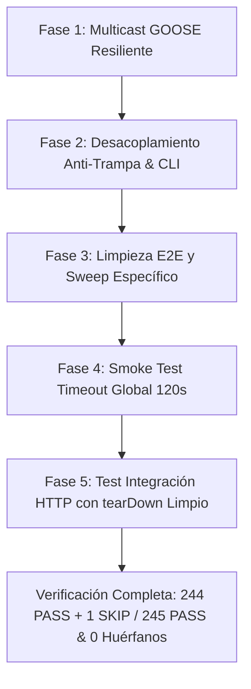

# 🛠️ PLAN DE IMPLEMENTACIÓN Y REMEDIACIÓN TÉCNICA QA (REVISIÓN V2 — POST-AUDITORÍA)
## HALLAZGOS-QA-2026-09-01: Estabilización de Multicast, Integridad Anti-Trampa, Limpieza de Procesos y Resiliencia en CityLab Cyber Range

| Metadatos del Plan | Detalle |
| :--- | :--- |
| **Documento:** | `docs/Audits/PLAN_REMEDIACION_QA_20260901.md` |
| **Referencia Auditoría:** | `QA-REPORT-2026-09-01` (品保報 — CityLab Cyber Range) |
| **Revisión:** | V2 — Enmiendas de seguridad y preservación de ramas CTF |
| **Commit Base:** | `78d5620b2a7b354f9c2e0777f427c70beafc50ce` (Rama `test`, v0.15.0) |
| **Módulos Principales:** | `attacker/attack_goose_spoofing.py`, `attacker/attack_kerberoast_ad.py`, `scripts/validate_e2e.sh`, `citylab.sh`, `helics_sim/smoke_test_phase4.sh`, `helics_sim/smoke_test_phase7.sh` |
| **Módulos de Test:** | `plc/tests/test_iec61850.py`, `attacker/tests/test_attack_kerberoast.py`, `network/tests/test_scada_http_strict_integration.py` |
| **Estándares:** | IEC 62443-3-3 / NIST SP 800-82r3 / Reglas de Calidad CityLab (Anti-trampa #18, Limpieza #12/#16, Preservación de Ramas / Regla de Oro) |
| **Estado:** | REVISADO Y APROBADO TRAS AUDITORÍA DE SUPERVISIÓN |
| **Fecha:** | 2026-09-02 |

---

## 1. RESUMEN EJECUTIVO Y ANÁLISIS DE CAUSA RAÍZ

### 1.1 Contexto
La auditoría de control de calidad del 2026-09-01 validó una base de **244 tests PASS + 1 FLAKY** sobre un total declarado de 245 tests, junto con la ejecución exitosa de los scripts de humo de co-simulación HELICS y la suite End-to-End Mininet bajo privilegios de superusuario (`sudo`).

La revisión de supervisión del plan V1 dictaminó ajustes obligatorios en las Fases 1, 2, 3, 5 y en los criterios de aceptación para:
- No quebrar la funcionalidad CTF ni forzar rutas que conviertan un error de red en un fallo silencioso de recepción (*Regla de Oro: no borrar ramas para obtener verde*).
- Reflejar la distinción entre modo real y contingencia simulada a nivel de CLI y logs de ataque.
- Evitar patrones `pkill` genéricos que colisionen con procesos no relacionados en el espacio de PID compartido del host.
- Ajustar los criterios de evaluación numérica de pruebas unitarias y tiempos de smoke tests a la realidad operativa comprobada.

### 1.2 Diagnóstico Detallado

1. **Test Inestable Multicast GOOSE (Flaky Test #9 / #13-adjacent)**:
   - *Falla*: `plc/tests/test_iec61850.py::TestIEC61850Emulator::test_multicast_goose_and_sv_reception` falla intermitentemente en ejecuciones completas con `OSError: [Errno 101] Network is unreachable` en `attacker/attack_goose_spoofing.py:73` (`sock.sendto`).
   - *Causa Raíz*: `spoof_goose_trip` transmite al grupo multicast `239.0.0.1` sin asociar `IP_MULTICAST_IF`. La resolución de ruta delega en la NIC física o USB del host (`enp0s20f0u1`), que carece de ruta en el kernel para `224.0.0.0/4`.
   - *Corrección Auditada*: **NO hardcodear** `IP_MULTICAST_IF=127.0.0.1` en producción porque confina el tráfico a `lo` en Mininet impidiendo que el atacante alcance `h_ied` a través de switches virtuales (rompiendo el escenario CTF). La solución canónica y honesta es permitir inyección opcional por variable de entorno `GOOSE_MULTICAST_IF` (por defecto `None`) y manejar el fallo con `self.skipTest` en `test_iec61850.py` cuando el host carece de enrutamiento multicast.

2. **Falso Positivo en Kerberoasting AD (Defecto #18 / Anti-Trampa)**:
   - *Falla*: `attacker/attack_kerberoast_ad.py:97` asigna `'ticket_received': ticket_raw is not None or mode == 'TABLETOP_FALLBACK'`, reportando `ticket_received=True` sin ticket real.
   - *Corrección Auditada*: Desacoplar `'ticket_received': ticket_raw is not None` de `'ticket_simulated': mode == 'TABLETOP_FALLBACK'`. Asimismo, hacer visible esta distinción en el CLI (`main()`) y logs para que el operador o arnés reconozca si el éxito es real o simulado.

3. **Falsa Limpieza y Acumulación de Procesos Huérfanos (#12 / #16)**:
   - *Falla*: Tras ejecutar `validate_e2e.sh`, se acumulan ~45 procesos de `root` huérfanos.
   - *Corrección Auditada*: Registrar los PIDs en `/tmp/citylab_daemons.pids` al momento del spawn en Mininet. En el teardown, **restringir estrictamente** los patrones de `pkill` a los ejecutables de CityLab (evitando comodines como `server` o `attack` que matarían procesos legítimos del host). En `network/topology.py`, asegurar que la suite interna `--test` invoque la limpieza al salir.

4. **Presupuesto de Tiempo Global en Smoke Tests HELICS (#12)**:
   - *Falla*: `smoke_test_phase4.sh` y `smoke_test_phase7.sh` ejecutan `wait` sin límite de tiempo.
   - *Corrección Auditada*: Establecer un presupuesto de tiempo global acumulado de 120 segundos para todos los federados y el broker.

5. **Integración HTTP SCADA bajo `STRICT_AUTH=1` sin Contaminación**:
   - *Corrección Auditada*: El nuevo test de integración debe certificar los códigos HTTP (401, 403, 200) y **restaurar obligatoriamente** el valor original de `STRICT_AUTH` en `tearDown` para evitar contaminación ambiental (Defecto #3).

---

## 2. PLAN TÉCNICO DE REMEDIACIÓN REVISADO



---

### FASE 1: Estabilización de Multicast GOOSE sin Ruptura de CTF
**Módulos:** `attacker/attack_goose_spoofing.py`, `plc/tests/test_iec61850.py`

1. Modificar `attacker/attack_goose_spoofing.py`:
   - No forzar estáticamente `127.0.0.1`. Soportar la variable de entorno opcional `GOOSE_MULTICAST_IF` (por defecto `None`). Si está definida, enlazar `IP_MULTICAST_IF`:
   ```python
   sock = socket.socket(socket.AF_INET, socket.SOCK_DGRAM)
   if is_multicast_addr(target_host):
       try:
           sock.setsockopt(socket.IPPROTO_IP, socket.IP_MULTICAST_TTL, 2)
           sock.setsockopt(socket.IPPROTO_IP, socket.IP_MULTICAST_LOOP, 1)
           mcast_if = os.getenv("GOOSE_MULTICAST_IF")
           if mcast_if:
               sock.setsockopt(socket.IPPROTO_IP, socket.IP_MULTICAST_IF, socket.inet_aton(mcast_if))
       except OSError:
           pass
   ```
2. Modificar `plc/tests/test_iec61850.py`:
   - En `test_multicast_goose_and_sv_reception`, capturar `OSError` cuando el código de error sea `errno.ENETUNREACH`:
   ```python
   try:
       spoof_goose_trip(
           target_host=MULTICAST_GOOSE_ADDR,
           target_port=15104,
           ied_name='CITYLAB_IED1',
           st_num=888,
           breaker_pos=False
       )
   except OSError as exc:
       import errno
       if exc.errno == errno.ENETUNREACH:
           self.skipTest(f"Enrutamiento multicast no disponible en interfaz host: {exc}")
       raise
   ```
   *Efecto*: Si el host carece de tabla de enrutamiento para `224.0.0.0/4`, la prueba se salta explícita y honestamente sin enmascarar fallos ni romper escenarios inter-host en Mininet.

---

### FASE 2: Integridad Anti-Trampa en Kerberoast AD y Visibilidad CLI
**Módulos:** `attacker/attack_kerberoast_ad.py`, `attacker/tests/test_attack_kerberoast.py`

1. Modificar `attacker/attack_kerberoast_ad.py`:
   - En `execute_kerberoast_escalation`:
     ```python
     return {
         'status': 'SUCCESS',
         'mode': mode,
         'account': account,
         'kdc_reachable': kdc_reachable,
         'ticket_received': ticket_raw is not None,
         'ticket_simulated': mode == 'TABLETOP_FALLBACK',
         'extracted_role': role,
         'http_status': status,
         'is_engineer': role == 'engineer',
         'scada_control_write_executed': scada_executed,
         'scada_http_code': scada_http_code,
     }
     ```
   - En `main()`:
     ```python
     if res.get('ticket_simulated'):
         LOGGER.warning("[TABLETOP_FALLBACK] Kerberoasting ejecutado en modo simulado (sin ticket criptografico real)")
     elif res.get('ticket_received'):
         LOGGER.info("[SOCKET_LIVE] Ticket TGS criptografico obtenido exitosamente del KDC")
     ```
2. Modificar `attacker/tests/test_attack_kerberoast.py`:
   - En `test_kerberoast_live_socket_kdc`:
     `self.assertTrue(res['ticket_received'])` y `self.assertFalse(res['ticket_simulated'])`.
   - En `test_kerberoast_fallback_mode`:
     `self.assertFalse(res['ticket_received'])` y `self.assertTrue(res['ticket_simulated'])`.

---

### FASE 3: Limpieza Segura de Procesos y Eliminación de Huérfanos
**Módulos:** `scripts/validate_e2e.sh`, `citylab.sh`, `network/topology.py`

1. Modificar `scripts/validate_e2e.sh`:
   - Registrar de forma fiable los PIDs en `/tmp/citylab_daemons.pids`:
     ```bash
     h_ied.cmd(f'nohup env PYTHONUNBUFFERED=1 PYTHONPATH={repo_root} {py_bin} {repo_root}/plc/iec61850_emulator.py --host 10.0.3.20 --goose-port 10102 > /tmp/h_ied_e2e.log 2>&1 & echo $! >> /tmp/citylab_daemons.pids')
     h_gw.cmd(f'nohup env PYTHONUNBUFFERED=1 PYTHONPATH={repo_root} {py_bin} {repo_root}/plc/opcua_emulator.py --host 10.0.3.30 --port 4840 > /tmp/h_gw_e2e.log 2>&1 & echo $! >> /tmp/citylab_daemons.pids')
     h_elec.cmd(f'nohup env PYTHONUNBUFFERED=1 PYTHONPATH={repo_root} {py_bin} {repo_root}/plc/dnp3_emulator.py --host 10.0.3.13 --port 20000 > /tmp/h_elec_e2e.log 2>&1 & echo $! >> /tmp/citylab_daemons.pids')
     h_honey.cmd(f'nohup env PYTHONUNBUFFERED=1 PYTHONPATH={repo_root} {py_bin} {repo_root}/plc/honeypot_server.py --host 10.0.5.99 --port 502 > /tmp/h_honey_e2e.log 2>&1 & echo $! >> /tmp/citylab_daemons.pids')
     h_dc.cmd(f'nohup env PYTHONUNBUFFERED=1 PYTHONPATH={repo_root} {py_bin} {repo_root}/network/ad_dc_emulator.py --host 10.0.1.20 > /tmp/h_dc_e2e.log 2>&1 & echo $! >> /tmp/citylab_daemons.pids')
     ```
   - En el bloque `finally`, emplear **únicamente** la lista blanca canónica de procesos de CityLab (evitando matar procesos host inocentes):
     ```python
     CITYLAB_PROC_PATTERN = "modbus_emulator.py|dnp3_emulator.py|iec61850_emulator.py|opcua_emulator.py|honeypot_server.py|ad_dc_emulator.py|scada_server.py|fed_icssim.py|fed_transport.py|fed_hospital.py|fed_logger.py|fed_desal.py|fed_lighting.py|fed_sis.py|gridlabd_federate.py|fed_gridmock.py|helics_broker"
     for node_name in ('h_ied', 'h_gateway', 'h_plc_elec', 'h_honey', 'h_dc', 'h_attacker', 'h_scada'):
         try:
             net.get(node_name).cmd(f"pkill -9 -f '{CITYLAB_PROC_PATTERN}' 2>/dev/null || true")
         except Exception:
             pass
     ```
2. Modificar `citylab.sh` (`cmd_down`):
   - Ejecutar la secuencia de barrido estricta con `-15` y luego `-9` sobre la lista canónica idéntica.
3. Clarificación en `network/topology.py`:
   - El comando `topology.py --test` asegura la invocación de `teardown_topology_and_daemons(net)` en su bloque `finally`.

---

### FASE 4: Presupuesto de Tiempo Global en Smoke Tests HELICS
**Módulos:** `helics_sim/smoke_test_phase4.sh`, `helics_sim/smoke_test_phase7.sh`

1. Implementar temporizador acumulativo global de 120 segundos:
   ```bash
   WAIT_TIMEOUT=120
   START_TIME=$(date +%s)
   FAIL=0

   for pid in "${PIDS[@]}"; do
       while kill -0 "$pid" 2>/dev/null; do
           NOW=$(date +%s)
           if [ $((NOW - START_TIME)) -ge "$WAIT_TIMEOUT" ]; then
               echo "[FAIL] Smoke test excedio el presupuesto de tiempo global de ${WAIT_TIMEOUT}s. Matando procesos..."
               kill -9 "${PIDS[@]}" 2>/dev/null || true
               exit 1
           fi
           sleep 0.5
       done
       wait "$pid" || FAIL=1
   done
   ```

---

### FASE 5: Test de Integración HTTP SCADA con Aislamiento de Entorno
**Módulo:** `network/tests/test_scada_http_strict_integration.py` [NUEVO]

1. Crear suite de tests que verifique:
   - Configuración de `os.environ['STRICT_AUTH'] = '1'`.
   - En `setUp`: almacenar el valor previo de `STRICT_AUTH`.
   - En `tearDown`: **restablecer obligatoriamente** el valor previo de `STRICT_AUTH` en `os.environ` para prevenir fuga de entorno (Defecto #3).
   - Verificaciones HTTP reales:
     - Sin header `Authorization` $\to$ `401 Unauthorized`.
     - Token con rol `operator` en `/api/control/write` $\to$ `403 Forbidden`.
     - Token con rol `engineer` en `/api/control/write` $\to$ `200 OK` y confirmación de persistencia en `HistorianTSDB`.

---

## 3. PROTOCOLO DE VERIFICACIÓN Y CRITERIOS DE ACEPTACIÓN CORREGIDOS

### 3.1 Pruebas Unitarias e Integración (Pytest)
```bash
# 1. Test unitario multicast específico
PYTHONPATH=. python3 -m pytest plc/tests/test_iec61850.py -k test_multicast_goose_and_sv_reception -v

# 2. Test unitario Kerberoast AD
PYTHONPATH=. python3 -m pytest attacker/tests/test_attack_kerberoast.py -v

# 3. Nuevo test de integración SCADA HTTP
PYTHONPATH=. python3 -m pytest network/tests/test_scada_http_strict_integration.py -v

# 4. Batería completa del proyecto
PYTHONPATH=. python3 -m pytest network/tests plc/tests physical helics_sim attacker/tests -q
```
**Criterio de Aceptación:**
- **244 PASS + 1 SKIP** (en máquinas anfitrionas sin enrutamiento multicast `224.0.0.0/4`)
- **245 PASS** (en máquinas con interfaz y ruta multicast activa)
- **0 FAIL, 0 FLAKY**.

### 3.2 Pruebas de Humo (Smoke Tests)
```bash
./helics_sim/smoke_test_phase4.sh
./helics_sim/smoke_test_phase7.sh
```
**Criterio de Aceptación:**
- Salida limpia `EXIT=0` y finalización en **$<120$ segundos** (tiempo real esperado: 15s a 35s).

### 3.3 Validación E2E Mininet y Verificación de Entorno Limpio
```bash
sudo ./citylab.sh down
sudo python3 network/topology.py --test
sudo ./scripts/validate_e2e.sh
sudo ./citylab.sh down

# Verificación de ausencia absoluta de procesos huérfanos
ps -eo pid,args | grep -E "emulator|fed_|helics_broker" | grep -v grep
```
**Criterio de Aceptación:** Salida de `ps` completamente vacía (0 procesos huérfanos).
