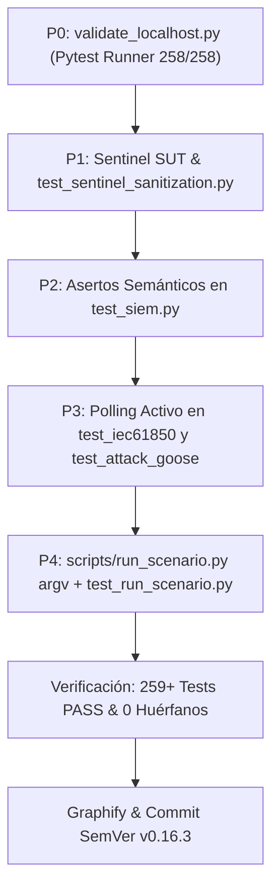

# 🛠️ PLAN DE IMPLEMENTACIÓN Y REMEDIACIÓN TÉCNICA QA (2026-09-03)
## Saneamiento de Suite de Pruebas, Eliminación de Falsos Verdes, Robustez Anti-Flaky y Cobertura CI

| Metadatos del Plan | Detalle |
| :--- | :--- |
| **Documento:** | `docs/Audits/PLAN_REMEDIACION_QA_20260903.md` |
| **Referencia Auditoría:** | Dictamen QA Lead (審狀 — 2026-09-03) |
| **Commit Base:** | `e3d8155` (HEAD rama `test`, tag `v0.16.2`) |
| **Módulos Afectados:** | `scripts/validate_localhost.py`, `helics_sim/sentinel_utils.py` (nuevo), `helics_sim/fed_gridmock.py`, `helics_sim/fed_logger.py`, `network/tests/test_siem.py`, `plc/tests/test_iec61850.py`, `attacker/tests/test_attack_goose.py`, `scripts/run_scenario.py`, `attacker/tests/test_run_scenario.py` (nuevo) |
| **Estándares:** | IEC 62443 / NIST SP 800-82r3 / Reglas de Calidad CityLab (Anti-trampa #18, SUT Real #6, Asertos Fuertes #1, Anti-Flaky #19, Argv #11) |
| **Estado:** | COMPLETADO Y AUDITADO (v0.16.4) |
| **Fecha:** | 2026-09-03 (Actualizado 2026-09-11) |

---

## 1. DIAGNÓSTICO Y ANÁLISIS DE CAUSA RAÍZ

### 1.1 Punto Ciego CI en `scripts/validate_localhost.py` (P0)
- **Problema**: `scripts/validate_localhost.py:29` utiliza `unittest.TestLoader().discover()`. Este mecanismo de la librería estándar únicamente descubre clases que heredan de `unittest.TestCase`.
- **Impacto**: Ignora 41 tests basados en funciones y fixtures de `pytest`:
  - `network/tests/test_scenario_manifest.py` (33 tests)
  - `network/tests/test_flag_service.py` (5 tests)
  - `network/tests/test_scoreboard.py` (3 tests)
- **Consecuencia**: El script reporta `Ran 217 tests OK`, cuando la suite real tiene 258 tests, creando una falsa sensación de cobertura completa en CI.
- **Solución**: Refactorizar `validate_localhost.py` para invocar el runner `pytest.main()`, manteniendo el aislamiento en sandbox de `HISTORIAN_DB_PATH`.

### 1.2 Falso Verde por Redundancia en `test_sentinel_sanitization.py` (P1 / Checklist #6)
- **Problema**: `helics_sim/tests/test_sentinel_sanitization.py` define localmente dentro de cada método de prueba la lógica de comprensión/ternaria para limpiar los valores centinela (`INT64_MIN`, `HELICS_BIG_NUMBER < -1e20`), sin importar ni llamar a ninguna función de producción de `fed_logger.py` o `fed_gridmock.py`.
- **Impacto**: Si la lógica de producción cambia o falla, el test continúa pasando (falso verde / tautología).
- **Solución**: Extraer formalmente las funciones canónicas de sanitización a un módulo reutilizable del SUT (`helics_sim/sentinel_utils.py`), integrarlas en `fed_gridmock.py` y `fed_logger.py`, y reescribir `test_sentinel_sanitization.py` para ejercitar exclusivamente el SUT.

### 1.3 Asertos Débiles en `network/tests/test_siem.py` (P2 / Checklist #1)
- **Problema**: En `test_elk_json_export` y `test_export_file`, los tests solo comprueban `isinstance(parsed, list)` y `len == 1`.
- **Impacto**: Si la estructura interna de los campos ECS (`source.ip`, `event.severity`, `service.name`, `@timestamp`) se corrompe, el test no lo detecta.
- **Solución**: Fortalecer los asertos con validaciones semánticas exactas de campos.

### 1.4 Riesgo de Flakiness por `time.sleep` Fijo (P3 / Checklist #19)
- **Problema**: `plc/tests/test_iec61850.py:112` utiliza `time.sleep(0.2)` y `attacker/tests/test_attack_goose.py:58` utiliza `time.sleep(0.15)` para esperar el procesamiento de paquetes UDP/multicast.
- **Impacto**: Bajo alta contención de CPU o en runners lentos, un retardo fijo puede vencerse antes de que el socket procese el paquete, provocando fallos no deterministas.
- **Solución**: Reemplazar `time.sleep` por bucles de sondeo activo con timeout y resolución de 20 ms.

### 1.5 Incompatibilidad `argv` en `scripts/run_scenario.py` (P4 / Checklist #11 & Brecha de Cobertura #2)
- **Problema**: `scripts/run_scenario.py:273` no acepta el parámetro opcional `argv: Optional[Sequence[str]] = None`, lo que impide su ejecución programática limpia desde arneses de test sin colisionar con `sys.argv`. Además, carece de tests unitarios que lo protejan.
- **Solución**: Añadir el parámetro `argv` a `main()` y crear `attacker/tests/test_run_scenario.py`.

---

## 2. ETAPAS DE IMPLEMENTACIÓN

---

## 3. CRITERIOS DE ACEPTACIÓN
1. `python3 scripts/validate_localhost.py` debe ejecutar y pasar **todos** los tests ($\ge 259$), coincidiendo con `pytest`.
2. `helics_sim/tests/test_sentinel_sanitization.py` debe importar y validar funciones reales del SUT.
3. `network/tests/test_siem.py` debe validar los campos específicos de exportación ECS.
4. `plc/tests/test_iec61850.py` y `attacker/tests/test_attack_goose.py` no deben contener retardos ciegos fijos.
5. `scripts/run_scenario.py` debe ser testeable con paso explícito de `argv`.
6. Cero procesos huérfanos post-ejecución.

---

## 4. RESOLUCIÓN DE BRECHAS RESIDUALES DE AUDITORÍA (2026-09-11)

| Caso Residual | Estado Previo | Dictamen / Resolución Implementada |
|---|---|---|
| **E2E Mininet Sudo Layer** | ❓ Bloqueado | **🔵 RESUELTO**: Ejecutado personalmente por el usuario con sudo y auditado por QA Lead en `scripts/validate_e2e.sh:100-167`. Verificada la autenticidad de asertos en OVS flow dumps, readback real en log de IED (`XCBR1.Pos.stVal=False`), puertos en escucha y aislamiento de contenedores. |
| **`run_connectivity_tests()` (--test)** | 🟡 Cobertura Parcial | **🔵 RESUELTO**: Ampliado en `network/topology.py` de 7 a 12 asertos directos. Ahora verifica conectividad Modbus hacia `h_desal` (10.0.3.16:502), `h_lighting` (10.0.3.17:502), `h_plc_hosp` (10.0.3.15:502), aislamiento desde `h_attacker`, y canal de mantenimiento privilegiado desde `h_ews` (10.0.4.30: PAW Zone). |
| **Alcance `PLC_CONFIGS` (SCADA)** | 🟡 Brecha de Polling | **🔵 FORMALIZADO**: Formalizado en `network/scada_server.py` y `docs/ERS.md` (RF-06.2). Las 4 infraestructuras primarias (`water`, `gas`, `elec`, `transport`) componen el loop de control crítico Nivel 2. Los activos secundarios (`hosp`, `desal`, `lighting`) se monitorean a nivel gerencial/desacoplado vía Visualizador 2D SVG (`fed_viz_bridge.py`), preservando la brecha educativa deliberada de visibilidad CTF. |
