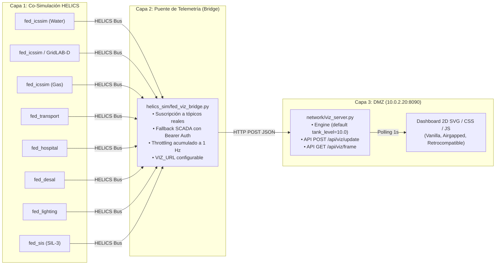

# 🏗️ PLAN DE IMPLEMENTACIÓN TÉCNICA: VISUALIZADOR URBANO 2D (FASE 9)
## Arquitectura de Telemetría HELICS $\to$ Viz Server, Fallback SCADA Autenticado y Dashboard 2D Airgapped

| Metadatos del Plan | Detalle |
| :--- | :--- |
| **Documento:** | `docs/Audits/PLAN_VISUALIZADOR_2D_FASE9.md` |
| **Referencia Auditoría:** | `FASE-9-VIZ-2D` (審狀 — Plan Visualizador 2D) |
| **Revisión:** | V3 — Enmienda 5 incorporada (State Engine Keys, Sector Validation HTTP 400 y UI/Test Coverage) |
| **Commit Base:** | `3ca0b65` (Rama `test`, Tag: `v0.15.2`) |
| **Módulos Principales:** | `helics_sim/fed_viz_bridge.py`, `network/viz_server.py`, `citylab.sh`, `scripts/validate_e2e.sh` |
| **Módulos de Test:** | `helics_sim/tests/test_fed_viz_bridge.py`, `network/tests/test_viz.py`, `network/tests/test_viz_server.py` |
| **Estándares:** | IEC 62443-3-3 (Segmentación DMZ / Mínimo Privilegio) / NIST SP 800-82r3 |
| **Estado:** | APROBADO CON 5 ENMIENDAS TÉCNICAS |
| **Fecha:** | 2026-09-02 |

---

## 1. RESUMEN EJECUTIVO Y DIAGNÓSTICO

### 1.1 Contexto y Oportunidad Arquitectónica
El Cyber Range CityLab cuenta con un servidor visualizador en la DMZ ([`network/viz_server.py`](../network/viz_server.py), puerto `8090`, instanciado en Mininet sobre `h_scada` @ `10.0.2.20:8090`). Dicho servidor dispone de:
1. Un motor de estado de 5 sectores (`water`, `gas`, `elec`, `transport`, `hospital`).
2. Endpoints HTTP activos (`GET /api/viz/frame`, `GET /api/viz/history`, `POST /api/viz/update`).
3. Una página HTML básica que actualmente solo realiza un volcado cíclico del JSON en una etiqueta `<pre id="viewport"></pre>`.

### 1.2 Diagnóstico de Brecha (Gap Real)
Un rastreo exhaustivo de la base de código evidenció que **ningún componente emite peticiones a `/api/viz/update`**. El servidor visualizador opera como un cascarón desconectado que muestra valores hardcodeados estáticos.
Para cerrar esta brecha con alta fidelidad y bajo riesgo operativo, se establece una estrategia en dos paquetes de trabajo desacoplados:
- **Paquete 1 (Fase A)**: Puente de datos liviano (`helics_sim/fed_viz_bridge.py`) que conecta la co-simulación física y el sondeo SCADA con el visualizador.
- **Paquete 2 (Fase B)**: Frontend 2D reactivo en SVG/Vanilla JS integrado en [`network/viz_server.py`](../network/viz_server.py), sin dependencias externas (100% airgapped).



---

## 2. LAS 4 ENMIENDAS TÉCNICAS AUDITADAS Y APROBADAS

La revisión técnica formal incorporó 4 enmiendas obligatorias ancladas en la verificación directa de la base de código:

### 🔴 Enmienda 1: Corrección de Tópicos HELICS Reales
El plan inicial presentaba discrepancias con los identificadores reales declarados en los federados. Se alinean estrictamente a los publicadores existentes:
- **`desal/hp_pump_trip` $\to$ `desal/pump_trip`**: En el código real, el disparo de la bomba de alta presión de la desalinizadora es emitido por [`helics_sim/fed_sis.py:96`](../helics_sim/fed_sis.py#L96) y suscrito por [`helics_sim/fed_desal.py:50`](../helics_sim/fed_desal.py#L50) bajo el tópico `desal/pump_trip`.
- **Inclusión de publicaciones de Desalinizadora**: [`helics_sim/fed_desal.py:51-54`](../helics_sim/fed_desal.py#L51-L54) publica `desal/power_kw` y `desal/tank_level_pct`. Ambos se incorporan al puente.
- **Inclusión de Alumbrado Inteligente y SIS**: Confirmación de `lighting/power_kw` ([`helics_sim/fed_lighting.py:87`](../helics_sim/fed_lighting.py#L87)) y `sis/trip` ([`helics_sim/fed_sis.py:95`](../helics_sim/fed_sis.py#L95)).

| Tópico HELICS Verificado | Tipo de Dato | Origen / Publicador | Destino en Visualizador |
|---|---|---|---|
| `water/t1_level`, `water/t2_level` | Double | `fed_icssim.py` (Water) | Sector `water` (`tank_level`, `t1_level`) |
| `breaker/trip` | Integer | `fed_icssim.py` (Water) | Sector `water` (`pump_running`, `alert`) |
| `gas/pressure` | Double | `fed_icssim.py` (Gas) | Sector `gas` (`pressure_psi`) |
| `gas/trip` | Integer | `fed_icssim.py` (Gas) | Sector `gas` (`valve_open`, `alert`) |
| `grid/frequency`, `grid/voltage_pu` | Double | `fed_icssim.py` / `gridlabd` | Sector `elec` (`grid_voltage`, `frequency`) |
| `grid/trip` | Integer | `fed_icssim.py` (Elec) | Sector `elec` (`blackout`, `breaker_open`) |
| `transport/congestion` | Double | `fed_transport.py` | Sector `transport` (`congestion_pct`) |
| `transport/trip` | Integer | `fed_transport.py` | Sector `transport` (`traffic_light`, `railway_gate`) |
| `hospital/load_kw`, `hospital/on_ups`| Double / Int | `fed_hospital.py` | Sector `hospital` (`powered`, `generator_active`) |
| `desal/pump_trip` | Integer | `fed_sis.py` | Sector `desal` (`pump_trip`) |
| `desal/power_kw` | Double | `fed_desal.py` | Sector `desal` (`power_kw`) |
| `desal/tank_level_pct` | Double | `fed_desal.py` | Sector `desal` (`tank_level_pct`) |
| `lighting/power_kw` | Double | `fed_lighting.py` | Sector `lighting` (`power_kw`) |
| `sis/trip` | Integer | `fed_sis.py` | Sector `safety` (`sis_trip`) |

### 🔴 Enmienda 2: Autenticación RBAC Obligatoria en Modo Fallback SCADA
En despliegues sin broker HELICS (Mininet standalone o tests puramente de red), el puente puede consultar el estado consolidado de los PLCs desde el servidor SCADA ([`network/scada_server.py:147-167`](../network/scada_server.py#L147-L167)).
- Toda petición `GET` a excepción de `/health` es validada por el módulo RBAC ([`network/rbac.py`](../network/rbac.py)). Peticiones sin token reciben `401 Unauthorized` (o `403 Forbidden` si `STRICT_AUTH=1`).
- **Resolución**: `fed_viz_bridge.py` inyecta obligatoriamente la cabecera:
  ```http
  Authorization: Bearer auditor:AUDIT_TOKEN_2026
  ```
  Permitiendo consultar el endpoint de telemetría consolidada `GET /api/telemetry` ([`network/scada_server.py:172`](../network/scada_server.py#L172)), garantizando plena conformidad con el Principio de Mínimo Privilegio (el rol `auditor` tiene permisos de solo lectura y no puede ejecutar comandos en `/api/control/write`). El token es parametrizable mediante la variable de entorno `SCADA_BEARER_TOKEN`.

### 🟡 Enmienda 3: `VIZ_URL` Dinámico y Configurable
- En pruebas unitarias, CI y ejecuciones locales sin Mininet, el host `10.0.2.20` no existe en la tabla de enrutamiento del kernel Linux.
- **Resolución**: El destino del visualizador se parametriza mediante:
  1. Argumento CLI: `--viz-url <URL>`
  2. Variable de entorno: `os.environ.get('VIZ_URL', 'http://127.0.0.1:8090')`
  3. En Mininet (`network/topology.py`), la invocación del daemon define automáticamente `VIZ_URL=http://10.0.2.20:8090`.

### 🟡 Enmienda 4: Throttling de Emisión a 1 Hz y Despacho Consolidado
- En simulaciones aceleradas o co-simulaciones con micro-pasos temporales, HELICS puede generar decenas de actualizaciones de variables por segundo. Emitir un `POST` HTTP individual por variable o por sub-segundo saturaría el socket server `BaseHTTPRequestHandler` de `viz_server.py`.
- **Resolución**:
  - `fed_viz_bridge.py` mantiene un diccionario local de estado acumulado (`_local_state`).
  - La sincronización HTTP hacia `/api/viz/update` se regula a una frecuencia máxima de **1 Hz** (1 despacho por segundo), consolidando los sectores modificados en una única ráfaga o transacción por lotes (`sectors`), optimizando el uso de CPU y sockets de red.

### 🔴 Enmienda 5: Soporte de Nuevos Sectores en Engine (`desal`, `lighting`, `safety`) y Validación HTTP 400
- **Diagnóstico de Brecha**: `CityVisualizerStateEngine.__init__` sólo define 5 sectores (`water`, `gas`, `elec`, `transport`, `hospital`). En `network/viz_server.py:40`, `if sector in self.state['city_sectors']` carece de bloque `else`; si el puente emite `POST` para `desal`, el servidor respondía `200 OK` falsamente mientras descartaba la telemetría.
- **Resolución**:
  1. **Nuevos sectores en `CityVisualizerStateEngine.__init__`**: Se incorporan `desal` (`{'power_kw': 45.0, 'tank_level_pct': 75.0, 'pump_trip': False}`), `lighting` (`{'power_kw': 120.0}`) y `safety` (`{'sis_trip': False}`). Los 5 sectores originales y sus valores por defecto se conservan 100% inalterados (`tank_level == 10.0`, etc.).
  2. **Rechazo explícito de sectores desconocidos**: `update_sector_state(sector, payload)` retorna `bool` (`False` si el sector no existe). El endpoint `POST /api/viz/update` retorna código HTTP `400 Bad Request` en caso de sector inválido (con test unitario negativo).
  3. **Visualización en UI (Fase B)**: Los 3 sectores se integran en el tablero SVG (planta desalinizadora, consumo de alumbrado público y banner de estado de seguridad SIS SIL-3).
  4. **Suite de pruebas**: Casos en `test_fed_viz_bridge.py` para la traducción de los 3 nuevos sectores y en `test_viz_server.py` para el rechazo con 400.

---

## 3. ESPECIFICACIÓN TÉCNICA DE COMPONENTES

### 3.1 Componente: Puente de Telemetría (`helics_sim/fed_viz_bridge.py`)
- **Dependencias**: Python stdlib puro (`urllib.request`, `json`, `time`, `logging`, `os`, `argparse`). Importación condicional y protegida de `helics` (`try: import helics as h except ImportError`).
- **Modos de Operación**:
  1. **Modo HELICS (por defecto con broker)**: Inicializa federado de valores (`HELICS_FED_NAME=VIZ_BRIDGE_fed`), registra suscripciones globales, entra en bucle `helicsFederateRequestTime()` con `POLL_INTERVAL=1.0` y traduce cambios de estado.
  2. **Modo Standalone / SCADA Poller (`--standalone` o `HELICS_STANDALONE=1`)**: No intenta contactar al broker HELICS. Ejecuta un hilo de sondeo HTTP a `GET /api/telemetry` del SCADA Server con token Bearer, parsea el bloque `scada_state['sectors']` y despacha el estado al visualizador.
- **Manejo Defensivo de Errores**: Todo despacho HTTP captura `urllib.error.URLError` y `TimeoutError`. Si el servidor visualizador aún no ha levantado o se reinicia, el puente registra advertencias con rate-limit y continúa operando sin abortar (`never-crash policy`).

### 3.2 Componente: Suite de Pruebas Unitarias (`helics_sim/tests/test_fed_viz_bridge.py`)
Casos de prueba automatizados en `unittest` / `pytest`:
1. `test_helics_metrics_mapping`: Valida la transformación de métricas crudas (ej. `water/t2_level = 15.2`, `breaker/trip = 1`) al esquema JSON de `CityVisualizerStateEngine`.
2. `test_http_dispatch_live`: Levanta un `ThreadedVizServer` en puerto efímero (`127.0.0.1:0`), ejecuta el despacho del puente y comprueba que `GET /api/viz/frame` refleja los valores actualizados.
3. `test_scada_fallback_with_rbac`: Simula un servidor SCADA con RBAC estricto, verifica el envío correcto del header `Authorization: Bearer auditor:AUDIT_TOKEN_2026` y la absorción de telemetría.
4. `test_http_resilience_on_viz_down`: Comprueba que el puente continúa su ejecución determinista aun cuando el endpoint HTTP no responde o retorna códigos de error 500/404.
5. `test_throttling_rate_limiting`: Demuestra que ráfagas de cambios múltiples en un mismo segundo se consolidan en una única petición HTTP por ventana de 1 segundo.

### 3.3 Componente: Servidor Visualizador y UI 2D (`network/viz_server.py`)
- **Preservación Estricta de Compatibilidad**:
  - `CityVisualizerStateEngine.__init__()` mantiene intacto el estado inicial (`tank_level == 10.0`, `pressure_psi == 145.0`, `grid_voltage == 230.0`, etc.) preservando el contrato con [`network/tests/test_viz_server.py:18-20`](../network/tests/test_viz_server.py#L18-L20).
  - El string HTML conserva en `<title>` y en el encabezado principal el texto exacto `'CityLab 2D/3D Presentational Visualizer'` para garantizar el paso de [`network/tests/test_viz.py:48`](../network/tests/test_viz.py#L48).
  - El endpoint `POST /api/viz/update` soporta tanto el esquema unitario `{sector, payload}` como el esquema por lotes `{sectors: {...}}`.
- **Diseño del Frontend 2D SVG / CSS / Vanilla JS**:
  - **100% Offline / Airgapped**: Cero fuentes externas, cero llamadas a CDNs (`unpkg`, `cdnjs`), cero dependencias npm.
  - **Cuadrícula Industrial Reactiva**:
    - *Agua*: Tanques cilíndricos SVG con relleno dinámico y bomba con indicador animado (verde rotativo / rojo alarma).
    - *Gas*: Tubería principal, válvula de corte y manómetro de aguja giratoria proporcional a la presión.
    - *Eléctrico*: Barra de subestación con disyuntor XCBR1 animado (cerrado continuo vs abierto disparado con arco eléctrico de alerta).
    - *Transporte*: Semáforo urbano con luces activas y medidor de congestión vial.
    - *Hospital*: Switch de transferencia ATS (fuente Red vs UPS/Generador diésel de emergencia).
    - *Banner SOC*: Alerta superior de incidentes ciberfísicos y botón para alternar al visor JSON crudo (`<pre>`).

### 3.4 Componente: Supervisión de Procesos y Teardown Limpio
- **`citylab.sh`**:
  - Inclusión de `fed_viz_bridge` en la matriz `patterns` de `cmd_status()` (línea 123).
  - Aseguramiento en `cmd_down()` y barrido de terminación de procesos.
- **`scripts/validate_e2e.sh`**:
  - Incorporación de `fed_viz_bridge.py` en la variable `citylab_procs` de la rutina de trampa `cleanup()` (línea 34).

---

## 4. PLAN DE VERIFICACIÓN Y CRITERIOS DE ACEPTACIÓN

### 4.1 Criterios de Aceptación Cuantitativos
1. **Pruebas Unitarias**:
   - `PYTHONPATH=. pytest helics_sim/tests/test_fed_viz_bridge.py -v` $\to$ **5/5 PASS**.
   - `PYTHONPATH=. pytest network/tests/test_viz.py network/tests/test_viz_server.py -v` $\to$ **PASS** sin regresiones.
   - Total suite: $\ge$ **255 PASS / 0 FAIL**.
2. **Procesos Huérfanos**:
   - Verificación estricta post-ejecución según Regla 3 de `AGENTS.md`:
     ```bash
     ps -eo pid,args | grep -E "modbus_emulator|dnp3_emulator|iec61850_emulator|opcua_emulator|honeypot_server|ad_dc_emulator|scada_server|fed_|helics_broker" | grep -v grep | wc -l
     ```
     El resultado debe ser estrictamente **0**.

### 4.2 Verificación de Integración y Visualización en Vivo
1. Lanzar `python3 network/viz_server.py --port 18090` en una terminal.
2. Lanzar `python3 helics_sim/fed_viz_bridge.py --standalone --viz-url http://127.0.0.1:18090`.
3. Validar actualización dinámica mediante `curl -s http://127.0.0.1:18090/api/viz/frame | jq .`.
4. Abrir en navegador `http://127.0.0.1:18090/` y comprobar la reactividad fluida de los gráficos SVG sin errores en la consola de JavaScript.

---

## 5. POLÍTICA DE COMMITS Y VERSIONADO SEMVER

Siguiendo la directiva mandatoria de [`AGENTS.md`](../AGENTS.md#2-política-de-commits-y-versionado-semver-mandatoria):
- Al tratarse de una nueva capacidad funcional completa (puente de telemetría y dashboard 2D interactivo), el cambio corresponde a una versión **Menor / Feature (Y)**:
  ```bash
  git add docs/Audits/PLAN_VISUALIZADOR_2D_FASE9.md helics_sim/fed_viz_bridge.py helics_sim/tests/test_fed_viz_bridge.py network/viz_server.py citylab.sh scripts/validate_e2e.sh
  git commit -m "feat(viz): implementar puente de telemetria fed_viz_bridge y dashboard 2d airgapped (fase 9)"
  git tag -a v0.16.0 -m "v0.16.0: visualizador urbano 2d interactivo y puente de telemetria helics/scada"
  ```
