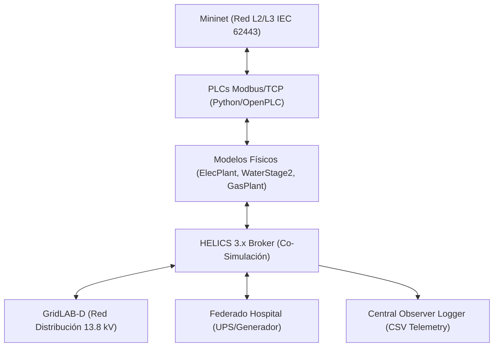

# Especificación de Requisitos de Software (ERS)
## Proyecto: Cyber Range Ciberfísico Multisectorial (CityLab)
**Estándar de Referencia**: Adaptación IEEE-830 / ISO/IEC/IEEE 29148:2018  
**Versión**: 2.0  
**Fecha**: Agosto 2026  

---

## 1. Introducción

### 1.1 Propósito
Este documento define la **Especificación de Requisitos de Software (ERS)** para la plataforma **CityLab**, un laboratorio de entrenamiento ciberfísico (*Cyber Range*) 100% basado en software. Su objetivo es emular infraestructuras críticas urbanas interdependientes (Red Eléctrica, Tratamiento de Agua, Gas y Salud/Hospital), permitiendo la ejecución de escenarios defensivos (Blue Team) y ofensivos (Red Team / Hacking Ético) con análisis de impacto cinético y fallos en cascada.

### 1.2 Alcance
El sistema comprende:
- Emulación de topología de red industrial según estándar **IEC 62443** (Mininet / OpenFlow).
- Dispositivos de control programable (PLCs) ejecutando Modbus/TCP en puerto `502`.
- Simulación de procesos físicos ciberfísicos (Ecuación de swing síncrona en red eléctrica, planta de agua SWaT en 2 etapas, presión de gas).
- Co-simulación distribuida sincronizada temporalmente vía **HELICS 3.x**.
- Sistema de observabilidad centralizado y registro CSV de eventos ciberfísicos.

### 1.3 Definiciones, Acrónimos y Abreviaturas
- **CPS**: *Cyber-Physical System* (Sistema Ciberfísico).
- **HIL**: *Hardware-in-the-Loop* (Simulación física en el bucle).
- **ICS/SCADA**: *Industrial Control Systems / Supervisory Control and Data Acquisition*.
- **UFLS**: *Under-Frequency Load Shedding* (Deslastre de carga por subfrecuencia).
- **PU**: *Per-Unit* (Unidad relativa en ingeniería eléctrica).
- **SWaT**: *Secure Water Treatment* (Arquitectura de tratamiento de agua de referencia).

---

## 2. Descripción General

### 2.1 Perspectiva del Producto
CityLab es una suite autónoma en software nativo Linux. Reemplaza los simuladores tradicionales basados en máquinas virtuales pesadas (como GRFICS o RADICS) por procesos nativos ultraligeros coordinados mediante HELICS y Mininet.

### 2.2 Restricciones de Hardware y Entorno
- **Sistema Operativo**: Linux Nativo (Debian 12+, Athena OS, Fedora).
- **Presupuesto de Memoria RAM**: $\le 1.5\text{ GB}$ para el laboratorio completo.
- **Sin Dependencia de Hypervisor**: 0% sobrecarga de máquinas virtuales Type-2 (VirtualBox/VMware descartados).

---

## 3. Requisitos Funcionales Específicos

### 3.1 Módulo de Red e Infraestructura (RF-01)
- **RF-01.1 (Segmentación IEC 62443)**: El sistema debe emular 3 zonas de red independientes:
  - *Corporate Zone* (`10.0.1.0/24`)
  - *DMZ Zone* (`10.0.2.0/24`)
  - *OT Cell Zone* (`10.0.3.0/24`)
- **RF-01.2 (Filtrado de Tráfico)**: Un firewall emulado (`fw`) debe denegar todo tráfico directo entre Corporate y OT, permitiendo únicamente tráfico Modbus/TCP (`TCP/502`) originado desde DMZ hacia los PLCs de la zona OT.

### 3.2 Módulo de Control Industrial PLC (RF-02)
- **RF-02.1 (Mapas de Memoria Modbus)**: Cada PLC emulado debe exponer 4 bobinas (*coils*):
  - Coil 0: `pump_start` / `valve_open` / `breaker_close` (Escritura).
  - Coil 1: `pump_stop` / `valve_close` / `breaker_open` (Escritura).
  - Coil 2: `actuator_running` / `status` (Lectura).
  - Coil 3: `actuator_fault` (Lectura).
- **RF-02.2 (Lógica de Interbloqueo)**: Si un atacante inyecta `START` (Coil 0) y `STOP` (Coil 1) simultáneamente, el PLC debe activar el flag de fallo (`Coil 3 = 1`) y detener el actuador.

### 3.3 Módulo de Física Ciberfísica HIL (RF-03)
- **RF-03.1 (Modelo Eléctrico Dinámico)**: `ElecPlant` debe resolver la ecuación de swing síncrona:
  $$\frac{df}{dt} = \frac{P_{gen} - P_{load}}{2 \cdot H}$$
  disparando bajo-frecuencia (UFLS) si $f < 57.0\text{ Hz}$.
- **RF-03.2 (Modelo de Agua 2 Etapas)**: `TwoStageWaterPlant` debe simular:
  - Bomba P1: Reservorio Crudo $\to$ Tanque Sedimentador T1 ($20\text{ m}^3$).
  - Bomba P2: Tanque T1 $\to$ Tanque Distribución T2 ($30\text{ m}^3$).
  - Demanda urbana constante de $0.5\text{ m}^3/\text{s}$ extraída de T2.
- **RF-03.3 (Interdependencia Eléctrica en Agua)**: Las bombas P1 y P2 deben detenerse automáticamente si la tensión de la red eléctrica cae por debajo de $0.85\text{ pu}$ (`grid/voltage_pu < 0.85`).

### 3.4 Módulo Hospitalario y Resiliencia (RF-04)
- **RF-04.1 (Lógica de Failover)**: `fed_hospital.py` debe monitorear frecuencia ($f$) y voltaje ($V_{pu}$). Transiciona a `UPS_ACTIVE` si $V < 0.85\text{ pu}$ o $f < 58.0\text{ Hz}$.
- **RF-04.2 (Capacidad de Reserva)**: Batería UPS de $75\text{ kWh}$ ($30\text{ min}$) y arranque de generador diésel en $10\text{ s}$.
- **RF-04.3 (Deslastre de Carga)**: Al entrar el generador, el hospital publica `hospital/load_kw = 0`, aliviando la demanda sobre el modelo de swing de la red eléctrica.

### 3.5 Módulo de Co-Simulación HELICS (RF-05)
- **RF-05.1 (Sincronización Temporal)**: El broker HELICS debe coordinar el avance temporal a paso discreto $\Delta t = 1.0\text{ s}$ entre los 6 federados (`water`, `gas`, `elec`, `gridlabd`, `hospital`, `logger`).
- **RF-05.2 (Publicación Global)**: Los temas globales requeridos son `tank/level`, `gas/pressure`, `grid/frequency`, `grid/voltage_pu`, `hospital/load_kw`, `hospital/on_ups`, `breaker/trip`, `gas/trip`, `grid/trip`.

### 3.6 Módulo de Emulación Adversaria Ofensiva (RF-06)
- **RF-06.1 (Script de Ataque Multisectorial)**: `attack_multisector.py` debe permitir la inyección remota de escrituras Modbus/TCP a cualquier sector (`water`, `gas`, `elec`, `all`) en modos `start`, `stop`, `fault`.

### 3.7 Módulo de Observabilidad y Telemetría (RF-07)
- **RF-07.1 (Logging Centralizado)**: `fed_logger.py` debe escribir cada segundo una fila en `logs/cascading_events.csv` con los valores físicos de todos los sectores y la alerta de cascada (`NORMAL`, `PARTIAL_TRIP`, `CASCADING_BLACKOUT`, `+HOSPITAL_UPS`).

---

## 4. Requisitos No Funcionales (RNF)

- **RNF-01 (Eficiencia de Recursos)**: El consumo global de RAM debe mantenerse en $< 1.5\text{ GB}$ durante ejecuciones continuas de la federación.
- **RNF-02 (Determinismo)**: La simulación ciberfísica no debe perder paquetes Modbus ni experimentar carreras críticas en los accesos al bus HELICS.
- **RNF-03 (Despliegue Automatizado)**: Un único comando (`sudo ./run_phase2.sh`) debe limpiar procesos previos, compilar modelos, levantar el broker HELICS, iniciar los 6 federados y desplegar la topología de red Mininet.
