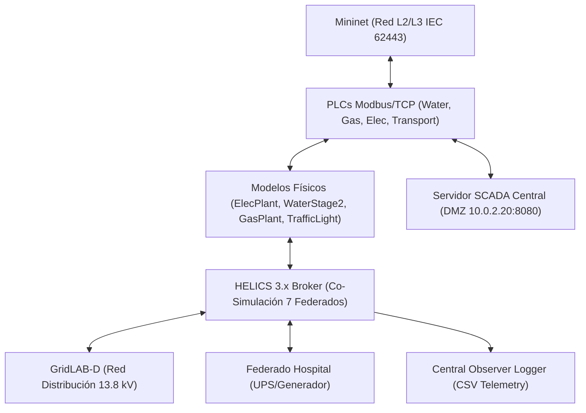

# Especificación de Requisitos de Software (ERS)
## Proyecto: Cyber Range Ciberfísico Multisectorial (CityLab)
**Estándar de Referencia**: Adaptación IEEE-830 / ISO/IEC/IEEE 29148:2018  
**Versión**: 3.0 (Fase 3 Ciudad Completa)  
**Fecha**: Agosto 2026  

---

## 1. Introducción

### 1.1 Propósito
Este documento define la **Especificación de Requisitos de Software (ERS)** para la plataforma **CityLab**, un laboratorio de entrenamiento ciberfísico (*Cyber Range*) 100% basado en software. Su objetivo es emular infraestructuras críticas urbanas interdependientes (Red Eléctrica, Agua Potable SWaT, Gasoducto, Red de Transporte/Semáforos, Hospital Crítico y Servidor SCADA Central), permitiendo la ejecución de escenarios defensivos (Blue Team) y ofensivos (Red Team / Hacking Ético) con análisis de impacto cinético y fallos en cascada.

### 1.2 Alcance
El sistema comprende:
- Emulación de topología de red industrial según estándar **IEC 62443** (Mininet / OpenFlow / Firewall `iptables`).
- Dispositivos de control programable (PLCs) ejecutando Modbus/TCP en puerto `502` para 4 sectores OT.
- Simulación de procesos ciberfísicos (Ecuación de swing síncrona, tratamiento de agua SWaT 2-etapas, presión de gasoducto y control semafórico de transporte).
- Servidor SCADA Central / Historian en DMZ (`h_scada` a `10.0.2.20:8080`) con API REST JSON.
- Co-simulación distribuida sincronizada temporalmente vía **HELICS 3.x** (7 federados).
- Sistema de observabilidad centralizado y registro CSV de eventos ciberfísicos (`logs/cascading_events.csv`).

### 1.3 Definiciones, Acrónimos y Abreviaturas
- **CPS**: *Cyber-Physical System* (Sistema Ciberfísico).
- **HIL**: *Hardware-in-the-Loop* (Simulación física en el bucle).
- **ICS/SCADA**: *Industrial Control Systems / Supervisory Control and Data Acquisition*.
- **UFLS**: *Under-Frequency Load Shedding* (Deslastre de carga por subfrecuencia).
- **PU**: *Per-Unit* (Unidad relativa en ingeniería eléctrica).
- **SWaT**: *Secure Water Treatment* (Arquitectura de tratamiento de agua de referencia).
- **CTF**: *Capture The Flag* (Desafío de ciberseguridad por banderas).

---

## 2. Descripción General

### 2.1 Perspectiva del Producto
CityLab es una suite autónoma en software nativo Linux. Reemplaza los simuladores tradicionales basados en máquinas virtuales pesadas por procesos nativos ultraligeros coordinados mediante HELICS y Mininet.

### 2.2 Restricciones de Hardware y Entorno
- **Sistema Operativo**: Linux Nativo (Debian 12+, Athena OS, Fedora).
- **Presupuesto de Memoria RAM**: $\le 1.5\text{ GB}$ para el laboratorio de ciudad completo.
- **Sin Dependencia de Hypervisor**: 0% sobrecarga de máquinas virtuales Type-2 (VirtualBox/VMware descartados).

---

## 3. Requisitos Funcionales Específicos

### 3.1 Módulo de Red e Infraestructura (RF-01)
- **RF-01.1 (Segmentación IEC 62443)**: El sistema debe emular 3 zonas de red independientes:
  - *Corporate Zone* (`10.0.1.0/24`) $\to$ `h_attacker` (`10.0.1.10`)
  - *DMZ Zone* (`10.0.2.0/24`) $\to$ `h_dmz` (`10.0.2.10`), `h_scada` (`10.0.2.20`)
  - *OT Cell Zone* (`10.0.3.0/24`) $\to$ `h_plc` (`.10`), `h_icssim` (`.11`), `h_plc_gas` (`.12`), `h_plc_elec` (`.13`), `h_plc_trans` (`.14`)
- **RF-01.2 (Filtrado de Tráfico)**: Un firewall emulado (`fw`) debe denegar todo tráfico directo entre Corporate y OT, permitiendo únicamente tráfico Modbus/TCP (`TCP/502`) originado desde DMZ hacia los 4 PLCs de la zona OT.

### 3.2 Módulo de Control Industrial PLC (RF-02)
- **RF-02.1 (Mapas de Memoria Modbus)**: Cada PLC emulado debe exponer 4 bobinas (*coils*):
  - Coil 0: `pump_start` / `valve_open` / `breaker_close` / `auto_cycle` (Escritura).
  - Coil 1: `pump_stop` / `valve_close` / `breaker_open` / `emergency_corridor` (Escritura).
  - Coil 2: `actuator_running` / `status` (Lectura).
  - Coil 3: `actuator_fault` (Lectura).
- **RF-02.2 (Lógica de Interbloqueo)**: Si un atacante inyecta `START` (Coil 0) y `STOP` (Coil 1) simultáneamente, el PLC debe activar el flag de fallo (`Coil 3 = 1`) y detener el actuador.

### 3.3 Módulo de Física Ciberfísica HIL (RF-03)
- **RF-03.1 (Modelo Eléctrico Dinámico)**: `ElecPlant` debe resolver la ecuación de swing síncrona:
  $$\frac{df}{dt} = \frac{P_{gen} - P_{load}}{2 \cdot H}$$
  disparando bajo-frecuencia (UFLS) si $f < 57.0\text{ Hz}$.
- **RF-03.2 (Modelo de Agua 2 Etapas)**: `TwoStageWaterPlant` debe simular:
  - Bomba P1: Reservorio Crudo $\to$ Tanque Sedimentador T1 ($20\text{ m}^3$).
  - Bomba P2: Tanque T1 $\to$ Tanque Distribución T2 ($30\text{ m}^3$).
  - Demanda urbana constante de $0.5\text{ m}^3/\text{s}$ extraída de T2.
- **RF-03.3 (Interdependencia Eléctrica en Agua)**: Las bombas P1 y P2 deben detenerse automáticamente si la tensión de la red eléctrica cae por debajo de $0.85\text{ pu}$ (`grid/voltage_pu < 0.85`).

### 3.4 Módulo Hospitalario y Resiliencia (RF-04)
- **RF-04.1 (Lógica de Failover)**: `fed_hospital.py` debe monitorear frecuencia ($f$) y voltaje ($V_{pu}$). Transiciona a `UPS_ACTIVE` si $V < 0.85\text{ pu}$ o $f < 58.0\text{ Hz}$.
- **RF-04.2 (Capacidad de Reserva)**: Batería UPS de $75\text{ kWh}$ ($30\text{ min}$) y arranque de generador diésel en $10\text{ s}$.
- **RF-04.3 (Deslastre de Carga)**: Al entrar el generador, el hospital publica `hospital/load_kw = 0`, aliviando la demanda sobre el modelo de swing de la red eléctrica.

### 3.5 Módulo de Transporte / Semáforos (RF-05)
- **RF-05.1 (Máquina de Estados Semafórica)**: `TrafficLightIntersection` debe ciclar entre `GREEN_NS`, `YELLOW_NS`, `GREEN_EW`, `YELLOW_EW`.
- **RF-05.2 (Fallo por Blackout)**: Si $V_{grid} < 0.85\text{ pu}$, conmuta a `FLASHING_YELLOW_EMERGENCY`, incrementando el índice de congestión vehicular de $0.05$ a $1.0$.

### 3.6 Módulo SCADA Central / Historian (RF-06)
- **RF-06.1 (Polling y REST API)**: `scada_server.py` debe ejecutar un hilo de polling Modbus sobre los 4 PLCs y exponer `/api/telemetry` en `http://10.0.2.20:8080`.

### 3.7 Módulo de Co-Simulación HELICS (RF-07)
- **RF-07.1 (Sincronización 7-Federados)**: El broker HELICS debe coordinar a avance temporal a paso discreto $\Delta t = 1.0\text{ s}$ entre los 7 federados (`water`, `gas`, `elec`, `transport`, `gridlabd`, `hospital`, `logger`).

### 3.8 Módulo de Emulación Adversaria y Playbooks CTF (RF-08)
- **RF-08.1 (Escenarios THM/HTB)**: Documentación de playbooks paso a paso con banderas de validación (`FLAG_1` a `FLAG_3`) en `docs/scenarios/`.

### 3.9 Módulo de Protocolos de Sector Especializados - Subestación Eléctrica DNP3 (RF-09)
- **RF-09.1 (Protocolo DNP3 IEEE 1815)**: `h_plc_elec` (`10.0.3.13`) debe ejecutar un Outstation DNP3 en puerto `TCP/20000`, exponiendo Binary Inputs (disyuntor, estado de red), Analog Inputs (voltaje, frecuencia, potencia kW) y Binary Outputs / CROB (disparo/cierre de disyuntor).
- **RF-09.2 (Reglas de Conduit DNP3)**: El firewall `fw` debe permitir tráfico DNP3 (`TCP/20000`) desde DMZ (`fw-eth1`) hacia la celda OT eléctrica (`10.0.3.13`).

### 3.10 Módulo IT/OT Corporate Active Directory Domain Controller (RF-10)
- **RF-10.1 (Servidor `h_dc` Samba AD DC)**: La zona Corporate (`10.0.1.0/24`) debe incorporar el Domain Controller `h_dc` (`10.0.1.20`), escuchando en LDAP (`389`), Kerberos (`88`) y SMB (`445`).
- **RF-10.2 (Emulación de Vectores de Compromiso IT)**: Permite simulaciones de movimiento lateral IT/OT mediante enumeración LDAP, Kerberoasting (ticket TGS para SPN `HTTP/h_ews.citylab.local`) y AS-REP Roasting contra la cuenta de ingeniero `jdoe_eng`.
- **RF-10.3 (Riesgo Aceptado L2 Corporate FINDING-03)**: Se acepta como debilidad intencional la colocalización L2 de `h_attacker` y `h_dc` en `s1` para fines pedagógicos de entrenamiento en Kerberoasting/AS-REP Roasting.
- **RF-10.4 (Control Compensatorio SDN OpenFlow COMP-02)**: El controlador SDN (`network/sdn_controller.py`) aplica microsegmentación por tupla `(src_ip, dst_ip, dst_port)` y aislación por Circuit Breaker dinámico ante ráfagas DoS (> 50 pkt/s).

---

## 4. Requisitos No Funcionales (RNF)

- **RNF-01 (Eficiencia de Recursos)**: El consumo global de RAM debe mantenerse en $< 1.5\text{ GB}$ durante ejecuciones continuas de la federación completa.
- **RNF-02 (Determinismo)**: La simulación ciberfísica no debe perder paquetes Modbus ni experimentar carreras críticas en los accesos al bus HELICS.
- **RNF-03 (Despliegue Automatizado)**: Un único comando (`sudo ./run_phase3.sh`) debe limpiar procesos previos, compilar modelos, levantar el broker HELICS, iniciar los 7 federados y desplegar la topología de red Mininet.
