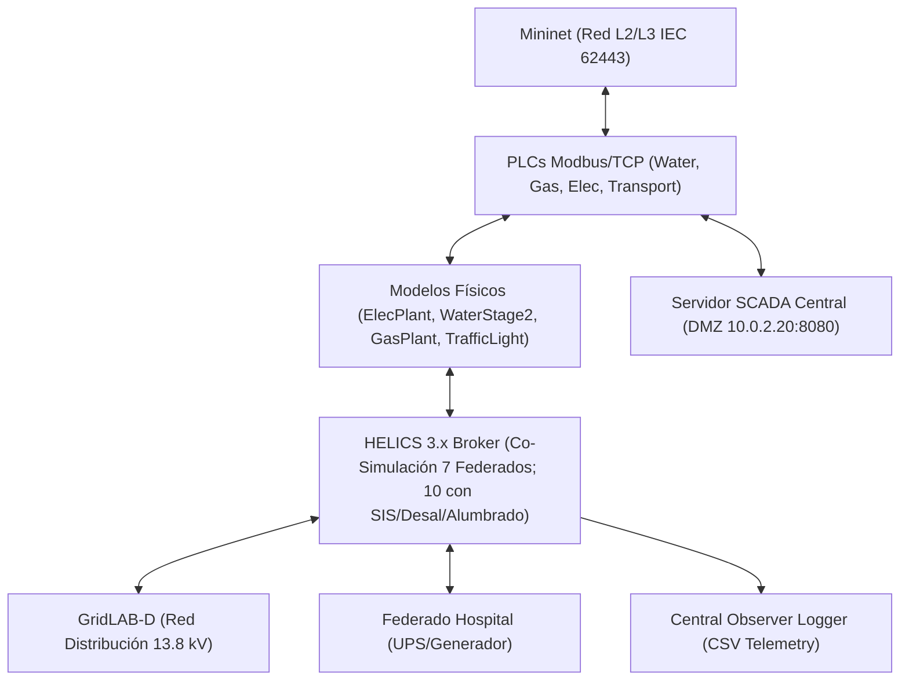

# Especificación de Requisitos de Software (ERS)
## Proyecto: Cyber Range Ciberfísico Multisectorial (CityLab)
**Estándar de Referencia**: Adaptación IEEE-830 / ISO/IEC/IEEE 29148:2018  
**Versión**: 3.0 (Fase 3 Ciudad Completa)  
**Fecha**: Agosto 2026  

---

## 1. Introducción

### 1.1 Propósito
Este documento define la **Especificación de Requisitos de Software (ERS)** para la plataforma **CityLab**, un laboratorio de entrenamiento ciberfísico (*Cyber Range*) 100% basado en software. Su objetivo es emular infraestructuras críticas urbanas interdependientes (Red Eléctrica, Agua Potable SWaT, Gasoducto, Red de Transporte/Semáforos, Hospital Crítico y Servidor SCADA Central), permitiendo la ejecución de escenarios defensivos (Blue Team) y ofensivos (Red Team / Hacking Ético) con análisis de impacto cinético y fallos en cascada.

### 1.2 Alcance
El sistema comprende:
- Emulación de topología de red industrial según estándar **IEC 62443** (Mininet / OpenFlow / Firewall `iptables`).
- Dispositivos de control programable (PLCs) ejecutando Modbus/TCP en puerto `502` sobre 7 hosts OT (agua, gas, eléctrico, transporte, hospital, desalinizadora y alumbrado), más NTCIP 1202 (`:161`), BACnet/IP (`:47808`), DNP3 (`:20000`), IEC 61850 GOOSE/SV (`:10102`) y OPC UA (`:4840`).
- Simulación de procesos ciberfísicos (Ecuación de swing síncrona, tratamiento de agua SWaT 2-etapas, ósmosis inversa de desalinización, presión de gasoducto, alumbrado con fotocelda y control semafórico de transporte).
- Servidor SCADA Central / Historian en DMZ (`h_scada` a `10.0.2.20:8080`) con API REST JSON, redundancia HA activo-pasivo, HMI industrial (`:8085`) y visualizador web 2D/3D (`:8090`).
- Co-simulación distribuida sincronizada temporalmente vía **HELICS 3.x**: 7 federados en `run_phase3.sh`, hasta 10 con `helics_sim/smoke_test_phase7.sh` (`ENABLE_SIS_FEDERATE=1`).
- Sistema de observabilidad centralizado y registro CSV de eventos ciberfísicos (`logs/cascading_events.csv`), historian SQLite WAL y pipeline SIEM con exportación ECS / Syslog RFC 5424.

### 1.3 Definiciones, Acrónimos y Abreviaturas
- **CPS**: *Cyber-Physical System* (Sistema Ciberfísico).
- **HIL**: *Hardware-in-the-Loop* (Simulación física en el bucle).
- **ICS/SCADA**: *Industrial Control Systems / Supervisory Control and Data Acquisition*.
- **UFLS**: *Under-Frequency Load Shedding* (Deslastre de carga por subfrecuencia).
- **PU**: *Per-Unit* (Unidad relativa en ingeniería eléctrica).
- **SWaT**: *Secure Water Treatment* (Arquitectura de tratamiento de agua de referencia).
- **CTF**: *Capture The Flag* (Desafío de ciberseguridad por banderas).

---

## 2. Descripción General

### 2.1 Perspectiva del Producto
CityLab es una suite autónoma en software nativo Linux. Reemplaza los simuladores tradicionales basados en máquinas virtuales pesadas por procesos nativos ultraligeros coordinados mediante HELICS y Mininet.

### 2.2 Restricciones de Hardware y Entorno
- **Sistema Operativo**: Linux Nativo (Debian 12+, Athena OS, Fedora).
- **Presupuesto de Memoria RAM**: $\le 8\text{ GB}$ para el laboratorio de ciudad completo (co-simulación HELICS, Mininet, AD DC, SDN, SIEM, HA, historian y visualizador). *Cifra de diseño; el consumo real se mide con `./citylab.sh profile` (ver RF-18.2).*
- **Sin Dependencia de Hypervisor**: 0% sobrecarga de máquinas virtuales Type-2 (VirtualBox/VMware descartados).

---

## 3. Requisitos Funcionales Específicos

### 3.1 Módulo de Red e Infraestructura (RF-01)
- **RF-01.1 (Segmentación IEC 62443)**: El sistema debe emular 3 zonas de red independientes:
  - *Corporate Zone* (`10.0.1.0/24`) $\to$ `h_attacker` (`10.0.1.10`)
  - *DMZ Zone* (`10.0.2.0/24`) $\to$ `h_dmz` (`10.0.2.10`), `h_scada` (`10.0.2.20`)
  - *OT Cell Zone* (`10.0.3.0/24`) $\to$ `h_plc` (`.10`), `h_icssim` (`.11`), `h_plc_gas` (`.12`), `h_plc_elec` (`.13`), `h_plc_trans` (`.14`)
- **RF-01.2 (Filtrado de Tráfico)**: Un firewall emulado (`fw`) debe denegar todo tráfico directo entre Corporate y OT, permitiendo únicamente tráfico Modbus/TCP (`TCP/502`) originado desde DMZ hacia los 4 PLCs de la zona OT.

### 3.2 Módulo de Control Industrial PLC (RF-02)
- **RF-02.1 (Mapas de Memoria Modbus)**: Cada PLC emulado debe exponer 4 bobinas (*coils*):
  - Coil 0: `pump_start` / `valve_open` / `breaker_close` / `auto_cycle` (Escritura).
  - Coil 1: `pump_stop` / `valve_close` / `breaker_open` / `emergency_corridor` (Escritura).
  - Coil 2: `actuator_running` / `status` (Lectura).
  - Coil 3: `actuator_fault` (Lectura).
- **RF-02.2 (Lógica de Interbloqueo)**: Si un atacante inyecta `START` (Coil 0) y `STOP` (Coil 1) simultáneamente, el PLC debe activar el flag de fallo (`Coil 3 = 1`) y detener el actuador.

### 3.3 Módulo de Física Ciberfísica HIL (RF-03)
- **RF-03.1 (Modelo Eléctrico Dinámico)**: `ElecPlant` debe resolver la ecuación de swing síncrona:
  $$\frac{df}{dt} = \frac{P_{gen} - P_{load}}{2 \cdot H}$$
  disparando bajo-frecuencia (UFLS) si $f < 57.0\text{ Hz}$.
- **RF-03.2 (Modelo de Agua 2 Etapas)**: `TwoStageWaterPlant` debe simular:
  - Bomba P1: Reservorio Crudo $\to$ Tanque Sedimentador T1 ($20\text{ m}^3$).
  - Bomba P2: Tanque T1 $\to$ Tanque Distribución T2 ($30\text{ m}^3$).
  - Demanda urbana constante de $0.5\text{ m}^3/\text{s}$ extraída de T2.
- **RF-03.3 (Interdependencia Eléctrica en Agua)**: Las bombas P1 y P2 deben detenerse automáticamente si la tensión de la red eléctrica cae por debajo de $0.85\text{ pu}$ (`grid/voltage_pu < 0.85`).

### 3.4 Módulo Hospitalario y Resiliencia (RF-04)
- **RF-04.1 (Lógica de Failover)**: `fed_hospital.py` debe monitorear frecuencia ($f$) y voltaje ($V_{pu}$). Transiciona a `UPS_ACTIVE` si $V < 0.85\text{ pu}$ o $f < 58.0\text{ Hz}$.
- **RF-04.2 (Capacidad de Reserva)**: Batería UPS de $75\text{ kWh}$ ($30\text{ min}$) y arranque de generador diésel en $10\text{ s}$.
- **RF-04.3 (Deslastre de Carga)**: Al entrar el generador, el hospital publica `hospital/load_kw = 0`, aliviando la demanda sobre el modelo de swing de la red eléctrica.

### 3.5 Módulo de Transporte / Semáforos (RF-05)
- **RF-05.1 (Máquina de Estados Semafórica)**: `TrafficLightIntersection` debe ciclar entre `GREEN_NS`, `YELLOW_NS`, `GREEN_EW`, `YELLOW_EW`.
- **RF-05.2 (Fallo por Blackout)**: Si $V_{grid} < 0.85\text{ pu}$, conmuta a `FLASHING_YELLOW_EMERGENCY`, incrementando el índice de congestión vehicular de $0.05$ a $1.0$.

### 3.6 Módulo SCADA Central / Historian (RF-06)
- **RF-06.1 (Polling y REST API)**: `scada_server.py` debe ejecutar un hilo de polling Modbus sobre los PLCs declarados en `PLC_CONFIGS` y exponer `/api/telemetry` en `http://10.0.2.20:8080`.
- **RF-06.2 (Alcance actual del polling — brecha conocida)**: `PLC_CONFIGS` cubre hoy 4 sectores (`water` `10.0.3.10`, `gas` `10.0.3.12`, `elec` `10.0.3.13`, `transport` `10.0.3.14`). Los hosts OT `h_plc_hosp` (`10.0.3.15`), `h_desal` (`10.0.3.16`) y `h_lighting` (`10.0.3.17`) exponen Modbus y son atacables, pero **no** están en el alcance de polling, por lo que no aparecen en telemetría SCADA, HMI ni historian.
- **RF-06.3 (Persistencia Historian TSDB)**: `network/historian.py` debe persistir la telemetría en SQLite en modo WAL (`HISTORIAN_DB_PATH`, por defecto `/tmp/citylab_historian.db`), escribiendo el snapshot por sector (`write_snapshot`) con desglose por punto (`write`) y sirviendo consultas por rango temporal (`query`).

### 3.7 Módulo de Co-Simulación HELICS (RF-07)
- **RF-07.1 (Sincronización de Federados)**: El broker HELICS debe coordinar el avance temporal a paso discreto $\Delta t = 1.0\text{ s}$. `run_phase3.sh` lanza **7** federados (`water`, `gas`, `elec`, `transport`, `gridlabd`, `hospital`, `logger`) con `HELICS_FED_COUNT=7`.
- **RF-07.2 (Federación Extendida de 10)**: `helics_sim/smoke_test_phase7.sh` orquesta **10** federados (`helics_broker -f 10`), sumando `fed_desal`, `fed_lighting` y `fed_sis` (este último con `ENABLE_SIS_FEDERATE=1`). Los entrypoints por fases todavía no lanzan esos tres.
- **RF-07.3 (Acoplamiento Eléctrico Agregado)**: La rama `elec` de `fed_icssim.py` debe componer la carga total como base $400\text{ kW}$ + `hospital/load_kw` + `desal/power_kw` + `lighting/power_kw`, normalizada sobre $1200\text{ kW}$ ($1.0\text{ pu}$), sanitizando únicamente los centinelas de HELICS ($< -10^{20}$) para preservar cargas legítimas de $0\text{ kW}$.

### 3.8 Módulo de Emulación Adversaria y Playbooks CTF (RF-08)
- **RF-08.1 (Escenarios THM/HTB)**: Documentación de playbooks paso a paso con banderas de validación (`FLAG_1` a `FLAG_3`) en `docs/scenarios/`.

### 3.9 Módulo de Protocolos de Sector Especializados - Subestación Eléctrica DNP3 (RF-09)
- **RF-09.1 (Protocolo DNP3 IEEE 1815)**: `h_plc_elec` (`10.0.3.13`) debe ejecutar un Outstation DNP3 en puerto `TCP/20000`, exponiendo Binary Inputs (disyuntor, estado de red), Analog Inputs (voltaje, frecuencia, potencia kW) y Binary Outputs / CROB (disparo/cierre de disyuntor).
- **RF-09.2 (Reglas de Conduit DNP3)**: El firewall `fw` debe permitir tráfico DNP3 (`TCP/20000`) desde DMZ (`fw-eth1`) hacia la celda OT eléctrica (`10.0.3.13`).

### 3.10 Módulo IT/OT Corporate Active Directory Domain Controller (RF-10)
- **RF-10.1 (Servidor `h_dc` Samba AD DC)**: La zona Corporate (`10.0.1.0/24`) debe incorporar el Domain Controller `h_dc` (`10.0.1.20`), escuchando en LDAP (`389`), Kerberos (`88`) y SMB (`445`).
- **RF-10.2 (Emulación de Vectores de Compromiso IT)**: Permite simulaciones de movimiento lateral IT/OT mediante enumeración LDAP, Kerberoasting (ticket TGS para SPN `HTTP/h_ews.citylab.local`) y AS-REP Roasting contra la cuenta de ingeniero `jdoe_eng`.
- **RF-10.3 (Riesgo Aceptado L2 Corporate FINDING-03)**: Se acepta como debilidad intencional la colocalización L2 de `h_attacker` y `h_dc` en `s1` para fines pedagógicos de entrenamiento en Kerberoasting/AS-REP Roasting.
- **RF-10.4 (Control Compensatorio SDN OpenFlow COMP-02)**: El controlador SDN (`network/sdn_controller.py`) aplica microsegmentación por tupla `(src_ip, dst_ip, dst_port)` y aislación por Circuit Breaker dinámico ante ráfagas DoS (> 50 pkt/s).

### 3.11 Decisiones de Diseño Pedagógico CTF (RF-11)
- **RF-11.1 (F-03: Mantenimiento de Redes Standalone Corp/DMZ s1/s2)**: Mantiene los switches `s1` y `s2` en modo standalone sin reglas OpenFlow restrictivas intencionalmente para preservar los escenarios de pivoteo IT/OT.
- **RF-11.2 (F-05: Mantenimiento de Modbus/TCP Plano Nivel 1)**: Modbus/TCP en puerto `:502` se mantiene sin cifrado TLS ni autenticación nativa para preservar la superficie de ataque requerida en las prácticas de inyección OT.
- **RF-11.3 (F-06: Ausencia de Aislamiento Automático ante Loss of View/Control)**: El SCADA detecta y alerta `LOSS_OF_VIEW`, pero no ejecuta aislamiento automático por software para permitir la intervención manual del operador.
- **RF-11.4 (F-07: Ausencia de Load-Shedding Automático en Cascada)**: La lógica ciberfísica no realiza deslastre de carga automático para posibilitar la demostración pedagógica de apagones en cascada multi-sector.

### 3.12 Matriz de Conduit de Red e Inventario de Puertos IEC 62443 (RF-12)
- **RF-12.1 (Matriz de Comunicaciones Permitidas / Firewalls / SDN)**:
  | Origen (Zona / Host) | Destino (Zona / Host) | Puerto / Protocolo | Propósito / Alcance | Mecanismo de Control |
  |---|---|---|---|---|
  | `10.0.1.0/24` (Corporate) | `10.0.2.0/24` (DMZ Jump) | `TCP/22` (SSH) | Gestión administrativa DMZ | Firewall `fw` (`fw-eth0` $\to$ `fw-eth1`) |
  | `10.0.1.0/24` (Corporate) | `10.0.1.20` (`h_dc`) | `TCP/389`, `TCP/88`, `TCP/445` | LDAP, Kerberos, SMB (AD DC) | Switch `s1` L2 Standalone |
  | `10.0.2.20` (`h_scada`) | `10.0.1.20` (`h_dc`) | `TCP/389` | Autenticación LDAP AD SCADA (`SCADA_AD_AUTH`) | Firewall `fw` (`fw-eth1` $\to$ `fw-eth0`) |
  | `10.0.2.20` (`h_scada`) | `10.0.3.0/24` (OT Cell) | `TCP/502`, `161`, `20000`, `10102`, `4840`, `UDP/47808` | Polling Modbus/NTCIP/DNP3/IEC61850/OPCUA/BACnet | Firewall `fw` (`fw-eth1` $\leftrightarrow$ `fw-eth2`) |
  | `10.0.4.30` (`h_ews` PAW) | `10.0.3.0/24` (OT Cell) | Todos los puertos OT | Ingeniería y mantenimiento PAW | Firewall `fw` (`fw-eth3` $\leftrightarrow$ `fw-eth2`) |
  | Cualquier Zona | `10.0.5.99` (`h_honey`) | `TCP/502` | Captura de escaneos honeypot | Firewall `fw` (`fw-eth4` ACCEPT) |
  | `10.0.1.0/24` (Corporate) | `10.0.3.0/24` (OT Cell) | **REJECT / DROP** | Bloqueo directo Corp $\to$ OT | Firewall `fw` (`fw-eth0` $\to$ `fw-eth2` DROP) |

- **RF-12.2 (Reserva Estructurada de Direcciones IP y Puertos OT/IT - Alineada con `topology.py`)**:
  - **Zona Corporate (`10.0.1.0/24`, Switch `s1`)**:
    - `10.0.1.10`: `h_attacker` (Estación Red Team)
    - `10.0.1.20`: `h_dc` (Active Directory Domain Controller — LDAP 389, Kerberos 88, SMB 445)
  - **Zona DMZ (`10.0.2.0/24`, Switch `s2`)**:
    - `10.0.2.10`: `h_dmz` (Jump Host / Bastión de gestión DMZ)
    - `10.0.2.20`: `h_scada` (Servidor SCADA / Historian — REST y HA `:8080`, HMI industrial `:8085`, Viz 2D/3D `:8090`; peer HA por defecto `:8081` vía `HA_PEER_URL`)
  - **Zona OT Cell (`10.0.3.0/24`, Switch `s3`)**:
    - `10.0.3.10`: `h_plc` (PLC Agua SWaT — Modbus/TCP `:502`)
    - `10.0.3.11`: `h_icssim` (Host de Co-Simulación de Procesos Físicos)
    - `10.0.3.12`: `h_plc_gas` (PLC Gasoducto — Modbus/TCP `:502`)
    - `10.0.3.13`: `h_plc_elec` (PLC Subestación Eléctrica — Modbus/TCP `:502`, DNP3 `:20000`)
    - `10.0.3.14`: `h_plc_tr` (PLC Control Semafórico — Modbus/TCP `:502`, NTCIP 1202 `:161`)
    - `10.0.3.15`: `h_plc_hosp` (PLC Energía Hospitalaria — Modbus/TCP `:502`, BACnet/IP `:47808`)
    - `10.0.3.16`: `h_desal` (Planta Desalinizadora RO — Modbus/TCP `:502`)
    - `10.0.3.17`: `h_lighting` (Alumbrado Público Inteligente — Modbus/TCP `:502`)
    - `10.0.3.20`: `h_ied` (Controlador de Bahía Subestación — IEC 61850 GOOSE/SV `:10102`)
    - `10.0.3.30`: `h_gateway` (Pasarela OT Subestación — OPC UA `:4840`)
  - **Zona PAW Aislada (`10.0.4.0/24`, Switch `s4`)**:
    - `10.0.4.30`: `h_ews` (Privileged Access Workstation / Ingeniería OT)
  - **Zona Honeypot (`10.0.5.0/24`, Switch `s5`)**:
    - `10.0.5.99`: `h_honey` (Decoy Honeypot OT PLC — Modbus/TCP `:502`)
  - **Servicios Internos Localhost / Co-Simulación**:
    - `127.0.0.1:23404`: Broker HELICS 3.x Co-Simulación
    - `127.0.0.1:6653`: Controlador SDN OpenFlow (OVS `s3`)

### 3.13 Módulo de Sistema Instrumentado de Seguridad SIS / ESD SIL-3 (RF-13)
- **RF-13.1 (Envolvente de Interlocks SIL-3)**: `helics_sim/fed_sis.py` debe evaluar cuatro interlocks físicos independientes del BPCS: sobre-nivel T1 $\ge 19.0\text{ m}^3$, bajo-nivel T1 $< 0.5\text{ m}^3$, sobre-presión de gas $\ge 180.0\text{ PSI}$ y sobre-frecuencia de red $\ge 62.5\text{ Hz}$.
- **RF-13.2 (Umbrales Alcanzables)**: Todo umbral de interlock debe permanecer dentro del rango que el modelo físico puede alcanzar. `ElecPlant` satura la frecuencia en `f_min=45.0` / `f_max=65.0`, por lo que un umbral de sobre-frecuencia $\ge 65.0$ dejaría el interlock permanentemente inactivo; el valor vigente ($62.5$) es alcanzable y no dispara en régimen nominal ($\approx 59.96\text{ Hz}$).
- **RF-13.3 (Actuación Real de la Parada)**: El SIS publica `sis/trip` y `fed_icssim.py` lo consume para forzar el disparo de planta (`trip = plant.needs_trip() OR sis_trip == 1`) en los tres tipos de planta. La parada no puede quedar como publicación sin consumidor.
- **RF-13.4 (Registro Forense)**: `fed_logger.py` debe suscribirse a `sis/trip` y registrar la columna `sis_trip` en `logs/cascading_events.csv`, añadiendo el sufijo `+SIS_ESD` a `cascade_alert` cuando la parada esté activa.
- **RF-13.5 (Compatibilidad como Librería)**: `SafetyInstrumentedLogic` y `SafetyInterlockLimits` deben permanecer importables desde `helics_sim/fed_sis.py`, ya que `attacker/attack_triton_low_slow.py` depende de ellas.

### 3.14 Módulo de Redundancia SCADA y Failover HA (RF-14)
- **RF-14.1 (Roles de Clúster)**: `network/scada_ha.py` (`SCADAPrimarySecondaryCluster`) debe soportar roles `PRIMARY` / `STANDBY` configurables por entorno (`HA_ROLE`, `HA_PEER_URL`).
- **RF-14.2 (Endpoints de Clúster)**: `scada_server.py` debe exponer `GET /api/ha/status`, `POST /api/ha/heartbeat` y `POST /api/ha/sync` en `:8080`.
- **RF-14.3 (Conmutación y Retorno)**: Ante ausencia de latido del primario más allá del timeout configurado, el nodo standby debe promoverse a `ACTIVE_STANDBY`; al recibir de nuevo latido del primario debe revertir a `STANDBY`. El monitor de latido debe arrancar en el `main()` del servidor, no solo existir como método.

### 3.15 Módulo HMI Industrial y Visualización Web 2D/3D (RF-15)
- **RF-15.1 (HMI Industrial)**: `network/hmi_server.py` (`:8085`) debe exponer `/api/hmi/overview`, `/api/hmi/alarms`, `/api/hmi/control` y consultas de tendencia histórica en `/api/history` y `/api/hmi/history`, resolviendo estas últimas contra `HistorianTSDB`.
- **RF-15.2 (Visualizador Presentacional)**: `network/viz_server.py` (`:8090`) debe exponer `/api/viz/frame`, `/api/viz/history` y `/api/viz/update`, manteniendo un búfer acotado de los últimos 100 cuadros de estado ciberfísico urbano.

### 3.16 Módulo SOC / SIEM y Exportación Empresarial (RF-16)
- **RF-16.1 (Reglas de Correlación)**: `network/siem_pipeline.py` debe implementar la Regla 1 (ataque en cascada IT→OT), la Regla 2 (spoofing GOOSE IEC 61850, patrón Industroyer2) y la Regla 3 (coincidencia con inspección pasiva Zeek / Suricata).
- **RF-16.2 (Exportación Multi-Formato)**: El motor debe exportar el búfer de eventos en ECS JSON (`export_elk_json`), Syslog RFC 5424 (`export_syslog_rfc5424`, con prioridad `<13>` para severidad `HIGH`/`CRITICAL` y `<14>` para el resto) y volcado directo a disco (`export_file`).
- **RF-16.3 (Nota de Fidelidad — Zeek/Suricata)**: La integración con Zeek y Suricata consiste en normalización a ECS de logs provistos (`ingest_zeek_log`, `ingest_suricata_eve`). **No** hay demonio Zeek/Suricata, puerto espejo OVS ni captura promiscua en el repo; cualquier requisito de detección pasiva en vivo permanece pendiente.

### 3.17 Módulo de Alumbrado Público Inteligente (RF-17)
- **RF-17.1 (Modelo Físico)**: `physical/elec/smart_lighting.py` (`SmartLightingSystem`) debe modelar el parque de luminarias con control por fotocélula sobre lux ambiental y regulación de dimmer $0..100\%$, publicando su consumo en `lighting/power_kw`.
- **RF-17.2 (Precedencia de Mando del Dimmer)**: `helics_sim/fed_lighting.py` debe resolver el nivel de dimmer en este orden estricto: (1) `grid/lighting_trip` desde HELICS — disparo de red fuerza $0\%$; (2) coil `4` del PLC de alumbrado (`h_lighting` `10.0.3.17:502`) — apagón comandado por Modbus; (3) control automático por fotocélula.
- **RF-17.3 (Superficie de Ataque OT)**: El coil `4` es la vía de ataque real del sector: un escritor Modbus no autenticado sobre `10.0.3.17:502` apaga el alumbrado público. Es coherente con F-05 (Modbus plano sin autenticación, RF-11.2) y no debe endurecerse. Con `--mock-plc` / `MOCK_PLC=1` el federado no consulta el PLC.
- **RF-17.4 (Sin Deslastre Automático)**: El alumbrado no debe implementar reducción automática de carga por baja frecuencia; cualquier atenuación ha de provenir de un mando explícito, preservando F-07 (RF-11.4).

### 3.18 Operación e Instrumentación del Laboratorio (RF-18)
- **RF-18.1 (Punto de Entrada Único)**: `./citylab.sh` debe ser el único comando documentado de operación, con los subcomandos `up` (despliegue, requiere root), `down` (parada y `mn -c`), `smoke` (co-simulación HELICS sin root), `test` (suite unitaria), `profile` (medición de recursos) y `status` (componentes vivos). Debe rechazar con mensaje explícito los subcomandos que exigen root cuando no lo hay, en lugar de fallar a mitad del despliegue.
- **RF-18.2 (Medición Real de Recursos)**: `scripts/profile_resources.py` debe medir RSS y CPU reales por proceso de los componentes CityLab vivos (`psutil`, con retroceso a `/proc` y `resource.getrusage`), agregarlos por componente y contrastarlos contra el presupuesto de RNF-01, emitiendo `logs/resource_profile.csv` y `logs/resource_profile_summary.{txt,json}`.
- **RF-18.3 (Honestidad de la Medición)**: Si no hay procesos CityLab en ejecución, el informe debe declararlo explícitamente y no emitir cifra alguna. Ninguna cifra de recursos publicada en la documentación puede presentarse como medida si no procede de esta instrumentación.

---

## 4. Requisitos No Funcionales (RNF)

- **RNF-01 (Eficiencia de Recursos)**: El consumo global de RAM debe mantenerse en $\le 8\text{ GB}$ durante ejecuciones continuas de la federación completa + SDN + AD DC. La verificación de este límite es medible y no estimada: `./citylab.sh profile` (RF-18.2) reporta RSS medido por componente y el porcentaje consumido del presupuesto.
- **RNF-02 (Determinismo)**: La simulación ciberfísica no debe perder paquetes Modbus ni experimentar carreras críticas en los accesos al bus HELICS.
- **RNF-03 (Despliegue Automatizado)**: Un único comando (`sudo ./citylab.sh up`) debe limpiar procesos previos, compilar modelos, levantar el broker HELICS, iniciar los federados de la fase y desplegar la topología de red Mininet. `./citylab.sh` es el **único punto de entrada soportado** del laboratorio (RF-18.1); los scripts `run_phase*.sh` pasan a ser implementación interna a la que delega `up`. La federación extendida de 10 (RF-07.2) se ejecuta con `./citylab.sh smoke`, que no requiere root.

