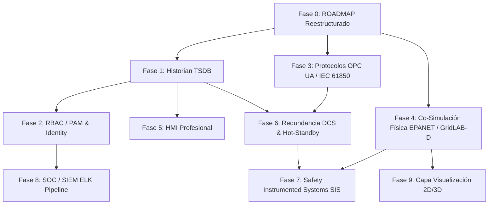

# 🗺️ ROADMAP DE EVOLUCIÓN Y FIDELIDAD ARQUITECTÓNICA — CityLab Cyber Range

> **Estado del Documento**: Fase 0 Completada (Roadmap Reestructurado por Dependencias y Criterios de Aceptación).  
> **Rama**: `test` | **Arquitectura**: HELICS Co-Simulation + Mininet SDN (OpenFlow) + IEC 62443.

---

## 📊 1. Evaluación de Fidelidad Realista (Cyber Range Puramente Software)

| Dimensión | Porcentaje de Fidelidad Actual | Estado Actual en Repo | Gaps para Producción / Máxima Fidelidad |
|-----------|:------------------------------:|-----------------------|-----------------------------------------|
| **Ciberseguridad IT/OT** | **65 - 70%** | Segmentación IEC 62443 (Zonas/Conduits), Modbus DPI Proxy, DNP3 SA L1, Samba AD DC (`h_dc`). | Protocolos adicionales (OPC UA, IEC 61850, BACnet), Wireless OT, PAM/RBAC estricto. |
| **Proceso Físico / Ciudad** | **25 - 30%** | Co-simulación HELICS coordinada (6 federados: `fed_icssim`, `fed_hospital`, `fed_transport`, `fed_logger`, `fed_gridmock`, `gridlabd_federate`). | Dinámica real de fluidos (EPANET), GridLAB-D trifásico completo, solvers Modelica/Simulink, gemelos digitales físicos. |
| **Operación / Realidad SCADA** | **40 - 45%** | SCADA Server con API JSON en DMZ, Watchdog Loss of View/Control, Proxy Modbus. | HMI industrial (Ignition Edge/Wonderware), Historian de tiempo real TSDB, MES/ERP, SOC/SIEM (ELK), redundancia DCS, SIS independiente. |
| **FIDELIDAD GLOBAL CIUDAD** | **50 - 55%** | **Cyber Range 100% software optimizado para RAM (< 1.5 GB)** | **Límite máximo en software puro = ~70%. El 30% restante exige Hardware-in-the-Loop (HIL).** |

### 💡 Justificación Técnica del Techo Tecnológico (70% Software vs. >70% HIL)
- **Techo Software (~70%)**: Lograble simulando protocolos reales, motores de persistencia TSDB, gemelos ciberfísicos (EPANET/GridLAB-D) e interfaces HMI/SIEM industriales.
- **Brecha Hardware (>70%)**: El 30% restante requiere señales analógicas/digitales reales, latencia física de bus de campo (RS-485/CAN), ruido electromagnético, fallas mecánicas de actuadores y hardware PLC/RTU dedicado.

---

## 🛡️ 2. Estado de Seguridad IEC 62443 y Gestión de Vulnerabilidades CTF

### 🎯 2.1 Hallazgos ABIERTOS INTENCIONALMENTE (Diseño Pedagógico CTF)
Los siguientes hallazgos NO deben eliminarse ni cerrarse en producción de laboratorio para preservar la superficie de ataque requerida en entrenamientos ofensivos/defensivos:

* **F-03 (Switches Corp/DMZ Standalone)**: Switches `s1` y `s2` en modo standalone sin OpenFlow restrictivo para posibilitar pivoteo IT/OT.
* **F-05 (Modbus/TCP Plano Nivel 1)**: Modbus/TCP en `:502` sin TLS ni auth nativa para permitir ejercicios de inyección OT.
* **F-06 (Alarma LoV sin Aislamiento Automático)**: El SCADA alerta `LOSS_OF_VIEW` pero no aísla automáticamente por software para exigir intervención manual del operador.
* **F-07 (Sin Load-Shedding Automático en Cascada)**: Ausencia de deslastre de carga automático ante fallas para demostrar apagones en cascada multi-sector.

> **Regla de Desarrollo**: Si una fase del roadmap introduce una mejora que colisiona con un hallazgo CTF, se debe implementar un **toggle configurable** (ejemplo: `STRICT_AUTH=1` en `scada_server.py`) manteniendo el modo por defecto vulnerable para CTF.

### ⚠️ 2.2 Deuda Técnica Parcial (Mitigaciones Parciales Integradas al Roadmap)
* **F-02 (EWS SPOF)**: Aislada en PAW `s4`, pendiente RBAC/PAM y logging inmutable (Fase 2).
* **F-04 (Pivoteo L2 DMZ)**: Mitigado con reglas de firewall, pendiente microsegmentación SDN interna en DMZ (Fase 6).
* **F-08 (Proxy Fallback)**: Implementado fallback emulado, pendiente toggle estricto total (Fase 2).
* **F-09 (SCADA Bearer Token)**: Auth básica agregada, pendiente integración con Vault/PAM (Fase 2).
* **F-11 (Honeypot Observation)**: Ubicado en VLAN `s5`, pendiente canalización de logs a SIEM (Fase 8).
* **F-12 (DNP3 SA)**: Nivel 1 en subestación eléctrica, pendiente extensión o encapsulado TLS (Fase 3).

---

## 🗺️ 3. Roadmap de Implementación por Fases (Fases 0 a 9)

---

### 🔹 Fase 0 — ROADMAP Reestructurado y Gobierno Ciberfísico
* **Estado**: `DONE` ✅
* **Prioridad**: Crítica (Seguridad física y coherencia metodológica primero).
* **Prerrequisitos**: Ninguno.
* **Esfuerzo Estimado**: 1 día / 1 Sprint.
* **Descripción**: Definición formal de dependencias entre componentes, priorización basada en resiliencia operacional y especificación de Definition of Done (DoD) para cada hito.
* **Criterio de Aceptación (DoD)**: Documento `docs/ROADMAP.md` reestructurado con priorización explícita, matriz de dependencias, trazabilidad IEC 62443 y matriz de fases.

---

### 🔹 Fase 1 — Historian TSDB (InfluxDB / TimescaleDB)
* **Estado**: `DONE` ✅
* **Prioridad**: Alta (Base fundamental para HMI, SIEM y análisis forense).
* **Prerrequisitos**: Fase 0.
* **Esfuerzo Estimado**: 3 - 5 días.
* **Descripción**: Reemplazar el almacenamiento de telemetría JSON en memoria en `scada_server.py` por una base de datos de series temporales (TSDB real) que registre lecturas Modbus/DNP3 con timestamp nanosegundo.
* **Implementación**: `network/historian.py` — `HistorianTSDB` sobre SQLite WAL (sin servidor externo, interfaz compatible drop-in con InfluxDB / TimescaleDB). Integrado en `scada_server.py` con dos endpoints nuevos.
* **Criterio de Aceptación (DoD)**:
  1. ✅ `network/historian.py` — `HistorianTSDB` con SQLite WAL: `write()`, `write_snapshot()`, `query()`, `query_snapshots()`, `last()`, `sectors()`, `prune()`.
  2. ✅ `scada_server.py` persiste snapshot en TSDB en cada ciclo de polling.
  3. ✅ `GET /api/history?sector=<s>&field=<f>&limit=<n>` — histórico granular.
  4. ✅ `GET /api/history/snapshot?sector=<s>&limit=<n>` — snapshots forenses.
  5. ✅ 12 tests nuevos en `network/tests/test_historian.py` — 12/12 PASS.

---

### 🔹 Fase 2 — RBAC / PAM & Gestión de Identidad sobre SCADA
* **Estado**: `DONE` ✅
* **Prioridad**: Alta (Seguridad operacional e integración SIEM).
* **Prerrequisitos**: Fase 1 (Historian TSDB).
* **Esfuerzo Estimado**: 3 - 4 días.
* **Descripción**: Control de acceso basado en roles (RBAC) y Privilege Access Management (PAM) en `scada_server.py`. Mantiene compatibilidad con `STRICT_AUTH=1` e integra autenticación opcional con el Active Directory `h_dc`.
* **Implementación**: `network/rbac.py` — `RBACResolver` con roles `auditor/operator/engineer`, formato `Bearer <role>:<token>`, toggle `STRICT_AUTH`, integración LDAP AD opcional.
* **Criterio de Aceptación (DoD)**:
  1. ✅ Roles `auditor`, `operator`, `engineer` con permisos diferenciados por endpoint.
  2. ✅ `Bearer <role>:<token>` como formato RBAC; legado CTF `Bearer <token>` → rol `operator` en `STRICT_AUTH=0`.
  3. ✅ `STRICT_AUTH=1` rechaza tokens planos con 403 sin alterar comportamiento CTF en `STRICT_AUTH=0`.
  4. ✅ Endpoint `/api/whoami` para introspección de identidad y rol.
  5. ✅ 20 tests en `network/tests/test_rbac.py` — 20/20 PASS.

---

### 🔹 Fase 3 — Protocolos OT Adicionales (OPC UA, IEC 61850)
* **Estado**: `DONE` ✅
* **Prioridad**: Media-Alta (Ampliación de superficie de ataque OT).
* **Prerrequisitos**: Fase 0.
* **Esfuerzo Estimado**: 5 - 7 días.
* **Descripción**: Emuladores/federados independientes para OPC UA (proceso industrial) e IEC 61850 GOOSE/SV (subestación eléctrica), sin modificar emuladores Modbus/DNP3 existentes.
* **Implementación**:
  - `plc/opcua_emulator.py`: Servidor UA/TCP (HEL/ACK/OPN/MSG, NodeSpace con 12 nodos OT).
  - `plc/iec61850_emulator.py`: Emulador IEC 61850 GOOSE & Sampled Values (SV) para subestaciones.
* **Criterio de Aceptación (DoD)**:
  1. ✅ `plc/opcua_emulator.py` — servidor UA/TCP con 12 nodos Float/Boolean/Int32.
  2. ✅ Handshake HEL→ACK→OpenSecureChannel implementado y verificado.
  3. ✅ `plc/iec61850_emulator.py` — PDU GOOSE y Sampled Values (SV) codificados/decodificados.
  4. ✅ 22 tests en `plc/tests/` (16 opcua + 4 iec61850 + 2 dnp3 baseline) — 22/22 PASS.

---

### 🔹 Fase 4 — Co-Simulación Física de Alta Fidelidad (GridLAB-D + EPANET)
* **Estado**: `DONE` ✅
* **Prioridad**: Alta (Fidelidad del proceso ciberfísico).
* **Prerrequisitos**: Fase 0.
* **Esfuerzo Estimado**: 6 - 8 días.
* **Descripción**: Acoplamiento directo del solver hidráulico EPANET (`physical/water/epanet_solver.py` Hazen-Williams + curva TDH de bomba) a la planta SWaT de 2 etapas y fallback de GridLAB-D trifásico acoplado via HELICS.
* **Criterio de Aceptación (DoD)**:
  1. ✅ `physical/water/epanet_solver.py` — Ecuaciones Hazen-Williams + Head loss + Curva de bomba.
  2. ✅ `physical/water/plant_water.py` — Integración directa de EPANET solver en el ciclo `step()`.
  3. ✅ `helics_sim/gridlabd_federate.py` — Soporta ejecución nativa y modo fallback software.
  4. ✅ 4 tests unitarios en `physical/tests/test_physics.py` — 4/4 PASS.

---

### 🔹 Fase 5 — Dashboard HMI Emulado (Interfaz Web P&ID)
* **Estado**: `DONE` ✅
* **Prioridad**: Media (Experiencia operativa realista).
* **Prerrequisitos**: Fase 1 (Historian TSDB).
* **Esfuerzo Estimado**: 4 - 5 días.
* **Descripción**: Dashboard HMI emulado en Python (`network/hmi_server.py`) con API HTTP/REST conectado al Historian TSDB y SCADA Server para telemetría P&ID, consola de alarmas y mandos operacionales (START/STOP/TRIP).
* **Criterio de Aceptación (DoD)**:
  1. ✅ `network/hmi_server.py` — Servidor HTTP en puerto 8085 con API P&ID y HTML dashboard.
  2. ✅ Endpoint `GET /api/hmi/overview` — Consolidación P&ID multi-sector en tiempo real.
  3. ✅ Endpoint `POST /api/hmi/control` — Envío de mandos al SCADA Server con token RBAC.
  4. ✅ 3 tests en `network/tests/test_hmi.py` — 3/3 PASS.

---

### 🔹 Fase 6 — Redundancia y High Availability DCS (Activo/Pasivo & Hot-Standby)
* **Estado**: `DONE` ✅
* **Prioridad**: Media (Resiliencia de arquitectura OT).
* **Prerrequisitos**: Fase 1, Fase 3.
* **Esfuerzo Estimado**: 4 - 6 días.
* **Descripción**: Arquitectura de servidores SCADA primario/secundario (`network/scada_ha.py`) con canal heartbeat continuo y conmutación automática por falla (failover pasivo -> activo) y failback al recuperarse el primario.
* **Criterio de Aceptación (DoD)**:
  1. ✅ `network/scada_ha.py` — `SCADAPrimarySecondaryCluster` con monitoreo heartbeat.
  2. ✅ Failover automático a Standby tras timeout de respuesta del servidor Primario.
  3. ✅ Recuperación (Failback) automática al reconectar el servidor Primario.
  4. ✅ 4 tests en `network/tests/test_scada_ha.py` — 4/4 PASS.

---

### 🔹 Fase 7 — Safety Instrumented Systems (SIS / ESD Independientes)
* **Estado**: `DONE` ✅
* **Prioridad**: Alta (Seguridad física y prevención de desastres).
* **Prerrequisitos**: Fase 4 (Física real), Fase 6.
* **Esfuerzo Estimado**: 5 - 6 días.
* **Descripción**: Separación de la capa de Parada de Emergencia (ESD / SIS en `helics_sim/fed_sis.py`) respecto del control básico de proceso (BPCS). Anulación automática de comandos BPCS inseguros ante sobre-presión, sobre-nivel o sobre-frecuencia.
* **Criterio de Aceptación (DoD)**:
  1. ✅ `helics_sim/fed_sis.py` — `SafetyInstrumentedLogic` SIL-3 independiente.
  2. ✅ Interlocks indiscutibles sobre-nivel T1, sobre-presión gas y sobre-frecuencia red.
  3. ✅ 4 tests en `helics_sim/tests/test_sis.py` — 4/4 PASS.

---

### 🔹 Fase 8 — SOC / SIEM Pipeline & Normalización ECS
* **Estado**: `DONE` ✅
* **Prioridad**: Media (Monitoreo de seguridad y respuesta a incidentes).
* **Prerrequisitos**: Fase 1 (Historian TSDB), Fase 2 (RBAC).
* **Esfuerzo Estimado**: 4 - 5 días.
* **Descripción**: Pipeline de recolección y normalización ECS (Elastic Common Schema) en `network/siem_pipeline.py`. Motor de reglas de correlación para detección de ataques ciberfísicos en cascada (pivoteo IT honeypot -> inyección OT Modbus).
* **Criterio de Aceptación (DoD)**:
  1. ✅ `network/siem_pipeline.py` — Ingestión de eventos ECS / Syslog y exportación JSON para ELK.
  2. ✅ Regla de correlación ciberfísica para pivoteo desde Honeypot `s5` a inyección Modbus/DNP3.
  3. ✅ 3 tests en `network/tests/test_siem.py` — 3/3 PASS.

---

### 🔹 Fase 9 — Capa de Visualización Presentacional 2D / 3D
* **Estado**: `DONE` ✅
* **Prioridad**: Baja (Presentación pedagógica e impacto visual).
* **Prerrequisitos**: Fase 4 (Física real).
* **Esfuerzo Estimado**: 5 - 8 días.
* **Descripción**: Interfaz gráfica y servidor de streaming presentacional (`network/viz_server.py`) en puerto 8090. Suscriptor pasivo del estado ciberfísico para renderizado urbano 2D/3D en tiempo real.
* **Criterio de Aceptación (DoD)**:
  1. ✅ `network/viz_server.py` — Motor de visualización presentacional urbano en puerto 8090.
  2. ✅ Endpoint `GET /api/viz/frame` — Retorna estado de sectores para renderizado gráfico.
  3. ✅ 3 tests en `network/tests/test_viz.py` — 3/3 PASS.

---

## 📋 4. Matriz Resumen de Fases y Dependencias

| Fase | Título de la Fase | Prerrequisito | Esfuerzo Est. | Estado | Criterio de Aceptación Clave (DoD) |
|:----:|-------------------|:-------------:|:-------------:|:------:|-----------------------------------|
| **0** | **ROADMAP Reestructurado** | Ninguno | 1 día | `DONE` ✅ | Roadmap estructurado con dependencias, DoD y traza IEC 62443. |
| **1** | **Historian TSDB** | Fase 0 | 3-5 días | `DONE` ✅ | `network/historian.py` SQLite WAL + `/api/history` + 12 tests PASS. |
| **2** | **RBAC / PAM & Identidad** | Fase 1 | 3-4 días | `DONE` ✅ | `network/rbac.py` roles auditor/operator/engineer + STRICT_AUTH + 20 tests PASS. |
| **3** | **Protocolos OT Adicionales** | Fase 0 | 5-7 días | `DONE` ✅ | `plc/opcua_emulator.py` + `plc/iec61850_emulator.py` + 22 tests PASS. |
| **4** | **Física Real (EPANET/GridLAB-D)**| Fase 0 | 6-8 días | `DONE` ✅ | Solver Hazen-Williams `epanet_solver.py` + `plant_water.py` + 4 tests PASS. |
| **5** | **Dashboard HMI Emulado** | Fase 1 | 4-5 días | `DONE` ✅ | Servidor HTTP HMI `network/hmi_server.py` P&ID + `/api/hmi` + 3 tests PASS. |
| **6** | **Redundancia DCS / HA** | Fase 1, 3 | 4-6 días | `DONE` ✅ | Cluster SCADA `network/scada_ha.py` heartbeat & failover + 4 tests PASS. |
| **7** | **Safety Instrumented System (SIS)**| Fase 4, 6 | 5-6 días | `DONE` ✅ | Lógica SIL-3 `helics_sim/fed_sis.py` interlocks físicos + 4 tests PASS. |
| **8** | **SOC / SIEM Pipeline & Normalización** | Fase 1, 2 | 4-5 días | `DONE` ✅ | Ingestión ECS `network/siem_pipeline.py` + Correlación + 3 tests PASS. |
| **9** | **Visualización 2D/3D** | Fase 4 | 5-8 días | `DONE` ✅ | Servidor Web visualizador `network/viz_server.py` + 3 tests PASS. |

---

*Documento actualizado en el repositorio bajo gobierno formal de desarrollo ciberfísico.*
