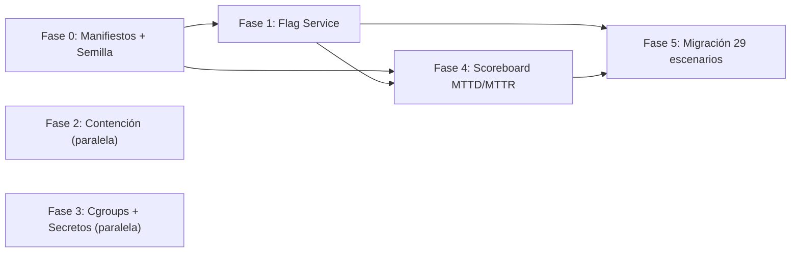

# 🎯 Roadmap — Medición del Aprendizaje y Contención del Laboratorio

**Estado**: Propuesto
**Base**: HEAD `1997751` (tag `v0.13.4`)
**Origen**: Auditoría IEC 62443 / revisión de fidelidad (2026-08-26). Hallazgo estratégico: el núcleo de simulación aprieta fuerte; los ejes de *medición del aprendizaje* y *contención del laboratorio* son los bordes blandos.
**Regla de oro**: toda afirmación de este plan se verifica contra código con `path:line`. Ningún criterio de aceptación se da por cumplido sin evidencia reproducible.

---

## 📑 Tabla de Contenidos

1. [Contexto y Justificación](#1-contexto-y-justificación)
2. [Objetivos Estratégicos y Métricas de Éxito](#2-objetivos-estratégicos-y-métricas-de-éxito)
3. [Fase 0 — Cimientos: Manifiestos de Escenario y Semilla de Sesión](#3-fase-0--cimientos-manifiestos-de-escenario-y-semilla-de-sesión)
4. [Fase 1 — Servicio de Flags Verificables (Scoring Server-Side)](#4-fase-1--servicio-de-flags-verificables-scoring-server-side)
5. [Fase 2 — Contención: Egress, Namespaces y Jaula Probada](#5-fase-2--contención-egress-namespaces-y-jaula-probada)
6. [Fase 3 — Ciclo de Vida por Cgroups y Secretos Fuera del Repo](#6-fase-3--ciclo-de-vida-por-cgroups-y-secretos-fuera-del-repo)
7. [Fase 4 — Scoreboard y Métricas MTTD/MTTR Automáticas](#7-fase-4--scoreboard-y-métricas-mttdmttr-automáticas)
8. [Fase 5 — Migración Masiva de Escenarios y Anti-Memorización](#8-fase-5--migración-masiva-de-escenarios-y-anti-memorización)
9. [Dependencias, Riesgos y Mitigaciones](#9-dependencias-riesgos-y-mitigaciones)
10. [Lo que este Plan NO Persigue](#10-lo-que-este-plan-no-persigue)

---

## 1. Contexto y Justificación

CityLab es un cyber range educativo: su producto no es el sistema, es el **aprendizaje medible**. La auditoría sobre `v0.13.4` confirmó:

- ✅ Núcleo sólido: microsegmentación IEC 62443 real (7 conduits PASS en vivo), cadena GOOSE → SIEM → SDN Circuit Breaker verificada en dataplane, 200 tests en verde.
- ⚠️ Brecha de medición: las flags CTF son strings estáticos visibles en el markdown (ej. `docs/scenarios/scenario_01_cascading_blackout.md:71`). Son memorizables y no verificables server-side; ningún escenario comprueba estado físico real para otorgar éxito.
- ⚠️ Brecha de contención: el teardown usa `pkill -9 -f` por nombre (`network/topology.py:281-300`), que puede matar procesos ajenos del host; no existe egress filtering que impida que tráfico de la simulación (10.0.0.0/8) salga a la LAN real; los tokens RBAC están hardcodeados en documentación (`docs/OPERATIONS.md:41`).

**Principio rector del plan**: la jaula se *prueba*, no se asume; la flag no *existe* hasta que la condición de estado real se cumple.

---

## 2. Objetivos Estratégicos y Métricas de Éxito

| # | Objetivo | Métrica de éxito (verificable) |
|---|---|---|
| O1 | Flags dinámicas por sesión | Ninguna flag aparece en texto plano en `docs/`; `grep -r "FLAG_" docs/` solo retorna placeholders |
| O2 | Scoring por estado real | `python3 scripts/run_scenario.py --id 01 --check` emite flag solo si el Historian confirma el efecto físico |
| O3 | Jaula probada | `sudo ./scripts/validate_e2e.sh` incluye fase anti-escape: desde `h_attacker`, ping a gateway real del host → 100% bloqueado |
| O4 | Teardown sin daño colateral | Teardown por cgroup/slice; `pkill -f` eliminado de `network/topology.py` y `scripts/validate_e2e.sh` |
| O5 | Secretos fuera del repo | `OP_TOKEN_2026` / `ENG_TOKEN_2026` solo en `.env` (git-ignored); generación aleatoria por sesión en `citylab.sh up` |
| O6 | Métricas SOC automáticas | Scoreboard reporta MTTD/MTTR desde eventos ECS del SIEM sin intervención del alumno |
| O7 | Regresión cero | `pytest network/tests plc/tests physical helics_sim attacker/tests -q` → 200 passed en cada fase |

---

## 3. Fase 0 — Cimientos: Manifiestos de Escenario y Semilla de Sesión

**Esfuerzo estimado**: 1 día. **Dependencias**: ninguna.

El markdown de escenarios queda para el humano; el manifiesto YAML es la fuente de verdad máquina-legible (elimina la clase de drift docs↔código corregida en `1997751`).

### Tareas

1. Crear `config/scenarios/scenario_01.yml` (piloto):
   ```yaml
   id: 01
   title: Apagón Urbano en Cascada
   seed_scope: [unit_ids, flags]
   objectives:
     - id: FLAG_1
       desc: Reconocimiento DMZ completado
       check: {type: http_status, url: "http://10.0.2.20:8080/api/telemetry", expect: 200}
     - id: FLAG_2
       desc: Subfrecuencia de red provocada
       check: {type: historian_condition, query: "grid_freq_hz < 58.0", window_s: 30}
     - id: FLAG_3
       desc: Apagón en cascada logrado
       check: {type: scada_sector_status, sector: water, expect: LOSS_OF_VIEW}
   ```
2. Definir JSON Schema del manifiesto en `config/scenarios/schema.json` (tipos de check: `http_status`, `historian_condition`, `scada_sector_status`, `siem_alert`, `openflow_rule`).
3. Semilla de sesión: `citylab.sh up` genera `CITYLAB_SESSION_SEED` (aleatoria por despliegue) y la exporta a todos los componentes vía entorno.
4. Test unitario: validación de esquema contra los 5 tipos de check (`network/tests/test_scenario_manifest.py`).

### Criterios de aceptación

- `python3 -c "import yaml, jsonschema; ..."` valida el manifiesto piloto contra el esquema.
- Semilla presente en entorno de emuladores lanzados desde `network/topology.py` (propagación en las líneas de `nohup env ...`).

---

## 4. Fase 1 — Servicio de Flags Verificables (Scoring Server-Side)

**Esfuerzo estimado**: 1-2 días. **Dependencias**: Fase 0.

### Tareas

1. Nuevo módulo `network/flag_service.py` (~150-200 líneas, stdlib pura, mismo estilo que `network/siem_pipeline.py`):
   - Flag = `FLAG_<id>{HMAC_SHA256(session_seed, flag_id)[:12]}` — dinámica, inmemorizable.
   - `GET /api/flag/mint/<flag_id>`: evalúa el check del manifiesto *en ese instante* (Historian SQLite WAL, `/api/telemetry`, `/api/siem/alerts`) y solo emite si la condición de estado real se cumple.
   - `POST /api/flag/submit`: rate-limited, registra en SIEM como `event_category='ctf'`.
   - Puerto: `8570` en `h_scada` (10.0.2.20), registrado en la matriz de puertos de `docs/ARCHITECTURE.md` §8.
2. Spawn del daemon en `network/topology.py` (mismo patrón `nohup env ...` de los demás servicios) y alta en el teardown por cgroup (Fase 3).
3. Oráculos de check (módulo interno `checkers`):
   - `historian_condition`: consulta SQL sobre el Historian TSDB (`network/historian.py`).
   - `scada_sector_status`: lectura de `/api/telemetry`.
   - `siem_alert`: presencia de alerta por nombre en `/api/siem/alerts`.
   - `openflow_rule`: `ovs-ofctl dump-flows s3` contiene la regla esperada.
4. Runner: `scripts/run_scenario.py --id NN --check` → ejecuta checks, imprime scorecard, emite flags.
5. Tests: `network/tests/test_flag_service.py` (mint positivo/negativo, rate limit, HMAC determinista por semilla, flags distintas entre sesiones).

### Criterios de aceptación

- Flag de `scenario_01` FLAG_2 **no** se emite con la planta en reposo; **sí** se emite tras `attack_multisector.py --sector elec --mode stop` con caída de frecuencia registrada en Historian.
- Dos sesiones con semillas distintas producen flags distintas para el mismo objetivo.
- Suite completa: 200 + nuevos tests en verde.

---

## 5. Fase 2 — Contención: Egress, Namespaces y Jaula Probada

**Esfuerzo estimado**: 0.5-1 día. **Dependencias**: ninguna (puede paralelizar con Fase 1). **Prioridad de seguridad: ALTA** — es riesgo real sobre el host.

### Tareas

1. **Egress filtering** en `network/topology.py` (junto a las reglas `iptables` existentes, ~línea 156):
   - Detectar interfaz física del host (`ip route show default`).
   - `iptables -A OUTPUT -s 10.0.0.0/8 -o <iface_física> -j DROP` en el namespace raíz.
   - Sin NAT/MASQUERADE del lab hacia el host bajo ninguna ruta.
2. **Multicast contenido**: `plc/iec61850_emulator.py` (~línea 255) debe fijar `IP_MULTICAST_IF` a la interfaz del netns; GOOSE/SV con TTL=2 no deben fugarse a la LAN.
3. **Ataques solo dentro de netns**: ningún `attacker/*.py` se ejecuta en el namespace del host durante escenarios guiados; documentar el patrón `h_attacker.cmd(...)` en `docs/OPERATIONS.md`.
4. **Auditoría de binds**: `citylab.sh up` verifica que ningún componente del lab escuche en `0.0.0.0` del namespace raíz (los daemons viven en netns Mininet; modo localhost solo `127.0.0.1`).
5. **Test de jaula** — nueva fase en `scripts/validate_e2e.sh`:
   - Desde `h_attacker`: ping al gateway real del host, consulta DNS externa, HTTP a IP pública → esperado BLOCKED (100% loss / timeout).
   - Verificar que `239.0.0.1` no se propaga fuera de `s3`.

### Criterios de aceptación

- `validate_e2e.sh` termina con sección `[7/7] Contención anti-escape` en PASS.
- `tcpdump` en la interfaz física durante el E2E: cero paquetes con origen `10.0.0.0/8` ni destino `239.0.0.0/24`.

---

## 6. Fase 3 — Ciclo de Vida por Cgroups y Secretos Fuera del Repo

**Esfuerzo estimado**: 0.5-1 día. **Dependencias**: ninguna.

### Tareas

1. **Cgroup por componente**: lanzar federados/emuladores/daemons con `systemd-run --scope --unit citylab-<comp>` (o cgroup v2 dedicado `citylab.slice`):
   - `MemoryMax=512M`, `CPUQuota=50%` por unidad — un `attack_modbus_dos.py` del alumno no tumba la estación.
   - Teardown = `systemctl kill 'citylab-*'` + `mn -c`: exacto, sin daño colateral.
2. **Eliminar `pkill -f`**: reescribir `teardown_topology_and_daemons()` (`network/topology.py:281-300`) y el `trap cleanup` de `scripts/validate_e2e.sh:20-40` para operar sobre el slice.
3. **Secretos dinámicos**:
   - Mover tokens RBAC a `.env` (git-ignored); `citylab.sh up` genera tokens aleatorios por sesión y los inyecta vía entorno a `scada_server` / `hmi_server`.
   - `docs/OPERATIONS.md` §2 pasa a mostrar placeholders (`Bearer engineer:<ENG_TOKEN>`).
   - `network/rbac.py` lee la tabla de tokens desde entorno/archivo, no hardcodeada.
4. **Mínimo privilegio**: solo `network/topology.py` (Mininet/OVS) corre con root; emuladores y daemons como usuario normal dentro de sus netns.

### Criterios de aceptación

- `grep -n "pkill" network/topology.py scripts/validate_e2e.sh` → 0 coincidencias.
- `systemd-cgls` muestra `citylab.slice` durante `up` y vacío tras `down`.
- `git grep "OP_TOKEN_2026"` → 0 coincidencias en archivos rastreados.
- E2E completo PASS con teardown por slice (0 procesos huérfanos verificado con `./citylab.sh status`).

---

## 7. Fase 4 — Scoreboard y Métricas MTTD/MTTR Automáticas

**Esfuerzo estimado**: 1 día. **Dependencias**: Fases 0 y 1.

### Tareas

1. Nuevo módulo `network/scoreboard.py`:
   - Consume `GET http://10.0.2.20:8514/api/siem/events` (embudo ECS ya existente — cero instrumentación nueva en componentes).
   - **MTTD**: `timestamp(primer evento del ataque) → timestamp(primera alerta correlacionada)`.
   - **MTTR**: `timestamp(alerta) → timestamp(regla OpenFlow de aislamiento / acción del operador)`.
   - Scorecard por sesión: objetivos cumplidos (cruzando con manifiesto YAML), timeline de eventos, métricas SOC.
2. Endpoint `GET /api/scoreboard` en el flag service (o daemon propio `:8571`).
3. Cierre del ciclo con `docs/scenarios/scenario_22_purple_team_metrics_mttd.md`: el escenario pasa de "el alumno reporta métricas" a "el motor las mide".
4. Tests: `network/tests/test_scoreboard.py` con eventos ECS sintéticos (timestamps controlados → MTTD/MTTR exactos).

### Criterios de aceptación

- Tras el E2E GOOSE, `run_scenario.py --id 02 --scorecard` reporta MTTD y MTTR numéricos consistentes con los timestamps del log.
- Scoreboard vacío (sin ataques) reporta 0 objetivos sin errores.

---

## 8. Fase 5 — Migración Masiva de Escenarios y Anti-Memorización

**Esfuerzo estimado**: 2-3 días (incremental). **Dependencias**: Fases 0, 1, 4.

### Tareas

1. Migrar los escenarios 01-29 a manifiestos `config/scenarios/scenario_*.yml`, priorizando los del currículo base (01, 02, 05, 11, 17, 19, 21) ya alineados en `v0.13.4`.
2. **Anti-memorización**: generalizar el patrón de `attacker/attack_blind_randomized_env.py` — la semilla de sesión permuta Unit IDs y offsets de coils dentro de rangos válidos; un walkthrough copiado deja de funcionar entre sesiones.
3. Los markdowns de escenarios reemplazan flags literales por placeholders y referencian su manifiesto.
4. `docs/OPERATIONS.md` §4: la matriz de escenarios lista los 29 con enlace a manifiesto y dificultad.
5. CI: cada manifiesto se valida contra `schema.json` en pre-commit/CI.

### Criterios de aceptación

- `grep -rn "FLAG_[0-9]{" docs/` → 0 flags literales (solo placeholders).
- `for i in $(seq -w 1 29); do python3 scripts/run_scenario.py --id $i --validate-manifest; done` → 29/29 OK.
- Dos despliegues consecutivos con semillas distintas: misma dificultad pedagógica, flags y offsets distintos.

---

## 9. Dependencias, Riesgos y Mitigaciones

### Grafo de dependencias



### Riesgos

| Riesgo | Prob. | Impacto | Mitigación |
|---|---|---|---|
| `systemd-run` no disponible en entorno minimal | Media | Medio | Fallback a cgroup v2 manual (`/sys/fs/cgroup`) o PID files bajo `runfiles/` con verificación de cmdline antes de matar |
| Egress filtering rompe smoke tests HELICS locales | Media | Medio | Reglas solo sobre interfaz física; localhost (`127.0.0.1`) explícitamente exento; correr smoke fases 4/7 como regresión |
| Checks de estado flaky por timing HELICS | Alta | Medio | Ventanas de tolerancia en manifiestos (`window_s`), reintentos con backoff en `checkers` |
| Deriva docs↔código reaparece | Media | Alto | Manifiesto YAML como fuente única; regla de auditoría: toda afirmación con `path:line`; CI valida esquemas |
| Rotura de escenarios CTF existentes al mover secretos | Media | Bajo | `STRICT_AUTH=0` (modo CTF) sigue funcional sin tokens; solo modo estricto exige `.env` |

### Estimación total

**6-9 días de ingeniería** en 5 fases. Fases 2 y 3 son paralelizables con 0-1.

---

## 10. Lo que este Plan NO Persigue

- ❌ Alta disponibilidad empresarial del SIEM/flag service (eso es sistema productivo, no range).
- ❌ Multi-tenancy / 1000 usuarios concurrentes.
- ❌ Reescribir el motor SIEM como correlador temporal completo (queda como mejora posterior; este plan lo *usa* como bus de evidencia, no lo reemplaza).
- ❌ Nuevos frameworks o dependencias externas: stdlib de Python + systemd + iptables, como el resto del repo.

**Criterio de cierre del roadmap**: O1-O7 verificados con evidencia reproducible, suite de tests en verde, E2E con fase anti-escape PASS, y auditoría de fidelidad documental sin 🔴.
