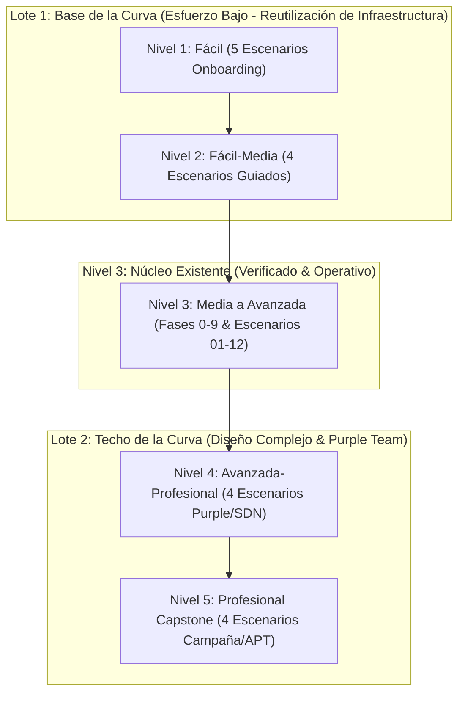

# 🎓 CityLab Cyber Range — Roadmap Curricular de Escenarios CTF (IEC 62443 / GICSP Aligned)

**Versión**: 2.0  
**Estado**: Propuesto & Planificado  
**Objetivo**: Establecer una curva pedagógica progresiva completa en ciberseguridad industrial OT/ICS, resolviendo el sesgo hacia niveles intermedios/avanzados mediante la incorporación de capas de onboarding fácil y capstones profesionales.

---

## 1. 📊 Diagnóstico y Distribución Curricular

### Estado Anterior (Escenarios 01 a 12)
La primera cohorte de escenarios centró su diseño en la sofisticación técnica de incidentes ciberfísicos reales (Industroyer2, Stuxnet, Triton, SWaT). Esto concentró el 91.6% de los laboratorios en niveles **Media** a **Avanzada**, dejando desatendida la fase de onboarding pasivo y el ejercicio de campaña profesional en tiempo real.

| Nivel de Dificultad | Escenarios Existentes | % Cobertura Anterior |
|:---|:---|:---:|
| **Fácil (Onboarding)** | Ninguno | 0.0% |
| **Fácil-Media** | Scenario 08 (`insider_rbac`) | 8.3% |
| **Media** | Scenarios 01, 06, 07, 12 | 33.3% |
| **Media-Avanzada** | Scenarios 02, 05, 11 | 25.0% |
| **Avanzada** | Scenarios 03, 04, 09, 10 | 33.3% |
| **Profesional (Capstone)** | Ninguno | 0.0% |

---

## 2. 🗺️ Propuesta de Extensión por Lotes



---

## 3. 📝 Desglose de Escenarios por Lote

### 🟢 LOTE 1: Base de la Curva (Fácil & Fácil-Media)

#### Nivel 1: Fácil (Onboarding OT — Cero Exploit, Solo Ojos)
*Reutiliza la captura de tráfico Mininet, honeypots e interfaces HMI sin requerir código de ataque complejo.*

1. **`scenario_13_ot_passive_recon` (Fácil)**:
   - **TTP**: Sniffing pasivo con `tcpdump` / Wireshark en la red OT Mininet.
   - **Objetivo**: Identificar puertos `TCP/502` (Modbus), `TCP/20000` (DNP3), `TCP/4840` (OPC UA) y dibujar el mapa topológico de zonas IEC 62443.
   - **Enseña**: Visibilidad de redes OT sin cifrado nativo.

2. **`scenario_14_ot_active_scanning` (Fácil)**:
   - **TTP**: Escaneo de red activo guiado con `nmap` desde `h_attacker` hacia las 3 zonas VLAN.
   - **Objetivo**: Mapear puertos abiertos y diferenciar respuestas entre zona corporativa, DMZ y celda OT.
   - **Enseña**: Evaluación de efectividad en la segmentación de red.

3. **`scenario_15_modbus_read_telemetry` (Fácil)**:
   - **TTP**: Lectura de registros Modbus sin escritura mediante script liviano `pymodbus`.
   - **Objetivo**: Correlacionar direcciones de coils/holding registers con variables físicas de planta (nivel de tanque, presión).
   - **Enseña**: Mapeo de memoria PLC a procesos físicos realistas.

4. **`scenario_16_honeypot_interaction` (Fácil)**:
   - **TTP**: Conexión directa al honeypot de subestación en VLAN `s5`.
   - **Objetivo**: Observar en tiempo real la generación del log/evento SIEM al ser detectado.
   - **Enseña**: Concepto de *deception technology* y detección de intrusiones.

5. **`scenario_17_scada_tour_api` (Fácil)**:
   - **TTP**: Exploración de la API REST y dashboard del Servidor SCADA/HMI.
   - **Objetivo**: Probar los endpoints `/api/whoami`, `/api/telemetry`, `/api/history` y visualizar el diagrama P&ID en puerto `:8085`.
   - **Enseña**: Navegación de interfaces operacionales HMI/SCADA.

#### Nivel 2: Fácil-Media (Manipulación Guiada & Gaps de Defensa)
*Empaquetado de componentes existentes con documentación interactiva.*

6. **`scenario_18_modbus_single_coil_write` (Fácil-Media)**:
   - **TTP**: Escritura forzada de un solo coil Modbus (`Coil 0` bomba agua) reutilizando script `attacker/exploit_modbus.py`.
   - **Objetivo**: Provocar el arranque manual del actuador y medir el incremento del proceso en la HMI.
   - **Enseña**: Control directo sin autenticación en protocolos legados.

7. **`scenario_19_guided_pivoting_chain` (Fácil-Media)**:
   - **TTP**: Cadena de salto explícita `Attacker (10.0.1.10) -> DMZ (10.0.2.10) -> OT PLC (10.0.3.10)`.
   - **Objetivo**: Utilizar credenciales dadas para atravesar las zonas de seguridad y documentar brechas de aislamiento (F-03).
   - **Enseña**: Defensa en profundidad y salto entre zonas IT/OT.

8. **`scenario_20_strict_auth_toggle_comparison` (Fácil-Media)**:
   - **TTP**: Comparación de ataque entre `STRICT_AUTH=0` (Token plano) y `STRICT_AUTH=1` (Bearer estricto con rol).
   - **Objetivo**: Analizar la respuesta HTTP 200 vs HTTP 403 en el proxy SCADA RBAC.
   - **Enseña**: Primer ejercicio práctico Blue Team sobre hardening de APIs OT.

9. **`scenario_21_loss_of_view_manual_isolation` (Fácil-Media)**:
   - **TTP**: Desconexión del enlace de red SCADA-PLC y observación del comportamiento del watchdog.
   - **Objetivo**: Detectar la pérdida de visibilidad (*Loss of View*) y responder mediante aislamiento manual de switch (F-06).
   - **Enseña**: Respuesta a incidentes (IR) ante cegamiento de telemetría.

---

### 🔴 LOTE 2: Techo de la Curva (Avanzada-Profesional & Capstone)

#### Nivel 4: Avanzada-Profesional (Purple Team, SDN & Resiliencia)

10. **`scenario_22_purple_team_metrics_mttd` (Avanzada-Profesional)**:
    - **TTP**: Inyección GOOSE Spoofing + monitoreo SIEM automatizado.
    - **Objetivo**: Medir tiempos de detección (MTTD) y respuesta (MTTR) generando un reporte formal NIST SP 800-61.
    - **Enseña**: Métricas cuantitativas de SOC Industrial.

11. **`scenario_23_live_sdn_defense_under_fire` (Avanzada-Profesional)**:
    - **TTP**: Ataque *Low-and-Slow* activo mientras el Blue Team aplica reglas de filtrado dinámico SDN (OVS) en caliente sin detener el proceso.
    - **Objetivo**: Proteger la disponibilidad de la planta manteniendo el proceso dentro de tolerancia física.
    - **Enseña**: El compromiso central de ciberseguridad OT: *Seguridad vs Disponibilidad*.

12. **`scenario_24_siem_rule_evasion_multi_ip` (Avanzada-Profesional)**:
    - **TTP**: Inspección de reglas de correlación en `siem_pipeline.py` y diseño de vector multi-IP distribuido para evadir alertas.
    - **Objetivo**: Lograr la disrupción ciberfísica sin disparar las firmas fijas del SIEM.
    - **Enseña**: Adquisición de mentalidad de evasión y limitaciones de la detección por reglas.

13. **`scenario_25_ransomware_tabletop_exercise` (Avanzada-Profesional)**:
    - **TTP**: Simulación de crisis por ransomware con inyección de eventos por instructor y roles asignados (Operador, CISO, Legal).
    - **Objetivo**: Ejecutar la toma de decisiones estratégicas ante indisponibilidad de sistemas de negocio.
    - **Enseña**: Gestión de crisis y continuidad operativa.

#### Nivel 5: Profesional (Capstones de Campaña APT)

14. **`scenario_26_apt_campaign_sandworm_emulation` (Profesional Capstone)**:
    - **TTP**: Campaña multilaboratorio de 4 a 6 horas (Recon -> Intrusión -> Pivoteo -> Persistencia -> Anti-forense -> Disrupción ciberfísica -> IR).
    - **Objetivo**: Recrear una operación persistente completa basada en los grupos de amenaza Sandworm / ELECTRUM.
    - **Enseña**: Ejecución end-to-end de una campaña de ciberataque industrial real.

15. **`scenario_27_red_vs_blue_adjudicated_match` (Profesional Capstone)**:
    - **TTP**: Enfrentamiento simultáneo entre Red Team (objetivos físicos logrados) y Blue Team (tiempo de detección y mitigación).
    - **Objetivo**: Puntuación automatizada por motor de árbitro basándose en telemetría de proceso y logs SOC.
    - **Enseña**: Simulación de ciberejercicio operacional en tiempo real.

16. **`scenario_28_blind_anti_memorization_environment` (Profesional Capstone)**:
    - **TTP**: Entorno dinámico con IPs, puertos, credenciales y umbrales SIS parametrizados al azar.
    - **Objetivo**: Impedir la resolución por recetas memorizadas, exigiendo al alumno aplicar metodología de análisis desde cero.
    - **Enseña**: Adaptabilidad de TTPs en entornos desconocidos.

17. **`scenario_29_post_incident_disaster_recovery` (Profesional Capstone)**:
    - **TTP**: Reconstrucción post-ataque: restauración de base Historian desde SIEM out-of-band, verificación de firma en firmware PLC y reporte de lecciones aprendidas.
    - **Objetivo**: Restablecer la operación segura y la integridad digital de la infraestructura atacada.
    - **Enseña**: Recuperación ante desastres y resiliencia post-incidente.

---

## 4. 📈 Matriz Resumen de Distribución Final

Al completar la incorporación de los Lotes 1 y 2, la curva pedagógica del CityLab Cyber Range quedará distribuida de forma equilibrada:

```
[Fácil: 5] ──> [Fácil-Media: 5] ──> [Media: 4] ──> [Media-Avanzada: 3] ──> [Avanzada: 4] ──> [Avanzada-Prof: 4] ──> [Profesional: 4]
   (17.2%)          (17.2%)          (13.8%)            (10.3%)            (13.8%)             (13.8%)             (13.8%)
```

- **Total de Escenarios en el Catálogo**: 29 escenarios CTF documentados.
- **Cobertura Curricular**: Desde onboarding sin requisitos de hacking hasta campañas APT completas de resiliencia industrial.

---

## 5. 🎯 Recomendación de Ejecución

1. **Proceder con el Lote 1 (Escenarios 13 a 21)**: Esfuerzo bajo de codificación, reutiliza la infraestructura física existente (`plant_water.py`, `scada_server.py`, `rbac.py`, `siem_pipeline.py`) y genera las guías formativas paso a paso.
2. **Proceder con el Lote 2 (Escenarios 22 a 29)**: Enfocado en el diseño de dinámicas de Purple Team, motor de arbitraje Red vs Blue y guías de crisis/recuperación.
