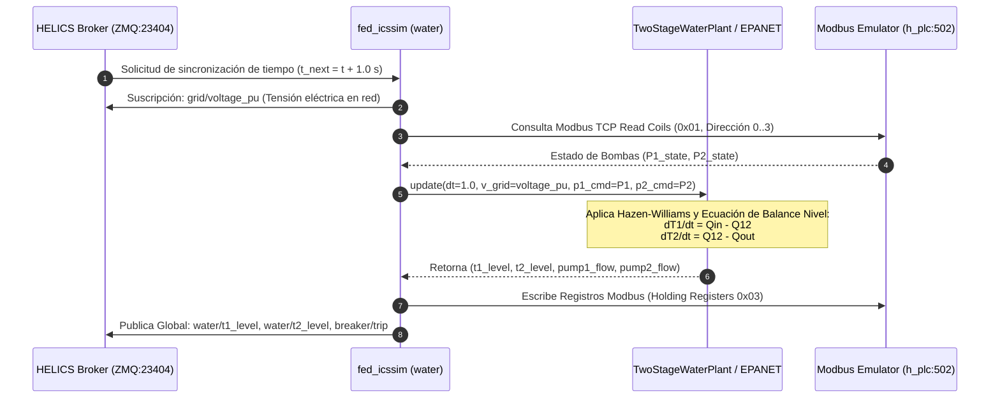

# 📘 Federado 01 — Sector Agua SWaT (Tratamiento y Distribución Multi-Etapa)

## 📌 1. Visión General del Módulo
El federado de Agua emula una planta de tratamiento SWaT (Secure Water Treatment) multi-etapa con resolución física diferencial de nivel y presión, solver hidráulico de Hazen-Williams para pérdidas por fricción en tuberías, e interfaz de control de procesos vía protocolo Modbus TCP.

- **Archivos fuente**: [`helics_sim/fed_icssim.py`](file:///home/kripi/Documentos/GitHub/CityLab/helics_sim/fed_icssim.py), [`physical/water/plant_water.py`](file:///home/kripi/Documentos/GitHub/CityLab/physical/water/plant_water.py), [`physical/water/epanet_solver.py`](file:///home/kripi/Documentos/GitHub/CityLab/physical/water/epanet_solver.py), [`plc/modbus_emulator.py`](file:///home/kripi/Documentos/GitHub/CityLab/plc/modbus_emulator.py).
- **IP / Puerto**: `h_plc` (`10.0.3.10:502`).
- **Asignación de Memoria (RAM)**: ~120 MB en ejecución continua *(estimación de diseño; medición real con `./citylab.sh profile`)* (dentro del margen global de **8 GB RAM** del Cyber Range).

---

## ⚙️ 2. Arquitectura de Código y Flujo de Trabajo



---

## 🧮 3. Modelo Físico e Interdependencia Ciberfísica

### Ecuación de Pérdida de Carga (Hazen-Williams)
$$h_f = 10.67 \cdot L \cdot Q^{1.852} \cdot C^{-1.852} \cdot D^{-4.87}$$
Donde:
- $L = 50.0\text{ m}$ (longitud de tubería),
- $C = 130.0$ (coeficiente de rugosidad de PVC/Acero),
- $D = 0.15\text{ m}$ (diámetro nominal).

### Balance de Niveles de Tanques
$$\frac{dh_{T1}}{dt} = \frac{Q_{in}(V_{grid}) \cdot S_{P1} - Q_{12} \cdot S_{P2}}{A_{T1}}$$
$$\frac{dh_{T2}}{dt} = \frac{Q_{12} \cdot S_{P2} - Q_{demand}}{A_{T2}}$$
Donde $A_{T1} = 4.0\text{ m}^2$, $A_{T2} = 6.0\text{ m}^2$, y si $V_{grid} < 0.85\text{ pu}$, la bomba P1 sufre deslastre de carga imprevisto ($S_{P1} = 0$).

---

## 🗺️ 4. Mapa de Registros Modbus TCP (PLC Agua `10.0.3.10:502`)

| Tipo de Registro | Dirección | Nombre de Variable | Rango / Unidad | Descripción |
|---|---|---|---|---|
| **Coil (0x01)** | `0x0000` | `PUMP_P1_CMD` | `0` (OFF) / `1` (ON) | Mando de operación bomba de agua cruda P1 |
| **Coil (0x01)** | `0x0001` | `PUMP_P2_CMD` | `0` (OFF) / `1` (ON) | Mando de operación bomba de transferencia P2 |
| **Coil (0x01)** | `0x0002` | `VALVE_V1_CMD` | `0` (CLOSED) / `1` (OPEN) | Válvula de drenaje de emergencia |
| **Holding Reg (0x03)** | `0x0000` | `T1_LEVEL_MM` | `0 .. 5000` (mm) | Nivel del Tanque Sedimentador T1 |
| **Holding Reg (0x03)** | `0x0001` | `T2_LEVEL_MM` | `0 .. 5000` (mm) | Nivel del Tanque de Distribución T2 |
| **Holding Reg (0x03)** | `0x0002` | `P1_FLOW_LPS` | `0 .. 100` (L/s) | Caudal de entrada de Bomba P1 |
| **Holding Reg (0x03)** | `0x0003` | `SYSTEM_STATUS` | `0` (OK) / `1` (TRIP) | Estado del relé de protección del sector |

---

## 📡 5. Interfaz de Co-Simulación HELICS

```python
# Suscripciones Entrada
sub_voltage = h.helicsFederateRegisterSubscription(fed, "grid/voltage_pu", "")

# Publicaciones Salida
pub_t1   = h.helicsFederateRegisterGlobalPublication(fed, "water/t1_level", h.HELICS_DATA_TYPE_DOUBLE, "")
pub_t2   = h.helicsFederateRegisterGlobalPublication(fed, "water/t2_level", h.HELICS_DATA_TYPE_DOUBLE, "")
pub_trip = h.helicsFederateRegisterGlobalPublication(fed, "breaker/trip", h.HELICS_DATA_TYPE_INT, "")
```

---

## 💾 6. Presupuesto de Recursos y Memoria RAM
- **Huella de memoria RAM objetivo**: **~120 MB** (Python + PyModbus + HELICS C-extension). *Estimación de diseño. Para la cifra medida ejecuta `./citylab.sh profile` (`scripts/profile_resources.py`) y consulta `logs/resource_profile_summary.txt`.*
- **Límite de tiempo de ejecución (Step Time)**: $1.0\text{ s}$ por paso de federación.
- **Uso de CPU**: <2% de 1 vCPU en Linux nativo.
