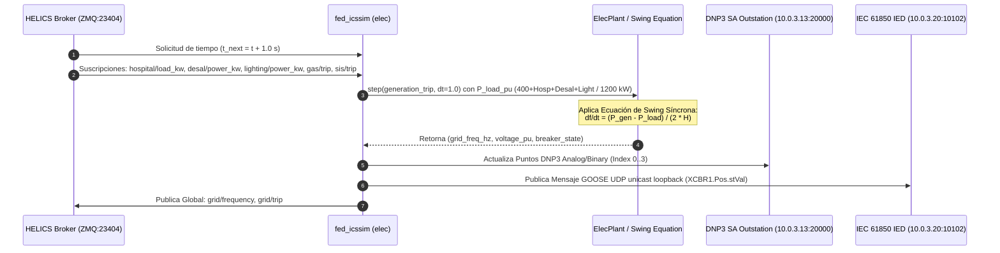

# ⚡ Federado 02 — Sector Eléctrico y Subestación (GridLab-D & IEC 61850 / DNP3 SA)

## 📌 1. Visión General del Módulo
El federado Eléctrico simula la física de generación síncrona, frecuencia de alimentador primario de 13.8 kV, interfaz DNP3 Outstation con Secure Authentication (SA) y la subestación IEC 61850 emulando IEDs con publicaciones GOOSE por UDP unicast a loopback.

- **Archivos fuente**: [`helics_sim/fed_icssim.py`](file:///home/kripi/Documentos/GitHub/CityLab/helics_sim/fed_icssim.py) (federado eléctrico real, `--plant-type elec`), [`physical/icssim/plant.py`](file:///home/kripi/Documentos/GitHub/CityLab/physical/icssim/plant.py) (`ElecPlant`, ecuación de swing y límites `f_min=45.0` / `f_max=65.0`), [`helics_sim/gridlabd_federate.py`](file:///home/kripi/Documentos/GitHub/CityLab/helics_sim/gridlabd_federate.py), [`plc/dnp3_emulator.py`](file:///home/kripi/Documentos/GitHub/CityLab/plc/dnp3_emulator.py), [`plc/iec61850_emulator.py`](file:///home/kripi/Documentos/GitHub/CityLab/plc/iec61850_emulator.py).
- **Archivos NO cableados** (no participan del flujo descrito abajo): [`helics_sim/fed_gridmock.py`](file:///home/kripi/Documentos/GitHub/CityLab/helics_sim/fed_gridmock.py) es un placeholder de PoC que ningún `run_phase*.sh` ni smoke test lanza, y [`physical/elec/grid_elec.py`](file:///home/kripi/Documentos/GitHub/CityLab/physical/elec/grid_elec.py) es un modelo muerto (nominal 50 Hz, incoherente con los 60 Hz de `ElecPlant`) que solo importa su propio test.
- **IPs / Puertos**: `h_plc_elec` (`10.0.3.13:20000` DNP3), `h_ied` (`10.0.3.20:10102` GOOSE/MMS).
- **Asignación de Memoria (RAM)**: ~180 MB en ejecución continua *(estimación de diseño; medición real con `./citylab.sh profile`)* (dentro del margen global de **8 GB RAM**).

---

## ⚙️ 2. Arquitectura de Código y Flujo de Trabajo



---

## 🧮 3. Modelo Físico e Inercia de Red

### Ecuación de Swing Síncrona
$$\frac{df}{dt} = \frac{P_{gen} - P_{load}}{2 \cdot H \cdot S_{base}} \cdot f_0$$
Donde:
- $H = 4.0\text{ s}$ (constante de inercia del sistema),
- $S_{base} = 550.0\text{ kW}$ ($1.0\text{ pu}$),
- $f_0 = 60.0\text{ Hz}$ (frecuencia nominal).

### Relación Tensión-Frecuencia bajo Sobrecarga
$$V_{pu} = 1.0 - \alpha \cdot \left(\frac{P_{load} - P_{gen}}{S_{base}}\right)$$
Si $V_{pu} < 0.85\text{ pu}$, los deslastres automáticos de carga por bajo voltaje (UVLS) se activan en la red.

---

## 🗺️ 4. Mapa de Protocolos (DNP3 SA `10.0.3.13` & IEC 61850 GOOSE `10.0.3.20`)

### DNP3 Outstation (Puerto `:20000`)
| Tipo de Punto | Índice | Nombre de Variable | Formato / Rango | Descripción |
|---|---|---|---|---|
| **Binary Input** | `0` | `BREAKER_CB1` | `0` (CLOSED) / `1` (TRIPPED) | Interruptor principal de alimentador 13.8 kV |
| **Binary Input** | `1` | `RECLOSER_STATUS` | `0` (READY) / `1` (LOCKED_OUT) | Estado de reconectador automático |
| **Analog Input** | `0` | `FREQ_HZ_X100` | `5500 .. 6500` ($f \times 100$) | Frecuencia de red instantánea |
| **Analog Input** | `1` | `VOLT_PU_X1000` | `0 .. 1200` ($V \times 1000$) | Tensión eficaz por unidad |

### IEC 61850 GOOSE — UDP Unicast Loopback (IED Subestación `:10102`)

> **Nota de fidelidad**: `iec61850_emulator.py` define `MULTICAST_GOOSE_ADDR = '239.0.0.1'` pero no la usa para el envío real — el `sendto()` de producción apunta a `('127.0.0.1', goose_port)`. Es UDP unicast a loopback, no multicast IP real. Un ataque L2 real de GOOSE spoofing sobre Ethernet multicast no está implementado; el spoofing se simula reinyectando al mismo puerto loopback.
| Data Attribute | IEC 61850 Object | Tipo de Dato | Valor Normal / Disparo |
|---|---|---|---|
| `XCBR1.Pos.stVal` | Circuit Breaker Position | `BOOLEAN` | `True` (Closed) / `False` (Tripped) |
| `XCBR1.stNum` | State Number Counter | `INT32` | Incremental por evento de conmutación |
| `TVTR1.Vol.instMag` | Voltage Transformer | `FLOAT32` | Valor de tensión instantánea en kV |

---

## 📡 5. Interfaz HELICS Pub-Sub

```python
# Suscripciones Entrada (rama plant_type == "elec" de fed_icssim.create_federate)
sub_input   = h.helicsFederateRegisterSubscription(fed, "hospital/load_kw", "")
pub_t1      = h.helicsFederateRegisterSubscription(fed, "gas/trip", "")   # reutilizado como sub_gas_trip
extra_io['desal_kw']    = h.helicsFederateRegisterSubscription(fed, "desal/power_kw", "")
extra_io['lighting_kw'] = h.helicsFederateRegisterSubscription(fed, "lighting/power_kw", "")
extra_io['sub_sis_trip'] = h.helicsFederateRegisterSubscription(fed, "sis/trip", "")

# Publicaciones Salida
pub_val  = h.helicsFederateRegisterGlobalPublication(fed, "grid/frequency", h.HELICS_DATA_TYPE_DOUBLE, "")
pub_trip = h.helicsFederateRegisterGlobalPublication(fed, "grid/trip", h.HELICS_DATA_TYPE_INT, "")
extra_io['pub_lighting_trip'] = h.helicsFederateRegisterGlobalPublication(
    fed, "grid/lighting_trip", h.HELICS_DATA_TYPE_INT, "")
```

---

## 💾 6. Presupuesto de Recursos y Memoria RAM
- **Huella de memoria RAM objetivo**: **~180 MB** (Python + DNP3 stack + PyOpenSSL + HELICS C-extension). *Estimación de diseño. Para la cifra medida ejecuta `./citylab.sh profile` (`scripts/profile_resources.py`) y consulta `logs/resource_profile_summary.txt`.*
- **Límite de tiempo de paso**: $1.0\text{ s}$.
- **Uso de CPU**: <3% 1 vCPU.
