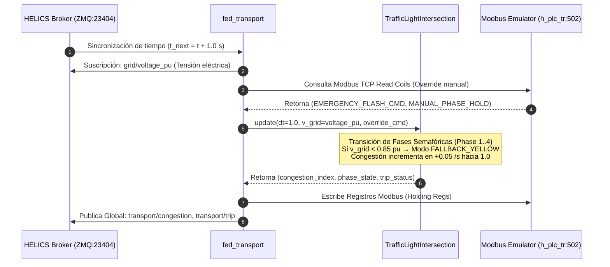

# 🚦 Federado 03 — Sector Transporte y Tráfico Urbano (`fed_transport.py`)

## 📌 1. Visión General del Módulo
El federado de Transporte simula la red vial urbana, la temporización de semáforos de 4 fases y el índice de congestión vehicular ciberfísico en respuesta al estado de la red eléctrica o ciberataques contra los autómatas de control de tráfico.

- **Archivos fuente**: [`helics_sim/fed_transport.py`](file:///home/kripi/Documentos/GitHub/CityLab/helics_sim/fed_transport.py), [`physical/transport/traffic.py`](file:///home/kripi/Documentos/GitHub/CityLab/physical/transport/traffic.py), [`plc/modbus_emulator.py`](file:///home/kripi/Documentos/GitHub/CityLab/plc/modbus_emulator.py).
- **IP / Puerto**: `h_plc_tr` (`10.0.3.14:502`).
- **Asignación de Memoria (RAM)**: ~95 MB en ejecución continua *(estimación de diseño; medición real con `./citylab.sh profile`)* (dentro del margen global de **8 GB RAM**).

---

## ⚙️ 2. Arquitectura de Código y Flujo de Trabajo



---

## 🧮 3. Modelo Físico de Congestión e Interdependencia

### Ecuación de Dinámica de Congestión Vehicular
$$\frac{dC}{dt} = \beta_{in} \cdot N_{vehicles} - \beta_{out} \cdot (1 - \Phi_{flash})$$
Donde:
- $C \in [0.0, 1.0]$ es el índice de congestión del sector urbano,
- $\Phi_{flash} = 1$ si $V_{grid} < 0.85\text{ pu}$ (semáforos en amarillo intermitente de emergencia), lo que reduce la capacidad de vaciado $\beta_{out}$ a 0,
- Si $C \ge 0.80$, el federado activa la alerta de colapso vial (`transport/trip = 1`).

---

## 🗺️ 4. Mapa de Registros Modbus TCP (PLC Transporte `10.0.3.14:502`)

| Tipo de Registro | Dirección | Nombre de Variable | Rango / Unidad | Descripción |
|---|---|---|---|---|
| **Coil (0x01)** | `0x0000` | `TRAFFIC_EMERGENCY_FLASH` | `0` (OFF) / `1` (ON) | Forzar modo destello amarillo de emergencia |
| **Coil (0x01)** | `0x0001` | `HOLD_PHASE_1` | `0` (AUTO) / `1` (HOLD) | Congelar intersección en Fase 1 (Norte-Sur) |
| **Holding Reg (0x03)** | `0x0000` | `CONGESTION_INDEX_X100` | `0 .. 100` ($C \times 100$) | Índice de congestión vial actual (%) |
| **Holding Reg (0x03)** | `0x0001` | `CURRENT_PHASE` | `1 .. 4` | Fase activa de semáforos |
| **Holding Reg (0x03)** | `0x0002` | `TRAFFIC_STATUS` | `0` (NORMAL) / `1` (JAMMED) | Estado operacional de tráfico |

---

## 📡 5. Interfaz HELICS Pub-Sub

```python
# Suscripciones Entrada
sub_voltage = h.helicsFederateRegisterSubscription(fed, "grid/voltage_pu", "")

# Publicaciones Salida
pub_congestion = h.helicsFederateRegisterGlobalPublication(fed, "transport/congestion", h.HELICS_DATA_TYPE_DOUBLE, "")
pub_trip       = h.helicsFederateRegisterGlobalPublication(fed, "transport/trip", h.HELICS_DATA_TYPE_INT, "")
```

---

## 💾 6. Presupuesto de Recursos y Memoria RAM
- **Huella de memoria RAM objetivo**: **~95 MB** (Python + PyModbus + HELICS). *Estimación de diseño. Para la cifra medida ejecuta `./citylab.sh profile` (`scripts/profile_resources.py`) y consulta `logs/resource_profile_summary.txt`.*
- **Límite de tiempo de paso**: $1.0\text{ s}$.
- **Uso de CPU**: <1.5% 1 vCPU.
