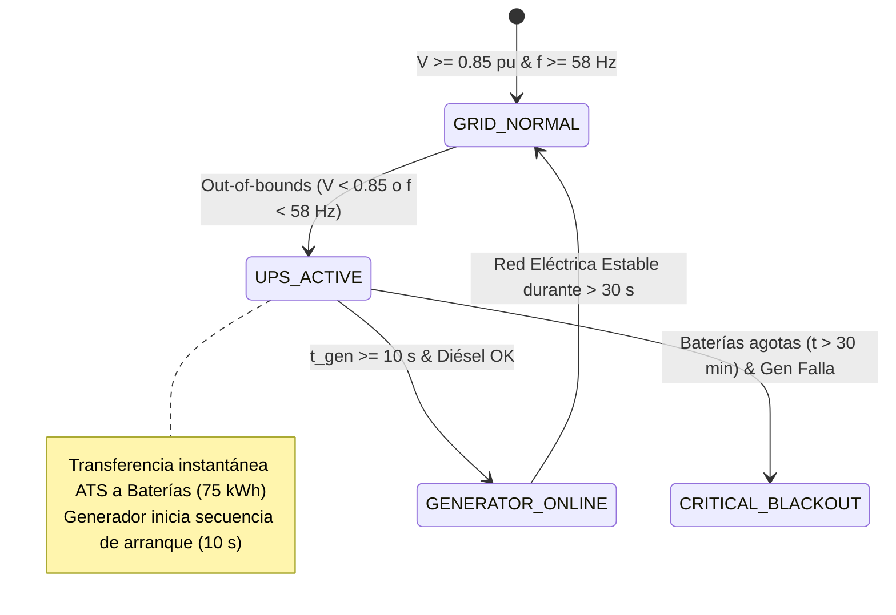
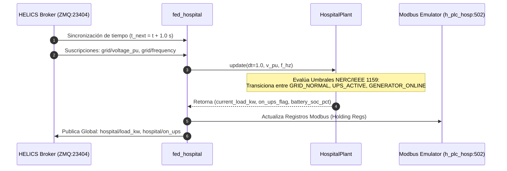

# 🏥 Federado 04 — Sector Hospital Carga Crítica y Sistema ATS/UPS (`fed_hospital.py`)

## 📌 1. Visión General del Módulo
El federado de Hospital emula la demanda eléctrica ininterrumpida de infraestructuras de salud de alta complejidad (Unidades de Cuidados Intensivos UCI, Quirófanos, Sistemas de Soporte Vital y Cadenas de Frío de Vacunas). Integra transferencia automática de fuente ATS (Automatic Transfer Switch), banco de baterías UPS y grupo electrógeno diésel de emergencia.

- **Archivos fuente**: [`helics_sim/fed_hospital.py`](file:///home/kripi/Documentos/GitHub/CityLab/helics_sim/fed_hospital.py), [`physical/hospital/hospital_load.py`](file:///home/kripi/Documentos/GitHub/CityLab/physical/hospital/hospital_load.py), [`plc/modbus_emulator.py`](file:///home/kripi/Documentos/GitHub/CityLab/plc/modbus_emulator.py).
- **IP / Puerto**: `h_plc_hosp` (`10.0.3.15:502`).
- **Asignación de Memoria (RAM)**: ~105 MB en ejecución continua *(estimación de diseño; medición real con `./citylab.sh profile`)* (dentro del margen global de **8 GB RAM**).

---

## ⚙️ 2. Arquitectura de Código y Máquina de Estados de Energía





---

## 🧮 3. Modelo Físico de Descarga de Baterías y Generador

### Demanda de Carga e Integración de Energía UPS
$$E_{UPS}(t + \Delta t) = E_{UPS}(t) - P_{hospital} \cdot \Delta t \cdot \eta_{inverter}$$
Donde:
- $P_{hospital} = 150.0\text{ kW}$ (carga base crítica),
- $E_{UPS}(0) = 75.0\text{ kWh}$ (autonomía nominal de 30 minutos a carga completa),
- $\eta_{inverter} = 0.95$ (eficiencia de conversión del inversor).

### Criterio de Failover (IEEE 1159)
$$\text{Fallo Red} \iff (V_{pu} < 0.85) \lor (f < 58.0\text{ Hz})$$

---

## 🗺️ 4. Mapa de Registros Modbus TCP (PLC Hospital `10.0.3.15:502`)

| Tipo de Registro | Dirección | Nombre de Variable | Rango / Unidad | Descripción |
|---|---|---|---|---|
| **Coil (0x01)** | `0x0000` | `FORCE_GENERATOR_START` | `0` (AUTO) / `1` (MANUAL_START) | Arranque forzado manual de generador diésel |
| **Coil (0x01)** | `0x0001` | `ATS_ISOLATE_GRID` | `0` (AUTO) / `1` (ISOLATE) | Desconexión manual del interruptor de transferencia |
| **Holding Reg (0x03)** | `0x0000` | `POWER_STATE_CODE` | `0` (NORMAL) / `1` (UPS) / `2` (GEN) / `3` (BLACKOUT) | Código de estado de alimentación eléctrica |
| **Holding Reg (0x03)** | `0x0001` | `BATTERY_SOC_PCT` | `0 .. 100` (%) | Estado de carga de banco de baterías UPS |
| **Holding Reg (0x03)** | `0x0002` | `LOAD_KW` | `0 .. 300` (kW) | Potencia consumida instantánea |

---

## 📡 5. Interfaz HELICS Pub-Sub

```python
# Suscripciones Entrada
sub_voltage = h.helicsFederateRegisterSubscription(fed, "grid/voltage_pu", "")
sub_freq    = h.helicsFederateRegisterSubscription(fed, "grid/frequency", "")

# Publicaciones Salida
pub_load   = h.helicsFederateRegisterGlobalPublication(fed, "hospital/load_kw", h.HELICS_DATA_TYPE_DOUBLE, "")
pub_on_ups = h.helicsFederateRegisterGlobalPublication(fed, "hospital/on_ups", h.HELICS_DATA_TYPE_INT, "")
```

---

## 💾 6. Presupuesto de Recursos y Memoria RAM
- **Huella de memoria RAM objetivo**: **~105 MB** (Python + PyModbus + HELICS). *Estimación de diseño. Para la cifra medida ejecuta `./citylab.sh profile` (`scripts/profile_resources.py`) y consulta `logs/resource_profile_summary.txt`.*
- **Límite de tiempo de paso**: $1.0\text{ s}$.
- **Uso de CPU**: <1.5% 1 vCPU.
