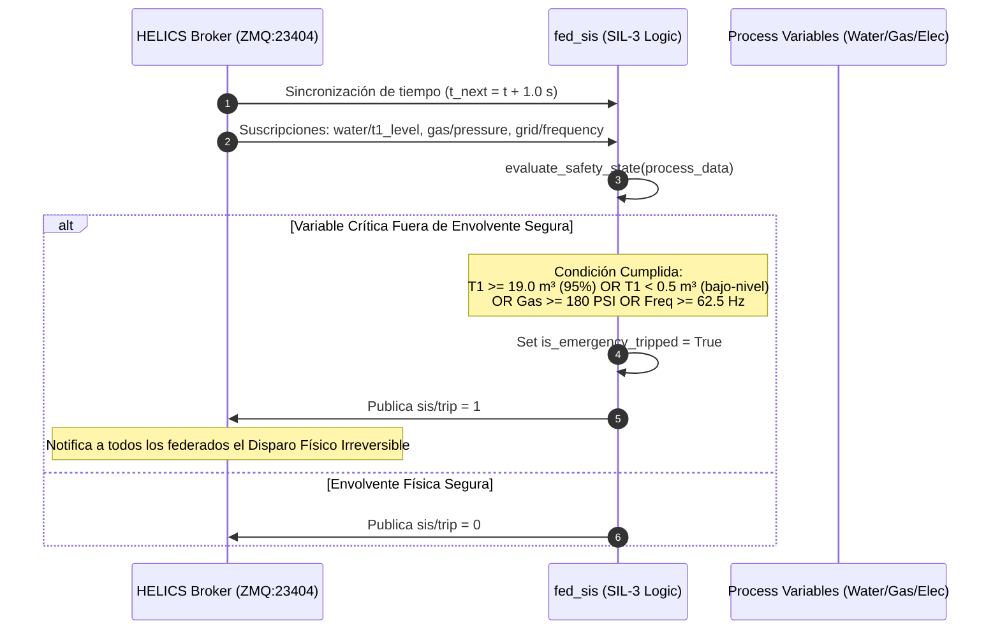

# 🛡️ Federado 05 — Sistema de Seguridad SIS / ESD (SIL-3) (`fed_sis.py`)

> **Estado**: **CABLEADO Y COMPLETADO (Fase 7)** — `helics_sim/fed_sis.py` opera como federado HELICS SIL-3 activo (#10 en co-simulación) habilitado mediante `ENABLE_SIS_FEDERATE=1` en `helics_sim/smoke_test_phase7.sh`. Evalúa variables de proceso en vivo (`water/t1_level`, `gas/pressure`, `grid/frequency`) y publica `sis/trip` consumido por `fed_icssim.py` para parada real de emergencia.

## 📌 1. Visión General del Módulo
El módulo SIS (Safety Instrumented System / Emergency Shutdown ESD) implementa la capa de protección física independiente conforme a la norma **IEC 61511 / IEC 61508 (Safety Integrity Level SIL-3)** como federado HELICS en vivo y como lógica Python evaluable.

- **Archivos fuente**: [`helics_sim/fed_sis.py`](file:///home/kripi/Documentos/GitHub/CityLab/helics_sim/fed_sis.py), [`helics_sim/tests/test_fed_sis.py`](file:///home/kripi/Documentos/GitHub/CityLab/helics_sim/tests/test_fed_sis.py), [`helics_sim/smoke_test_phase7.sh`](file:///home/kripi/Documentos/GitHub/CityLab/helics_sim/smoke_test_phase7.sh).
- **Rol**: Interlock SIL-3 independiente que detecta condiciones inseguras y publica `sis/trip` consumido por los federados de planta para forzar parada de emergencia física (ESD). Preserva además compatibilidad como librería para `attacker/attack_triton_low_slow.py`.
- **Asignación de Memoria (RAM)**: ~85 MB como federado nativo HELICS (#10) *(estimación de diseño; medición real con `./citylab.sh profile`)*.

---

## ⚙️ 2. Arquitectura de Lógica Indesconectable SIL-3



---

## 🧮 3. Envolvente de Seguridad Física (Safety Limits)

| Variable de Proceso | Límite Físico Normal | Umbral Trip SIS (SIL-3) | Acción de Emergencia Irreversible |
|---|---|---|---|
| **Nivel SWaT T1** | $2.0 .. 18.0\text{ m}^3$ | $\ge 19.0\text{ m}^3$ ($95\%$) | Cierre inmediato de Válvula de Entrada P1 / Trip |
| **Nivel SWaT T1** | $2.0 .. 18.0\text{ m}^3$ | $< 0.5\text{ m}^3$ | Parada por cavitación de Bomba P2 |
| **Presión Gas** | $100 .. 150\text{ PSI}$ | $\ge 180.0\text{ PSI}$ | Disparo de Válvula ESD V-GAS-01 |
| **Frecuencia Red** | $59.5 .. 60.5\text{ Hz}$ | $\ge 62.5\text{ Hz}$ | Desconexión de generador por sobre-frecuencia |

---

## 📡 4. Interfaz HELICS Pub-Sub

```python
# Suscripciones Entrada (Variables Brutas del Proceso)
sub_water_t1 = h.helicsFederateRegisterSubscription(fed, "water/t1_level", "")
sub_gas_p    = h.helicsFederateRegisterSubscription(fed, "gas/pressure", "")
sub_grid_f   = h.helicsFederateRegisterSubscription(fed, "grid/frequency", "")

# Publicaciones Salida (Lógica Indesconectable ESD)
pub_sis_trip = h.helicsFederateRegisterGlobalPublication(fed, "sis/trip", h.HELICS_DATA_TYPE_INT, "")
```

---

## 💾 5. Presupuesto de Recursos y Memoria RAM
- **Huella de memoria RAM objetivo**: **~85 MB** (Python + HELICS). *Estimación de diseño. Para la cifra medida ejecuta `./citylab.sh profile` (`scripts/profile_resources.py`) y consulta `logs/resource_profile_summary.txt`.*
- **Límite de tiempo de paso**: $1.0\text{ s}$.
- **Uso de CPU**: <1.0% 1 vCPU.
