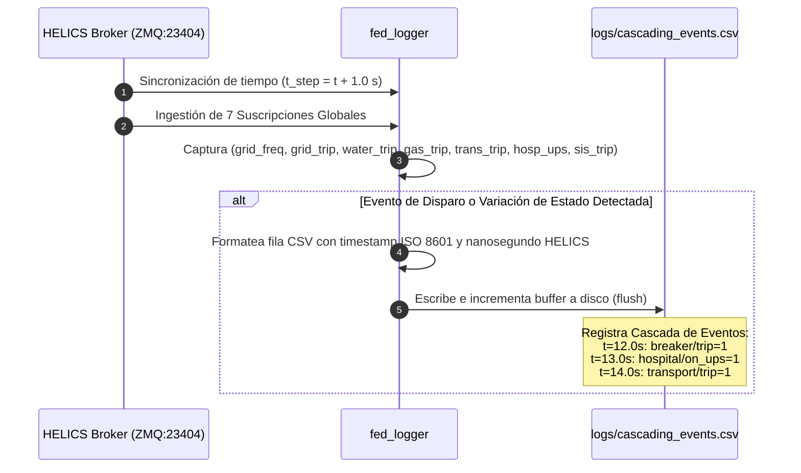

# 📊 Federado 06 — Observer y Logger de Co-Simulación HELICS (`fed_logger.py`)

## 📌 1. Visión General del Módulo
El federado Logger actúa como el observador pasivo centralizado de la co-simulación HELICS. Registra eventos temporales multivariables en archivos CSV de series de tiempo, calcula métricas de impacto ciberfísico en tiempo real (MTTD, MTTR) y registra cascadas de fallos intersectoriales.

- **Archivos fuente**: [`helics_sim/fed_logger.py`](file:///home/kripi/Documentos/GitHub/CityLab/helics_sim/fed_logger.py).
- **Salida Principal**: `logs/cascading_events.csv`.
- **Asignación de Memoria (RAM)**: ~90 MB en ejecución continua *(estimación de diseño; medición real con `./citylab.sh profile`)* (dentro del margen global de **8 GB RAM**).

---

## ⚙️ 2. Arquitectura de Captura y Registro de Eventos



---

## 🗺️ 3. Esquema del Archivo CSV de Eventos (`cascading_events.csv`)

| Columna | Tipo de Dato | Rango / Ejemplo | Descripción |
|---|---|---|---|
| `timestamp_s` | `FLOAT64` | `1.0 .. 3600.0` | Tiempo transcurrido de simulación en segundos |
| `water_t1_m3` | `FLOAT64` | `0.0 .. 20.0` | Nivel del tanque T1 (SWaT etapa 1) |
| `water_t2_m3` | `FLOAT64` | `0.0 .. 20.0` | Nivel del tanque T2 (SWaT etapa 2) |
| `water_trip` | `INT32` | `0` / `1` | Disparo de bombas de sector agua (`breaker/trip`) |
| `gas_pressure_psi` | `FLOAT64` | `0.0 .. 200.0` | Presión de gasoducto |
| `gas_trip` | `INT32` | `0` / `1` | Disparo de sector de gas natural |
| `grid_freq_hz` | `FLOAT64` | `45.0 .. 65.0` | Frecuencia de la red eléctrica instantánea |
| `grid_trip` | `INT32` | `0` / `1` | Disparo de subestación eléctrica |
| `grid_voltage_pu` | `FLOAT64` | `0.0 .. 1.1` | Tensión de red en por-unidad |
| `hospital_load_kw` | `FLOAT64` | `0.0 .. 800.0` | Carga eléctrica hospitalaria |
| `hospital_on_ups` | `INT32` | `0` / `1` | Transferencia de hospital a baterías/generador |
| `transport_congestion` | `FLOAT64` | `0.0 .. 1.0` | Índice de congestión vehicular |
| `transport_trip` | `INT32` | `0` / `1` | Colapso de tráfico e intersecciones |
| `sis_trip` | `INT32` | `0` / `1` | Parada de emergencia SIL-3 (`sis/trip`, publicada por `fed_sis`) |
| `cascade_alert` | `STRING` | `NORMAL`, `PARTIAL_TRIP`, `CASCADING_BLACKOUT` (con sufijos `+HOSPITAL_UPS` / `+SIS_ESD`) | Clasificación agregada del evento en cascada |

---

## 📡 4. Suscripciones HELICS

```python
sub_water_t2  = h.helicsFederateRegisterSubscription(fed, "water/t2_level", "")
sub_water_t1  = h.helicsFederateRegisterSubscription(fed, "water/t1_level", "")
sub_water_trip = h.helicsFederateRegisterSubscription(fed, "breaker/trip", "")
sub_gas_val   = h.helicsFederateRegisterSubscription(fed, "gas/pressure", "")
sub_gas_trip  = h.helicsFederateRegisterSubscription(fed, "gas/trip", "")
sub_grid_val  = h.helicsFederateRegisterSubscription(fed, "grid/frequency", "")
sub_grid_trip = h.helicsFederateRegisterSubscription(fed, "grid/trip", "")
sub_grid_voltage = h.helicsFederateRegisterSubscription(fed, "grid/voltage_pu", "")
sub_hospital_load = h.helicsFederateRegisterSubscription(fed, "hospital/load_kw", "")
sub_hospital_ups  = h.helicsFederateRegisterSubscription(fed, "hospital/on_ups", "")
sub_trans_cong = h.helicsFederateRegisterSubscription(fed, "transport/congestion", "")
sub_trans_trip = h.helicsFederateRegisterSubscription(fed, "transport/trip", "")
sub_sis_trip  = h.helicsFederateRegisterSubscription(fed, "sis/trip", "")
```

> **Nota**: `fed_sis` solo se lanza con `ENABLE_SIS_FEDERATE=1` (`helics_sim/smoke_test_phase7.sh`); `run_phase3.sh` no lo arranca. Sin ese federado, la entrada `sis/trip` queda en valor centinela de HELICS y `fed_logger` la sanea a `0` antes de escribir el CSV, de modo que la columna `sis_trip` siempre es `0`/`1` y nunca un centinela.

---

## 💾 5. Presupuesto de Recursos y Memoria RAM
- **Huella de memoria RAM objetivo**: **~90 MB** (Python + HELICS + CSV I/O). *Estimación de diseño. Para la cifra medida ejecuta `./citylab.sh profile` (`scripts/profile_resources.py`) y consulta `logs/resource_profile_summary.txt`.*
- **Límite de tiempo de paso**: $1.0\text{ s}$.
- **Uso de CPU**: <1.0% 1 vCPU.
