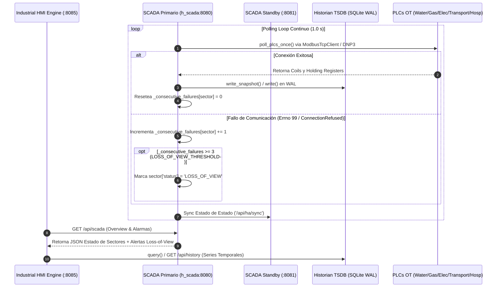
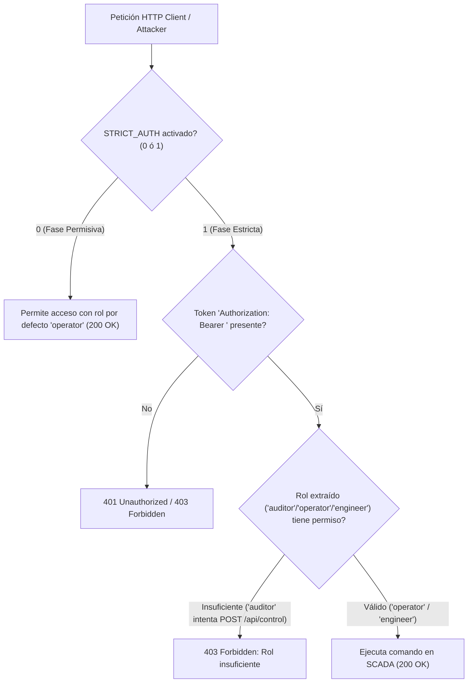

# 🖥️ Infraestructura 07 — Servidor SCADA Central, HA Cluster y Dashboard HMI

## 📌 1. Visión General del Módulo
La infraestructura SCADA/HMI proporciona la capa de supervisión centralizada, adquisición de datos (SCADA Polling Engine), alta disponibilidad (Cluster Primario/Standby con Heartbeat), autenticación RBAC con tokens Bearer estáticos (`Authorization: Bearer <role>:<token>`, sin JWT), y la interfaz HMI P&ID para operadores de planta.

- **Archivos fuente**: [`network/scada_server.py`](file:///home/kripi/Documentos/GitHub/CityLab/network/scada_server.py), [`network/scada_ha.py`](file:///home/kripi/Documentos/GitHub/CityLab/network/scada_ha.py), [`network/hmi_server.py`](file:///home/kripi/Documentos/GitHub/CityLab/network/hmi_server.py), [`network/historian.py`](file:///home/kripi/Documentos/GitHub/CityLab/network/historian.py), [`network/viz_server.py`](file:///home/kripi/Documentos/GitHub/CityLab/network/viz_server.py), [`network/rbac.py`](file:///home/kripi/Documentos/GitHub/CityLab/network/rbac.py).
- **IPs / Puertos**: `h_scada` (`0.0.0.0:8080` SCADA REST API), HMI Engine (`http://127.0.0.1:8085` / `:8080`), Viz Server (`http://127.0.0.1:8090`).
- **Asignación de Memoria (RAM)**: ~220 MB en ejecución continua (dentro del margen global de **8 GB RAM**).

---

## ⚙️ 2. Arquitectura de Control, Historian y Conmutación HA (High Availability)

---

## 🔐 3. Control de Acceso por Roles (RBAC Bearer Estático & Toggle `STRICT_AUTH`)

> **Nota de fidelidad**: `network/rbac.py` resuelve el token contra una tabla estática en memoria (`Bearer <role>:<token>`) — no hay JWT (sin firma, sin claims, sin expiración). Cero `import jwt`/`PyJWT`/`jose` en el repo.

---

## 🌐 4. Endpoints REST API de Infraestructura SCADA / HMI / Viz (`:8080`, `:8085`, `:8090`)

| Método | Endpoint | Componente | Descripción |
|---|---|---|---|
| `GET` | `/api/scada` | SCADA Server (`:8080`) | Retorna telemetría consolidada de los 5 sectores y alarmas activo |
| `GET` | `/api/whoami` | SCADA Server (`:8080`) | Introspección de identidad de usuario y permisos |
| `POST` | `/api/control` | SCADA Server (`:8080`) | Ejecuta mandos de conmutación de bombas, válvulas o interruptores |
| `POST` | `/api/control/write` | SCADA Server (`:8080`) | Modificación estricta de parámetros de calibración de PLC |
| `GET` | `/api/ha/status` | SCADA HA (`:8080`) | Estado de cluster HA (PRIMARY/STANDBY, timestamp último heartbeat) |
| `POST` | `/api/ha/heartbeat` | SCADA HA (`:8080`) | Recepción de latido entre nodos SCADA |
| `POST` | `/api/ha/sync` | SCADA HA (`:8080`) | Sincronización de estado entre SCADA Primario y Standby |
| `GET` | `/api/history` | HMI Historian (`:8085`) | Consulta de series temporales históricas almacenadas en SQLite WAL |
| `GET` | `/api/viz/frame` | Viz Server (`:8090`) | Cuadro de renderizado en tiempo real para visualizador 2D/3D |
| `GET` | `/api/viz/history` | Viz Server (`:8090`) | Histórico de cuadros para reproductor de tendencias 2D/3D |
| `POST` | `/api/viz/update` | Viz Server (`:8090`) | Actualización de estado sectorial desde HELICS o SCADA |

---

## 💾 5. Presupuesto de Recursos y Memoria RAM
- **Huella de memoria RAM objetivo**: **~220 MB** (Python + HTTPServer + PyModbus). *Estimación de diseño. Para la cifra medida ejecuta `./citylab.sh profile` (`scripts/profile_resources.py`) y consulta `logs/resource_profile_summary.txt`.*
- **Límite de tiempo de respuesta REST**: <10 ms.
- **Uso de CPU**: <3% 1 vCPU.
