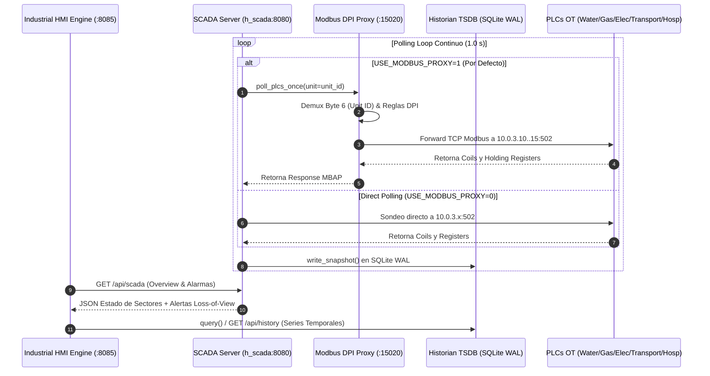

# 🖥️ Infraestructura 07 — Servidor SCADA Central, HA Cluster, Modbus DPI Proxy y HMI

## 📌 1. Visión General del Módulo
La infraestructura SCADA/HMI proporciona la capa de supervisión centralizada, adquisición de datos (SCADA Polling Engine), inspección profunda de paquetes Modbus TCP (DPI Proxy), alta disponibilidad (Cluster Primario/Standby con Heartbeat y persistencia de estado sincronizado), autenticación RBAC con tokens Bearer estáticos (`Authorization: Bearer <role>:<token>`), y la interfaz HMI P&ID para operadores de planta.

- **Archivos fuente**: [`network/scada_server.py`](file:///home/kripi/Documentos/GitHub/CityLab/network/scada_server.py), [`network/modbus_proxy.py`](file:///home/kripi/Documentos/GitHub/CityLab/network/modbus_proxy.py), [`network/scada_ha.py`](file:///home/kripi/Documentos/GitHub/CityLab/network/scada_ha.py), [`network/hmi_server.py`](file:///home/kripi/Documentos/GitHub/CityLab/network/hmi_server.py), [`network/historian.py`](file:///home/kripi/Documentos/GitHub/CityLab/network/historian.py), [`network/viz_server.py`](file:///home/kripi/Documentos/GitHub/CityLab/network/viz_server.py), [`network/rbac.py`](file:///home/kripi/Documentos/GitHub/CityLab/network/rbac.py).
- **IPs / Puertos**:
  - SCADA Server REST API: `http://10.0.2.20:8080` (o `0.0.0.0:8080`)
  - Modbus DPI Proxy: `10.0.2.20:15020`
  - HMI Dashboard Web: `http://10.0.2.20:8085` (o `127.0.0.1:8085`)
  - Viz 2D/3D Server: `http://10.0.2.20:8090` (o `127.0.0.1:8090`)
- **Asignación de Memoria (RAM)**: ~220 MB en ejecución continua (dentro del margen global de **8 GB RAM**).

---

## ⚙️ 2. Arquitectura de Control, DPI Proxy e Historian

---

## 🔀 3. Modbus DPI Proxy y Enrutamiento por Unit ID (`network/modbus_proxy.py`)

El proxy inverso opera en la DMZ (`10.0.2.20:15020`) y filtra todo el tráfico Modbus TCP antes de alcanzar los PLCs:

| Unit ID (Byte 6) | Sector Destino | IP Destino | Puerto | Funciones Permitidas (DPI) |
|---|---|---|---|---|
| `1` | Agua SWaT | `10.0.3.10` | `502` | FC 1, 2, 3, 4, 5 (Coils 0..3, Holding 0..10) |
| `2` | Gas Natural | `10.0.3.12` | `502` | FC 1, 2, 3, 4, 5 (Coils 0..3, Holding 0..10) |
| `3` | Red Eléctrica | `10.0.3.13` | `502` | FC 1, 2, 3, 4, 5 (Coils 0..3, Holding 0..10) |
| `4` | Transporte | `10.0.3.14` | `502` | FC 1, 2, 3, 4, 5 (Coils 0..3, Holding 0..10) |
| `5` | Hospital ATS | `10.0.3.15` | `502` | FC 1, 2, 3, 4, 5 (Coils 0..3, Holding 0..10) |

- **Rechazo DPI**: Si un atacante intenta escribir fuera de rango o ejecutar funciones no autorizadas (ej. FC 16 sobre holding de calibración bloqueados), el proxy corta la conexión y reenvía una alerta de auditoría al colector central SIEM (`SIEM_HTTP_URL`).

---

## 🔄 4. Alta Disponibilidad (HA) y Sincronización de Estado (`network/scada_ha.py`)

El cluster SCADA HA implementa arquitectura Primary/Standby:
- **Latido (Heartbeat)**: Transmitido periódicamente mediante `POST /api/ha/heartbeat`. Si el nodo primario no responde en 3 segundos, el secundario conmuta a rol `PRIMARY`.
- **Persistencia de Snapshot de Estado**: Mediante `sync_state(state)`, el nodo primario sincroniza el diccionario de variables físicas activas. El estado queda persistido en `self.synced_state = dict(state)`, reportando `synced_sectors_count` y `last_state_sync` en `GET /api/ha/status`.

---

## 🔐 5. Control de Acceso por Roles (RBAC Bearer Estático & Toggle `STRICT_AUTH`)

> **Nota de fidelidad**: `network/rbac.py` resuelve el token contra una tabla estática en memoria (`Bearer <role>:<token>`). Si `STRICT_AUTH=1`, `hmi_server.py` normaliza automáticamente las credenciales con prefijo de rol (`Authorization: Bearer engineer:ENG_TOKEN_2026`).

---

## 🌐 6. Endpoints REST API de Infraestructura SCADA / HMI / Viz (`:8080`, `:8085`, `:8090`)

| Método | Endpoint | Componente | Descripción |
|---|---|---|---|
| `GET` | `/api/scada` | SCADA Server (`:8080`) | Retorna telemetría consolidada de los 5 sectores y alarmas activo |
| `GET` | `/api/whoami` | SCADA Server (`:8080`) | Introspección de identidad de usuario y permisos |
| `POST` | `/api/control` | SCADA Server (`:8080`) | Ejecuta mandos de conmutación de bombas, válvulas o interruptores |
| `POST` | `/api/control/write` | SCADA Server (`:8080`) | Modificación estricta de parámetros de calibración de PLC |
| `GET` | `/api/ha/status` | SCADA HA (`:8080`) | Estado de cluster HA (PRIMARY/STANDBY, timestamp último heartbeat, sync count) |
| `POST` | `/api/ha/heartbeat` | SCADA HA (`:8080`) | Recepción de latido entre nodos SCADA |
| `POST` | `/api/ha/sync` | SCADA HA (`:8080`) | Sincronización de estado entre SCADA Primario y Standby |
| `GET` | `/api/history` | HMI Historian (`:8085`) | Consulta de series temporales históricas almacenadas en SQLite WAL |
| `GET` | `/api/viz/frame` | Viz Server (`:8090`) | Cuadro de renderizado en tiempo real para visualizador 2D/3D |
| `GET` | `/api/viz/history` | Viz Server (`:8090`) | Histórico de cuadros para reproductor de tendencias 2D/3D |
| `POST` | `/api/viz/update` | Viz Server (`:8090`) | Actualización de estado sectorial desde HELICS o SCADA |

