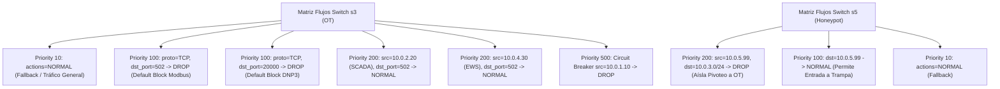

# 🛡️ Infraestructura 08 — SIEM Central, SDN Controller y Active Directory DC

## 📌 1. Visión General del Módulo
Esta infraestructura engloba los componentes centrales de detección, respuesta a incidentes e identidad corporativa de CityLab:
1. **Colector y Motor de Correlación SIEM (`network/siem_pipeline.py`)**: Opera como daemon HTTP en `10.0.2.20:8514`. Ingesta eventos en formato Elastic Common Schema (ECS), Syslog RFC 5424 y JSON directo. Recibe reenvíos asíncronos de auditoría de todos los emuladores y proxies OT mediante `SIEM_HTTP_URL=http://10.0.2.20:8514`.
2. **Controlador SDN OpenFlow (`network/sdn_controller.py`)**: Microsegmentación dinámica en switches Open vSwitch (OVS `s3` OT y `s5` Honeypot) con aislamiento automático Circuit Breaker en plano de datos.
3. **Active Directory DC Emulator (`network/ad_dc_emulator.py`)**: Servidor Samba AD DC (`CITYLAB.LOCAL` @ `10.0.1.20`) emulando Kerberos (`:88`), LDAP (`:389`) y SMB (`:445`), interconectado con la DMZ mediante conduit TCP 389.
4. **Decoy Honeypot Server (`plc/honeypot_server.py`)**: Trampa Conpot emulada en `10.0.5.99:502` para atracción y registro de escaneos hostiles.

- **Archivos fuente**: [`network/siem_pipeline.py`](file:///home/kripi/Documentos/GitHub/CityLab/network/siem_pipeline.py), [`network/sdn_controller.py`](file:///home/kripi/Documentos/GitHub/CityLab/network/sdn_controller.py), [`network/ad_dc_emulator.py`](file:///home/kripi/Documentos/GitHub/CityLab/network/ad_dc_emulator.py), [`plc/honeypot_server.py`](file:///home/kripi/Documentos/GitHub/CityLab/plc/honeypot_server.py).
- **Asignación de Memoria (RAM)**: ~250 MB en ejecución conjunta (dentro del margen global de **8 GB RAM**).

---

## ⚙️ 2. Arquitectura de Reenvío Asíncrono y Detección SIEM

```mermaid
flowchart LR
    subgraph Producers ["Generadores de Eventos OT / IT"]
        PLC["PLCs Modbus (10.0.3.10..17)"]
        IED["IED Subestación (10.0.3.20)"]
        PROXY["Modbus DPI Proxy (10.0.2.20:15020)"]
        SCADA["SCADA Server (10.0.2.20:8080)"]
        HONEY["Honeypot (10.0.5.99:502)"]
    end

    subgraph SIEM_Daemon ["Colector y Motor de Correlación SIEM (10.0.2.20:8514)"]
        HTTP_Ingest["HTTP POST Ingest Engine"]
        Engine["SiemCorrelationEngine"]
        Rules["Reglas de Detección Heurísticas"]
        Alerts[("Alertas Activas SOC")]
    end

    subgraph SDN_Enforce ["Defensa Activa SDN / Circuit Breaker"]
        Operator["Operador SOC / Script de Defensa"]
        SDN_Ctrl["SDN Controller (sdn_controller.py)"]
        Switch_S3["Switch OVS s3 (OT Data Plane)"]
    end

    PLC & IED & PROXY & SCADA & HONEY -.->|HTTP POST JSON (SIEM_HTTP_URL)| HTTP_Ingest
    HTTP_Ingest --> Engine
    Engine --> Rules
    Rules --> Alerts
    Alerts -.->|Notificación / Triaje| Operator
    Operator -->|apply_circuit_breaker(offending_ip)| SDN_Ctrl
    SDN_Ctrl -->|ovs-ofctl add-flow drop (priority=500)| Switch_S3
```

---

## 🛡️ 3. Reglas de Correlación SIEM en Código (`network/siem_pipeline.py`)

El motor de correlación evalúa una ventana circular de los últimos 10 eventos y genera identificadores secuenciales de alerta `SOC-ALT-%04d`:

| Regla | Nombre de la Regla SOC | Vector de Ataque Detectado | Criterio de Activación ECS (`_evaluate_correlation_rules`) | Severidad Generada |
|---|---|---|---|---|
| **Regla 1** | Ataque Ciberfísico en Cascada (IT Pivoting $\to$ OT Injection) | Escaneo a Honeypot seguido de inyección anómala a PLC | Evento `honeypot` + evento `process_control` (`HIGH`/`CRITICAL`) con mismo `source_ip` en últimos 10 eventos | `CRITICAL` |
| **Regla 2** | Inyección / Spoofing GOOSE IEC 61850 (Industroyer2 Pattern) | Manipulación ilícita de disyuntores en subestación | `event_category == 'process_control'` y (`'GOOSE' in message.upper()` o `service_name == 'iec61850_emulator'`) | `CRITICAL` |
| **Regla 3** | Alerta de Inspección Pasiva Network Bridge | Detección por firmas NIDS o anomalías de flujo | `'zeek' in service_name` o `'suricata' in service_name` con severidad `HIGH` o `CRITICAL` | `HIGH` / `CRITICAL` |

> **Nota de Integración SDN**: El pipeline SIEM es desacoplado y de solo lectura/notificación; el aislamiento en plano de datos se ejecuta mediante `python3 network/sdn_controller.py --isolate-ip <IP>` invocando `apply_circuit_breaker()`.

---

## 🔀 4. Matriz de Flujos OpenFlow Microsegmentación OVS (`s3` OT / `s5` Honeypot)



---

## 💾 5. Presupuesto de Recursos y Rendimiento
- **Huella de memoria RAM objetivo**: **~250 MB** (Python HTTP + OVS daemon + Samba AD emulator).
- **Límite de tiempo de procesamiento de regla SIEM**: <2 ms por evento.
- **Uso de CPU**: <2.5% 1 vCPU.

