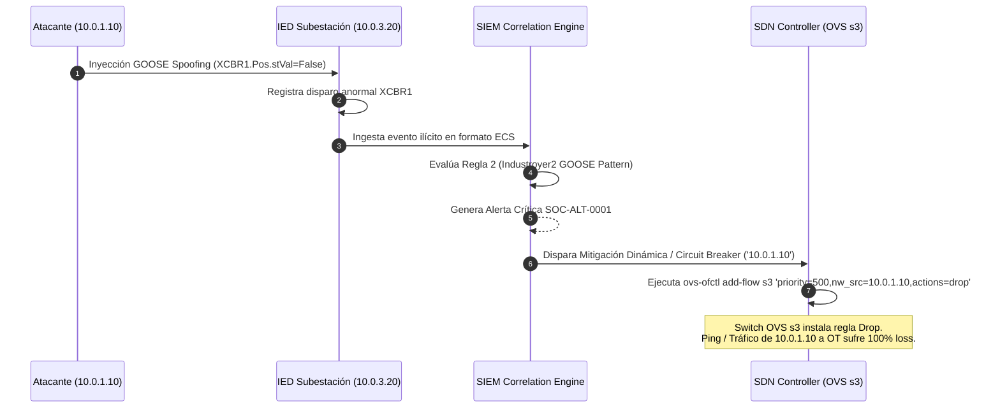
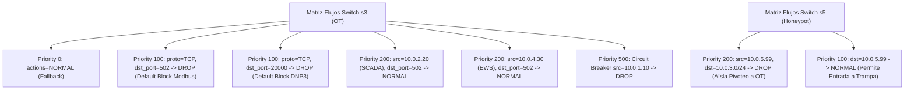

# 🛡️ Infraestructura 08 — SIEM, SDN Controller y Active Directory Domain Controller

> **Estado**: **COMPLETADO (Fase 8)** — `network/siem_pipeline.py` opera como motor de recolección, normalización y correlación de eventos IT/OT en formato Elastic Common Schema (ECS), Syslog RFC 5424 y exportación directa a disco para integración con Kibana / ELK / Graylog.

## 📌 1. Visión General del Módulo
Esta infraestructura engloba los componentes centrales de seguridad cibernética e identidad corporativa de CityLab:
1. **Motor de Correlación SIEM**: Ingestión y normalización de eventos en formato ECS (Elastic Common Schema), Syslog RFC 5424, Zeek logs y Suricata Eve JSON, con detección de patrones de ciberguerra en cascada (GOOSE Spoofing, Kerberoasting, Fuerza Bruta).
2. **Controlador SDN OpenFlow**: Microsegmentación dinámica en switches Open vSwitch (OVS `s3` OT y `s5` Honeypot) con aislamiento automático Circuit Breaker.
3. **Active Directory DC Emulator**: Servidor Samba AD DC (`CITYLAB.LOCAL`) emulando servicios Kerberos (`:88`), LDAP (`:389`) y SMB (`:445`).
4. **Decoy Honeypot Server**: Trampa Conpot emulada en `10.0.5.99:502` para atracción y registro de escaneos hostiles.

- **Archivos fuente**: [`network/siem_pipeline.py`](file:///home/kripi/Documentos/GitHub/CityLab/network/siem_pipeline.py), [`network/sdn_controller.py`](file:///home/kripi/Documentos/GitHub/CityLab/network/sdn_controller.py), [`network/ad_dc_emulator.py`](file:///home/kripi/Documentos/GitHub/CityLab/network/ad_dc_emulator.py), [`plc/honeypot_server.py`](file:///home/kripi/Documentos/GitHub/CityLab/plc/honeypot_server.py).
- **Asignación de Memoria (RAM)**: ~250 MB en ejecución conjunta (dentro del margen global de **8 GB RAM**).

---

## ⚙️ 2. Arquitectura de Defensa SDN y Correlación SIEM en Caliente

---

## 🛡️ 3. Reglas de Correlación SIEM Destacadas

| ID Alerta | Regla SIEM | Vector de Ataque Detectado | Criterio de Activación ECS | Acción Automática |
|---|---|---|---|---|
| `SOC-ALT-0001` | Regla 2: GOOSE Spoofing | Industroyer2 / IEC 61850 Injection | `event_type == 'goose_injection'` & `severity == 'CRITICAL'` | Notificación SOC + Circuit Breaker SDN |
| `SOC-ALT-0002` | Regla 6: Kerberoasting | Extracción de tickets TGS en AD DC | `service_name == 'krbe_ews'` & `event_type == 'tgs_req'` | Aislamiento de cuenta de usuario en LDAP |
| `SOC-ALT-0003` | Regla 16: Honeypot Touch | Reconocimiento en Trampa OT | `destination_ip == '10.0.5.99'` & `dst_port == 502` | Bloqueo IP origen en Switch `s5` |

---

## 🔀 4. Matriz de Flujos OpenFlow Microsegmentación OVS (`s3` OT / `s5` Honeypot)

---

## 💾 5. Presupuesto de Recursos y Memoria RAM
- **Huella de memoria RAM objetivo**: **~250 MB** (Python + OVS daemon + Samba AD emulator). *Estimación de diseño. Para la cifra medida ejecuta `./citylab.sh profile` (`scripts/profile_resources.py`) y consulta `logs/resource_profile_summary.txt`.*
- **Límite de tiempo de procesamiento de regla SIEM**: <2 ms por evento.
- **Uso de CPU**: <2.5% 1 vCPU.
