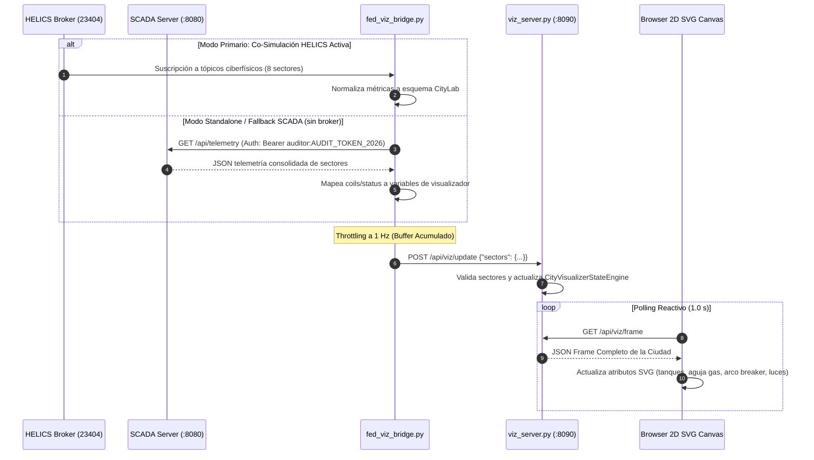

# 🎨 Infraestructura 09 — Visualizador Urbano 2D SVG Airgapped y Puente de Telemetría (`fed_viz_bridge.py` & `viz_server.py`)

## 📌 1. Visión General del Módulo
La infraestructura de visualización de la **Fase 9** dota al Cyber Range CityLab de una interfaz gráfica reactiva en tiempo real orientada a centros de operaciones de ciberseguridad industrial (SOC/NOC). Permite monitorear dinámicamente el estado ciberfísico de los 8 sectores urbanos (`water`, `gas`, `elec`, `transport`, `hospital`, `desal`, `lighting`, `safety`/SIS SIL-3), proyectar visualmente el impacto de ciberataques y mitigar la desconexión entre la simulación matemática y la supervisión operativa.

- **Archivos fuente**:
  - Puente de Telemetría: [`helics_sim/fed_viz_bridge.py`](file:///home/kripi/Documentos/GitHub/CityLab/helics_sim/fed_viz_bridge.py)
  - Servidor y Dashboard 2D: [`network/viz_server.py`](file:///home/kripi/Documentos/GitHub/CityLab/network/viz_server.py)
  - Suites de Test: [`helics_sim/tests/test_fed_viz_bridge.py`](file:///home/kripi/Documentos/GitHub/CityLab/helics_sim/tests/test_fed_viz_bridge.py), [`network/tests/test_viz.py`](file:///home/kripi/Documentos/GitHub/CityLab/network/tests/test_viz.py), [`network/tests/test_viz_server.py`](file:///home/kripi/Documentos/GitHub/CityLab/network/tests/test_viz_server.py)
- **Ubicación y Puertos**:
  - Servidor Visualizador HTTP: `http://10.0.2.20:8090` (en Mininet DMZ) o `http://127.0.0.1:8090` (local/CI).
  - Tasa de Emisión (Throttling): Máximo 1 despacho HTTP consolidado por segundo (1 Hz).
- **Asignación de Recursos**: ~35 MB RSS para `viz_server.py` y ~40 MB RSS para `fed_viz_bridge.py` (dentro del presupuesto global $\le 8\text{ GB}$).

---

## ⚙️ 2. Arquitectura de Flujo de Datos



---

## 🗺️ 3. Mapeo de Tópicos y Sectores Urbanos (8 Sectores)

El puente suscribe los tópicos reales publicados por los federados ciberfísicos y los traduce al modelo de estado:

| Sector | Tópico HELICS de Origen | Variable Destino en Engine | Representación Gráfica SVG en Dashboard |
|---|---|---|---|
| 💧 **Water** | `water/t1_level`, `water/t2_level`, `breaker/trip` | `tank_level`, `t1_level`, `pump_running`, `alert` | Tanques gemelos T1/T2 con líquido dinámico y bomba P101 rotativa / alarma de disparo. |
| 🔥 **Gas** | `gas/pressure`, `gas/trip` | `pressure_psi`, `valve_open`, `alert` | Manómetro analógico circular con aguja rotativa proporcional a PSI y válvula solenoide V-101. |
| ⚡ **Elec** | `grid/frequency`, `grid/voltage_pu`, `grid/trip` | `grid_voltage`, `frequency`, `blackout` | Barra de subestación con disyuntor XCBR1 animado (continuo verde vs abierto rojo con arco). |
| 🚦 **Transport**| `transport/congestion`, `transport/trip` | `traffic_light`, `congestion_pct`, `railway_gate` | Semáforo de 3 ópticas activas (rojo/ámbar/verde), barra de congestión y barrera ferroviaria. |
| 🏥 **Hospital** | `hospital/load_kw`, `hospital/on_ups` | `load_kw`, `powered`, `generator_active` | Cuadro de conmutación ATS (Red Normal vs Generador Diésel / Baterías UPS de emergencia). |
| 🌊 **Desal** | `desal/power_kw`, `desal/tank_level_pct`, `desal/pump_trip` | `power_kw`, `tank_level_pct`, `pump_trip` | Bomba de alta presión para ósmosis inversa y tanque de permeado desalinizador. |
| 💡 **Lighting** | `lighting/power_kw` | `power_kw` | Luminaria pública urbana con halo de brillo reactivo y consumo de red en kW. |
| 🛡️ **Safety** | `sis/trip` (publicado por `fed_sis.py`) | `sis_trip` | Escudo de interbloqueos de seguridad SIS SIL-3 (verde ARMED vs rojo ¡DISPARO SIL-3!). |

---

## 🌐 4. Endpoints REST API de `viz_server.py`

| Método | Endpoint | Cabecera / Payload | Respuesta HTTP | Descripción |
|---|---|---|---|---|
| `GET` | `/` ó `/index.html` | Ninguna | `200 OK` (HTML5/SVG) | Dashboard interactivo 100% airgapped (cero CDNs, cero npm). |
| `GET` | `/api/viz/frame` | Ninguna | `200 OK` (JSON) | Cuadro de telemetría instantánea de los 8 sectores. |
| `GET` | `/api/viz/history` | Ninguna | `200 OK` (JSON) | Historial de los últimos 100 cuadros para análisis forense. |
| `POST` | `/api/viz/update` | `{"sector": "water", "payload": {...}}` | `200 OK` ó `400 Bad Request` | Actualización de un sector individual. Rechaza sectores desconocidos con HTTP 400. |
| `POST` | `/api/viz/update` | `{"sectors": {"water": {...}, "desal": {...}}}` | `200 OK` ó `400 Bad Request` | Actualización por lotes consolidada en una única ráfaga HTTP. |

---

## 🚀 5. Modos de Ejecución y Opciones de CLI

El puente [`helics_sim/fed_viz_bridge.py`](file:///home/kripi/Documentos/GitHub/CityLab/helics_sim/fed_viz_bridge.py) puede operar de forma autónoma o integrado:

```bash
# Modo Standalone (Sondeo SCADA con Token Bearer, sin broker HELICS)
python3 helics_sim/fed_viz_bridge.py --standalone --viz-url http://127.0.0.1:8090

# Modo Co-Simulación HELICS con Broker ZMQ
python3 helics_sim/fed_viz_bridge.py --broker-address 127.0.0.1 --broker-port 23404 --viz-url http://10.0.2.20:8090

# Parámetros CLI disponibles:
#   --viz-url URL         Destino del visualizador (default: http://127.0.0.1:8090)
#   --scada-url URL       URL de SCADA Server para fallback (default: http://127.0.0.1:8080)
#   --scada-token TOKEN   Token RBAC Bearer para consultas SCADA (default: auditor:AUDIT_TOKEN_2026)
#   --standalone          Fuerza modo SCADA Poller sin broker
#   --broker-address HOST Host del broker HELICS
#   --broker-port PORT    Puerto del broker HELICS
#   --max-steps N         Límite de pasos para testing automatizado
```

---

## 🔒 6. Garantías de Seguridad y Resiliencia
1. **Airgapped 100%**: Todo el CSS, JavaScript y SVG está embebido en línea. No se emiten peticiones de red salientes (`egress` cortado al 100% en Mininet).
2. **Principio de Mínimo Privilegio**: El token de fallback `auditor:AUDIT_TOKEN_2026` solo otorga permisos de lectura (`GET /api/telemetry`), impidiendo cualquier modificación inadvertida sobre los actuadores.
3. **Resiliencia ante Caídas (Never-Crash)**: Los errores de red, reinicios de `viz_server` o Timeouts HTTP son capturados defensivamente sin interrumpir el avance de la co-simulación física.
4. **Erradicación de Huérfanos**: Integrado plenamente en la lista canónica `citylab_procs` de [`citylab.sh`](file:///home/kripi/Documentos/GitHub/CityLab/citylab.sh) y [`scripts/validate_e2e.sh`](file:///home/kripi/Documentos/GitHub/CityLab/scripts/validate_e2e.sh).
